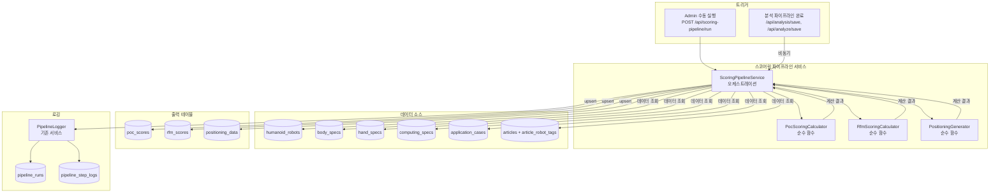
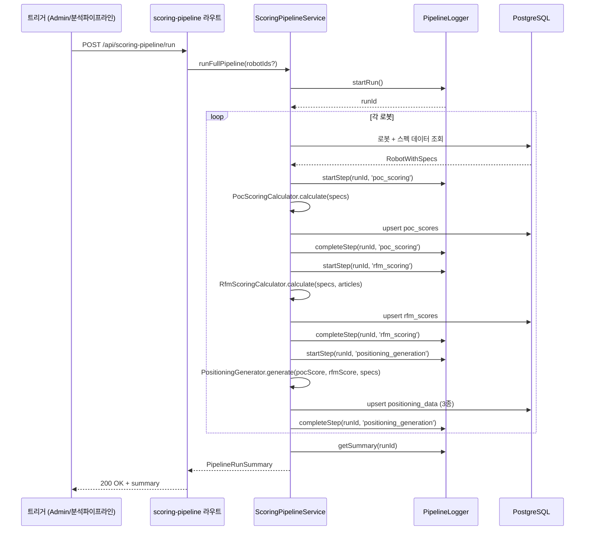
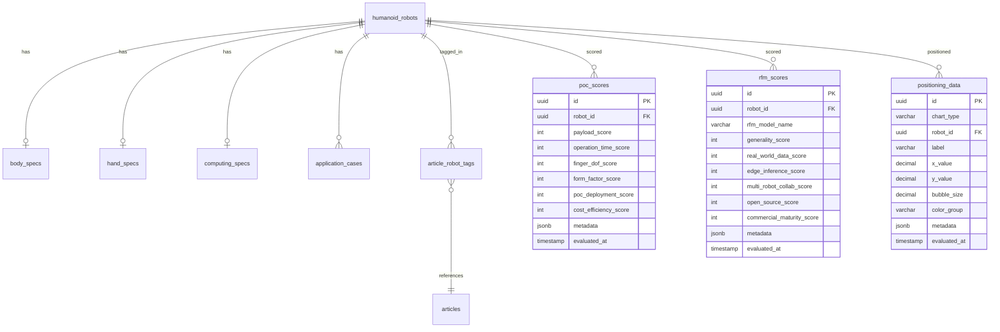

# 설계 문서 — 자동 스코어링 파이프라인

## 개요

자동 스코어링 파이프라인은 기존 DB 데이터(bodySpecs, handSpecs, computingSpecs, applicationCases 등)를 입력으로 받아 정의된 스코어링 루브릭에 따라 `poc_scores`, `rfm_scores`, `positioning_data` 3개 테이블을 자동으로 채우는 백엔드 서비스이다.

핵심 설계 원칙:
- **순수 계산 분리**: 스코어링 로직은 DB 의존성 없는 순수 함수로 구현하여 테스트 용이성 확보
- **기존 인프라 활용**: PipelineLogger, HumanoidTrendService 등 기존 서비스를 최대한 재사용
- **비동기 트리거**: 분석 파이프라인 완료 후 비동기(fire-and-forget)로 스코어링 실행
- **Upsert 패턴**: robotId 기준 upsert로 중복 없이 최신 점수 유지

## 아키텍처



### 실행 흐름



## 컴포넌트 및 인터페이스

### 1. ScoringPipelineService (오케스트레이션)

파이프라인 전체 실행을 관리하는 서비스. 기존 `PipelineLogger`를 사용하여 실행 로그를 기록한다.

파일: `packages/backend/src/services/scoring-pipeline.service.ts`

```typescript
interface RobotWithSpecs {
  robot: HumanoidRobot;
  company: Company;
  bodySpec: BodySpec | null;
  handSpec: HandSpec | null;
  computingSpec: ComputingSpec | null;
  applicationCases: ApplicationCase[];
  articleCount: number;
  articleKeywords: string[];
}

interface ScoringResult {
  robotId: string;
  pocScore: PocScoreValues;
  rfmScore: RfmScoreValues;
  positioning: PositioningValues[];
  estimatedFields: string[];  // 데이터 부족으로 추정된 필드 목록
}

interface PipelineExecutionResult {
  runId: string;
  status: 'success' | 'partial_failure' | 'failure';
  totalRobots: number;
  successCount: number;
  failureCount: number;
  totalDurationMs: number;
  errors: { robotId: string; step: string; message: string }[];
}

class ScoringPipelineService {
  // 전체 로봇 스코어링 실행
  async runFullPipeline(triggeredBy?: string): Promise<PipelineExecutionResult>;
  
  // 단일 로봇 스코어링 실행
  async runForRobot(robotId: string, triggeredBy?: string): Promise<PipelineExecutionResult>;
  
  // 특정 로봇 목록 스코어링 (분석 파이프라인 트리거용)
  async runForRobots(robotIds: string[], triggeredBy?: string): Promise<PipelineExecutionResult>;
  
  // 로봇 + 스펙 데이터 일괄 조회
  private async fetchRobotWithSpecs(robotId: string): Promise<RobotWithSpecs>;
  
  // 단일 로봇 스코어링 처리 (트랜잭션 단위)
  private async processRobot(robot: RobotWithSpecs, runId: string): Promise<ScoringResult>;
  
  // 점수 upsert (robotId 기준)
  private async upsertScores(result: ScoringResult): Promise<void>;
  
  // 파이프라인 상태 조회
  async getLastRunStatus(): Promise<PipelineExecutionResult | null>;
}
```

### 2. PocScoringCalculator (순수 함수 모듈)

DB 의존성 없이 스펙 데이터만으로 PoC 6-Factor 점수를 계산하는 순수 함수 모듈.

파일: `packages/backend/src/services/scoring/poc-calculator.ts`

```typescript
interface PocScoreValues {
  payloadScore: number;       // 1–10
  operationTimeScore: number; // 1–10
  fingerDofScore: number;     // 1–10
  formFactorScore: number;    // 1–10
  pocDeploymentScore: number; // 1–10
  costEfficiencyScore: number;// 1–10
  metadata: {
    source: 'auto' | 'manual';
    estimatedFields: string[];
    calculatedAt: string;
  };
}

// 선형 스케일 매핑: value를 [0, maxValue] → [1, maxScore] 범위로 변환
function linearScale(value: number, maxValue: number, maxScore: number): number;

// payloadKg → 1–10 (0kg=1, 20kg+=10)
function calculatePayloadScore(payloadKg: number | null): { score: number; estimated: boolean };

// operationTimeHours → 1–10 (0h=1, 8h+=10)
function calculateOperationTimeScore(hours: number | null): { score: number; estimated: boolean };

// handDof → 1–10 (0=1, 24+=10)
function calculateFingerDofScore(handDof: number | null): { score: number; estimated: boolean };

// 복합 가중치 계산 → 1–10
function calculateFormFactorScore(
  heightCm: number | null, dofCount: number | null,
  fingerCount: number | null, locomotionType: string | null
): { score: number; estimated: boolean };

// 배포 사례 기반 → 1–10
function calculatePocDeploymentScore(
  cases: { deploymentStatus: string | null }[]
): { score: number; estimated: boolean };

// 비용 효율성 → 1–10
function calculateCostEfficiencyScore(
  payloadKg: number | null, operationTimeHours: number | null, estimatedPriceUsd: number | null
): { score: number; estimated: boolean };

// 전체 PoC 점수 계산
function calculatePocScores(specs: RobotWithSpecs): PocScoreValues;
```

### 3. RfmScoringCalculator (순수 함수 모듈)

파일: `packages/backend/src/services/scoring/rfm-calculator.ts`

```typescript
interface RfmScoreValues {
  generalityScore: number;          // 1–5
  realWorldDataScore: number;       // 1–5
  edgeInferenceScore: number;       // 1–5
  multiRobotCollabScore: number;    // 1–5
  openSourceScore: number;          // 1–5
  commercialMaturityScore: number;  // 1–5
  rfmModelName: string;
  metadata: {
    source: 'auto' | 'manual';
    estimatedFields: string[];
    calculatedAt: string;
  };
}

// distinct taskType 수 → 1–5
function calculateGeneralityScore(cases: { taskType: string | null }[]): { score: number; estimated: boolean };

// 기사 키워드 분석 → 1–5 (real-world testing 관련)
function calculateRealWorldDataScore(articleCount: number, keywords: string[]): { score: number; estimated: boolean };

// topsMax → 1–5 (구간 매핑)
function calculateEdgeInferenceScore(topsMax: number | null): { score: number; estimated: boolean };

// 기사 키워드 분석 → 1–5 (multi-robot collaboration 관련)
function calculateMultiRobotCollabScore(keywords: string[]): { score: number; estimated: boolean };

// 기사 키워드 분석 → 1–5 (open-source 관련)
function calculateOpenSourceScore(keywords: string[]): { score: number; estimated: boolean };

// commercializationStage → 1–5
function calculateCommercialMaturityScore(stage: string | null): { score: number; estimated: boolean };

// 전체 RFM 점수 계산
function calculateRfmScores(specs: RobotWithSpecs): RfmScoreValues;
```

### 4. PositioningGenerator (순수 함수 모듈)

파일: `packages/backend/src/services/scoring/positioning-generator.ts`

```typescript
interface PositioningValues {
  chartType: 'rfm_competitiveness' | 'poc_positioning' | 'soc_ecosystem';
  label: string;
  xValue: number;
  yValue: number;
  bubbleSize: number;
  colorGroup: string | null;
  metadata: Record<string, unknown>;
}

// RFM 경쟁력 포지셔닝 생성
function generateRfmPositioning(
  rfmScore: RfmScoreValues, robotName: string, companyName: string
): PositioningValues;

// PoC 포지셔닝 생성
function generatePocPositioning(
  pocScore: PocScoreValues, robotName: string, companyName: string
): PositioningValues;

// SoC 에코시스템 포지셔닝 생성
function generateSocPositioning(
  computingSpec: ComputingSpec | null, applicationCaseCount: number,
  robotName: string, companyName: string, region: string | null
): PositioningValues;

// 전체 포지셔닝 데이터 생성
function generateAllPositioning(
  pocScore: PocScoreValues, rfmScore: RfmScoreValues,
  specs: RobotWithSpecs
): PositioningValues[];
```

### 5. ScoringRubricProvider (루브릭 정의)

파일: `packages/backend/src/services/scoring/rubric-provider.ts`

스코어링 루브릭을 정적 데이터로 정의하고 API로 제공하는 모듈. 루브릭 정의는 계산 로직과 동일한 소스에서 관리하여 일관성을 보장한다.

```typescript
interface RubricFactor {
  factorName: string;
  dataSource: string;
  scoreRange: string;
  formula: string;
}

interface PositioningRubric {
  chartType: string;
  xAxis: { label: string; source: string };
  yAxis: { label: string; source: string };
  bubbleSize: { label: string; source: string };
  colorGroup?: { label: string; source: string };
}

function getPocRubric(): RubricFactor[];
function getRfmRubric(): RubricFactor[];
function getPositioningRubric(): PositioningRubric[];
```

### 6. 스코어링 파이프라인 라우트

파일: `packages/backend/src/routes/scoring-pipeline.ts`

```typescript
// POST /api/scoring-pipeline/run          — Admin: 전체 재계산
// POST /api/scoring-pipeline/run/:robotId — Admin: 단일 로봇 재계산
// GET  /api/scoring-pipeline/status       — Admin: 마지막 실행 상태
// GET  /api/scoring-pipeline/rubric/poc   — 인증 사용자: PoC 루브릭
// GET  /api/scoring-pipeline/rubric/rfm   — 인증 사용자: RFM 루브릭
// GET  /api/scoring-pipeline/rubric/positioning — 인증 사용자: 포지셔닝 루브릭
```

### 7. 분석 파이프라인 통합 (자동 트리거)

기존 `/api/analysis/save` 및 `/api/analyze/save` 라우트에 후처리 훅을 추가한다. 저장 완료 후 `ScoringPipelineService.runForRobots()`를 비동기(fire-and-forget)로 호출한다.

```typescript
// analysis.ts /save 엔드포인트 수정
const result = await articleDBWriterService.save(saveRequest);
if (result.isNew && result.linkedEntities.robots > 0) {
  // 비동기 트리거 — 응답 지연 없음
  scoringPipelineService.runForRobots(saveRequest.linkedRobotIds)
    .catch(err => console.error('Auto-scoring failed:', err));
}
```

### 8. 프론트엔드 컴포넌트

#### RubricPanel 컴포넌트
파일: `packages/frontend/src/components/humanoid-trend/RubricPanel.tsx`

각 차트 섹션 헤더에 "평가 기준 보기" 버튼을 추가하고, 클릭 시 해당 차트 타입의 루브릭을 모달/패널로 표시한다.

#### ScoreBadge 컴포넌트
파일: `packages/frontend/src/components/humanoid-trend/ScoreBadge.tsx`

점수 옆에 "자동"/"수동" 배지를 표시하고, estimated 필드가 있으면 경고 아이콘 + 툴팁을 표시한다.

#### ScoringPipelineAdmin 컴포넌트
파일: `packages/frontend/src/components/humanoid-trend/ScoringPipelineAdmin.tsx`

AdminDataPanel 내에 파이프라인 실행 상태, 전체 재계산 버튼, 로봇별 재계산 버튼을 표시한다.

## 데이터 모델

### 기존 테이블 변경 사항

기존 `poc_scores`, `rfm_scores`, `positioning_data` 테이블의 `metadata` JSONB 필드를 활용하여 추가 정보를 저장한다. 스키마 변경은 불필요하다.

#### metadata JSONB 구조 (poc_scores, rfm_scores)

```json
{
  "source": "auto",
  "estimatedFields": ["costEfficiencyScore"],
  "calculatedAt": "2025-01-15T10:30:00Z",
  "previousValues": {
    "payloadScore": 7,
    "source": "manual"
  }
}
```

현재 `poc_scores` 테이블에 `metadata` 컬럼이 없으므로, 마이그레이션으로 추가해야 한다:

```sql
ALTER TABLE poc_scores ADD COLUMN metadata JSONB DEFAULT '{}';
ALTER TABLE rfm_scores ADD COLUMN metadata JSONB DEFAULT '{}';
```

#### positioning_data metadata 구조

```json
{
  "source": "auto",
  "sourcePocScoreId": "uuid",
  "sourceRfmScoreId": "uuid",
  "calculationParams": {
    "xFormula": "edgeInferenceScore",
    "yFormula": "generalityScore",
    "bubbleSizeFormula": "commercialMaturityScore"
  },
  "calculatedAt": "2025-01-15T10:30:00Z"
}
```

### 데이터 흐름 요약



### 스코어 범위 검증 규칙

| 테이블 | 필드 | 최소 | 최대 |
|--------|------|------|------|
| poc_scores | payloadScore, operationTimeScore, fingerDofScore, formFactorScore, pocDeploymentScore, costEfficiencyScore | 1 | 10 |
| rfm_scores | generalityScore, realWorldDataScore, edgeInferenceScore, multiRobotCollabScore, openSourceScore, commercialMaturityScore | 1 | 5 |
| positioning_data | xValue, yValue, bubbleSize | 0 | ∞ (양수) |


## 정확성 속성 (Correctness Properties)

*속성(Property)은 시스템의 모든 유효한 실행에서 참이어야 하는 특성 또는 동작입니다. 속성은 사람이 읽을 수 있는 명세와 기계가 검증할 수 있는 정확성 보장 사이의 다리 역할을 합니다.*

### Property 1: 선형 스케일 매핑 정확성

*For any* 입력값 v ≥ 0과 정의된 최대값 maxValue, maxScore에 대해, `linearScale(v, maxValue, maxScore)` 함수는 항상 [1, maxScore] 범위 내의 정수를 반환해야 하며, v=0일 때 1, v≥maxValue일 때 maxScore를 반환해야 한다. 이 속성은 payloadScore(maxValue=20, maxScore=10), operationTimeScore(maxValue=8, maxScore=10), fingerDofScore(maxValue=24, maxScore=10)에 동일하게 적용된다.

**Validates: Requirements 1.1, 1.2, 1.3**

### Property 2: formFactorScore 가중치 합산 정확성

*For any* heightCm, dofCount, fingerCount, locomotionType 조합에 대해, `calculateFormFactorScore`는 항상 [1, 10] 범위의 정수를 반환해야 하며, 가중치 합(0.3 + 0.3 + 0.2 + 0.2 = 1.0)이 보존되어야 한다. null 입력이 포함된 경우 해당 컴포넌트는 0으로 처리되고 estimated=true가 반환되어야 한다.

**Validates: Requirements 1.4, 1.7**

### Property 3: pocDeploymentScore 배포 사례 점수 합산

*For any* deploymentStatus 값의 리스트에 대해, `calculatePocDeploymentScore`는 concept=1, pilot=3, production=5 점수를 합산하고 [1, 10] 범위로 클램핑한 정수를 반환해야 한다. 빈 리스트의 경우 1을 반환하고 estimated=true여야 한다.

**Validates: Requirements 1.5, 1.7**

### Property 4: costEfficiencyScore 공식 정확성

*For any* payloadKg, operationTimeHours, estimatedPriceUsd 조합에 대해, estimatedPriceUsd가 null이면 score=5를 반환해야 하고, 유효한 가격이 있으면 (payloadKg × operationTimeHours) / estimatedPriceUsd를 [1, 10]으로 정규화한 정수를 반환해야 한다.

**Validates: Requirements 1.6, 1.7**

### Property 5: generalityScore distinct taskType 카운트 매핑

*For any* taskType 값의 리스트에 대해, `calculateGeneralityScore`는 고유 taskType 수를 세어 1→1, 2→2, 3→3, 4→4, 5+→5로 매핑한 [1, 5] 범위의 정수를 반환해야 한다. 빈 리스트의 경우 1을 반환하고 estimated=true여야 한다.

**Validates: Requirements 2.8, 2.14**

### Property 6: 키워드 카운트 기반 티어 매핑 정확성

*For any* 키워드 리스트와 관련 키워드 세트에 대해, 매칭 키워드 수를 세어 0→1, 1-2→2, 3-5→3, 6-10→4, 11+→5로 매핑한 [1, 5] 범위의 정수를 반환해야 한다. 이 속성은 realWorldDataScore, multiRobotCollabScore, openSourceScore에 동일하게 적용된다.

**Validates: Requirements 2.9, 2.11, 2.12, 2.14**

### Property 7: edgeInferenceScore TOPS 구간 매핑

*For any* topsMax 값에 대해, `calculateEdgeInferenceScore`는 0-10→1, 11-50→2, 51-200→3, 201-500→4, 501+→5로 매핑한 [1, 5] 범위의 정수를 반환해야 한다. null 입력의 경우 1을 반환하고 estimated=true여야 한다.

**Validates: Requirements 2.10, 2.14**

### Property 8: commercialMaturityScore 카테고리 매핑

*For any* commercializationStage 문자열에 대해, concept→1, prototype→2, poc→3, pilot→4, commercial→5로 매핑한 [1, 5] 범위의 정수를 반환해야 한다. null 또는 알 수 없는 값의 경우 1을 반환하고 estimated=true여야 한다.

**Validates: Requirements 2.13, 2.14**

### Property 9: RFM 경쟁력 포지셔닝 공식

*For any* 유효한 RfmScoreValues에 대해, `generateRfmPositioning`은 xValue=edgeInferenceScore, yValue=generalityScore, bubbleSize=commercialMaturityScore, chartType='rfm_competitiveness'인 PositioningValues를 반환해야 한다.

**Validates: Requirements 3.15**

### Property 10: PoC 포지셔닝 공식

*For any* 유효한 PocScoreValues에 대해, `generatePocPositioning`은 xValue=formFactorScore, yValue=(payloadScore × operationTimeScore / 10), bubbleSize=fingerDofScore, chartType='poc_positioning'인 PositioningValues를 반환해야 한다.

**Validates: Requirements 3.16**

### Property 11: SoC 에코시스템 포지셔닝 공식

*For any* computingSpec과 applicationCaseCount, region 조합에 대해, `generateSocPositioning`은 chartType='soc_ecosystem'이고, colorGroup이 region에 따라 올바르게 매핑(north_america→blue, china→orange, korea→pink)된 PositioningValues를 반환해야 한다.

**Validates: Requirements 3.17**

### Property 12: 포지셔닝 데이터 불변 조건

*For any* 생성된 PositioningValues에 대해, label은 "{robotName} ({companyName})" 형식이어야 하고, metadata에는 source score ID와 계산 파라미터가 포함되어야 한다.

**Validates: Requirements 3.18, 3.19**

### Property 13: 파이프라인 오류 격리

*For any* 로봇 목록에서 일부 로봇의 스코어링이 실패하더라도, 나머지 로봇의 스코어링은 정상적으로 완료되어야 하며, 성공한 로봇의 점수는 DB에 저장되어야 한다.

**Validates: Requirements 4.26**

### Property 14: Upsert 멱등성

*For any* 로봇에 대해, 스코어링 파이프라인을 두 번 연속 실행하면 해당 로봇의 poc_scores, rfm_scores, positioning_data 레코드는 각각 하나만 존재해야 하며, 두 번째 실행의 evaluatedAt이 첫 번째보다 이후여야 한다.

**Validates: Requirements 4.23, 8.43**

### Property 15: 자동 생성 점수의 source 메타데이터

*For any* 파이프라인이 생성한 점수 레코드에 대해, metadata.source는 반드시 "auto"여야 한다.

**Validates: Requirements 8.44**

### Property 16: 점수 범위 검증

*For any* 파이프라인이 계산한 점수에 대해, PoC 점수는 [1, 10] 범위, RFM 점수는 [1, 5] 범위 내의 정수여야 한다. 범위를 벗어나는 값은 DB에 저장되지 않아야 한다.

**Validates: Requirements 9.49**

## 오류 처리

### 스코어링 계산 오류

| 오류 상황 | 처리 방식 |
|-----------|-----------|
| 로봇 스펙 데이터 null | 해당 팩터 기본값 1 할당, estimated 마킹 |
| 계산 결과 범위 초과 | 클램핑 (PoC: 1–10, RFM: 1–5) |
| 로봇 ID 존재하지 않음 | 해당 로봇 건너뛰기, 에러 로그 기록 |
| DB 트랜잭션 실패 | 해당 로봇 롤백, 다음 로봇 계속 처리 |

### 파이프라인 실행 오류

| 오류 상황 | 처리 방식 |
|-----------|-----------|
| 전체 DB 연결 실패 | 파이프라인 즉시 중단, status='failure' 기록 |
| 개별 로봇 처리 실패 | 에러 로그 기록 후 다음 로봇 계속 처리 |
| PipelineLogger 기록 실패 | console.error로 폴백, 파이프라인 계속 실행 |
| 동시 파이프라인 실행 시도 | 이미 실행 중이면 409 Conflict 반환 |

### 자동 트리거 오류

| 오류 상황 | 처리 방식 |
|-----------|-----------|
| 분석 파이프라인 저장 후 스코어링 실패 | 분석 결과는 이미 저장됨, 스코어링 에러만 로그 |
| 연결된 로봇 ID가 없는 경우 | 스코어링 트리거 건너뛰기 |

## 테스팅 전략

### 단위 테스트 (Unit Tests)

순수 함수 모듈의 구체적 예시와 엣지 케이스를 검증한다.

- **poc-calculator**: 각 팩터별 경계값 테스트 (0, 최대값, 최대값 초과, null)
- **rfm-calculator**: 각 팩터별 티어 경계값 테스트, 빈 키워드 리스트
- **positioning-generator**: 각 차트 타입별 구체적 입력/출력 예시
- **rubric-provider**: 루브릭 데이터 구조 검증
- **API 엔드포인트**: 인증/권한 검증, 요청/응답 형식 검증

### 속성 기반 테스트 (Property-Based Tests)

`fast-check` 라이브러리를 사용하여 각 정확성 속성을 최소 100회 반복 테스트한다.

각 테스트는 설계 문서의 속성을 참조하는 태그를 포함한다:
- 태그 형식: `Feature: auto-scoring-pipeline, Property {number}: {property_text}`

테스트 대상:
- **Property 1**: linearScale 함수에 임의의 양수 입력 → 범위 및 경계값 검증
- **Property 2**: formFactorScore에 임의의 스펙 조합 → 범위 및 가중치 합 검증
- **Property 3**: pocDeploymentScore에 임의의 배포 상태 리스트 → 합산 및 클램핑 검증
- **Property 4**: costEfficiencyScore에 임의의 가격/스펙 조합 → 공식 및 기본값 검증
- **Property 5**: generalityScore에 임의의 taskType 리스트 → distinct 카운트 매핑 검증
- **Property 6**: 키워드 티어 매핑에 임의의 키워드 리스트 → 구간 매핑 검증
- **Property 7**: edgeInferenceScore에 임의의 TOPS 값 → 구간 매핑 검증
- **Property 8**: commercialMaturityScore에 임의의 stage 문자열 → 카테고리 매핑 검증
- **Property 9–11**: 포지셔닝 생성 함수에 임의의 점수 조합 → 공식 정확성 검증
- **Property 12**: 모든 포지셔닝 데이터의 label 형식 및 metadata 구조 검증
- **Property 13**: 일부 실패하는 로봇 목록으로 파이프라인 실행 → 나머지 성공 검증
- **Property 14**: 동일 로봇에 파이프라인 2회 실행 → 레코드 수 불변 검증
- **Property 15**: 파이프라인 생성 점수의 metadata.source="auto" 검증
- **Property 16**: 모든 계산 결과의 범위 검증 (PoC: 1–10, RFM: 1–5)

### 통합 테스트 (Integration Tests)

- 파이프라인 전체 실행 흐름 (DB 포함)
- 분석 파이프라인 저장 후 자동 트리거 동작 검증
- API 엔드포인트 인증/권한 검증
- React Query 캐시 무효화 검증
