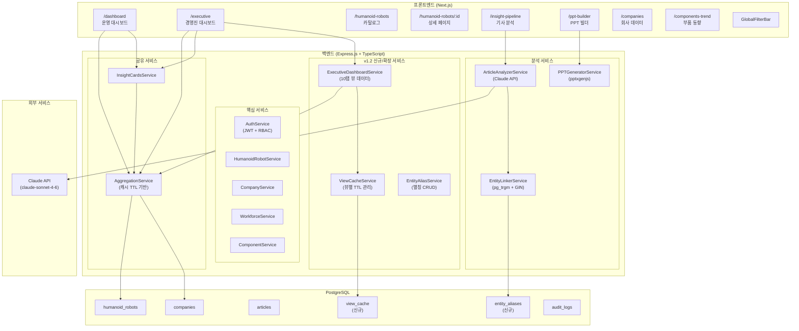
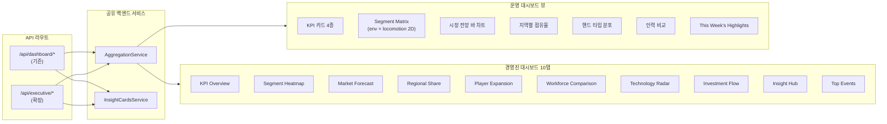
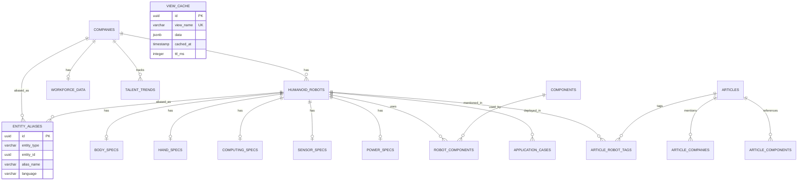

# 설계 문서 — HRI Portal v1.2

## 개요

HRI Portal v1.2는 기존 v1.0/v1.1 코드베이스를 확장하여 경영진 대시보드(REQ-09), 엔티티 별칭 기반 fuzzy 매칭(REQ-05), 뷰별 에러 처리/캐시 전략(REQ-11), 그리고 Segment Matrix 2D 히트맵 + 드릴다운(REQ-04)을 구현합니다.

핵심 설계 원칙:
- 기존 서비스(AggregationService, InsightCardsService, EntityLinkerService 등)를 확장하되 대체하지 않음
- 운영 대시보드(`/dashboard`)와 경영진 대시보드(`/executive`)는 독립 라우트로 공존하며 백엔드 서비스를 공유
- PostgreSQL pg_trgm + GIN 인덱스 기반 fuzzy 매칭으로 기존 Levenshtein 방식 대체
- 뷰별 캐시 TTL 및 폴백 전략을 프론트엔드 React Query + 백엔드 인메모리 캐시로 구현

기술 스택:
- Backend: Express.js + TypeScript + Drizzle ORM + PostgreSQL
- Frontend: Next.js + React 18 + TypeScript + Tailwind CSS + Recharts + React Query
- AI: Claude API (Anthropic) — claude-sonnet-4-6
- PPT: pptxgenjs (Node.js 서버사이드)
- Auth: Custom JWT (allowed_emails 테이블)

## 아키텍처

### 시스템 아키텍처 다이어그램



### 대시보드 공존 아키텍처




## 컴포넌트 및 인터페이스

### 백엔드 서비스 인터페이스

#### 1. EntityAliasService (신규)

Entity_Alias 테이블 CRUD 및 pg_trgm 기반 fuzzy 매칭을 담당합니다.

```typescript
// packages/backend/src/services/entity-alias.service.ts

export interface EntityAlias {
  aliasId: string;
  entityType: 'company' | 'robot';
  entityId: string;
  aliasName: string;
  language: string | null; // 'ko' | 'en' | 'zh' | null
}

export interface FuzzyMatchResult {
  entityId: string;
  entityName: string;
  entityType: 'company' | 'robot';
  matchedAlias: string;
  similarity: number;        // 0.0 ~ 1.0
  isAutoMatch: boolean;       // similarity >= 0.7
  isCandidate: boolean;       // similarity >= 0.4
}

export class EntityAliasService {
  /** pg_trgm similarity() 기반 fuzzy 매칭 */
  async fuzzyMatch(query: string, entityType?: 'company' | 'robot'): Promise<FuzzyMatchResult[]>;
  
  /** 별칭 CRUD */
  async createAlias(alias: Omit<EntityAlias, 'aliasId'>): Promise<EntityAlias>;
  async getAliasesByEntity(entityType: string, entityId: string): Promise<EntityAlias[]>;
  async deleteAlias(aliasId: string): Promise<void>;
  
  /** 벌크 별칭 등록 (시드 데이터용) */
  async bulkCreateAliases(aliases: Omit<EntityAlias, 'aliasId'>[]): Promise<number>;
}
```

#### 2. EntityLinkerService (확장)

기존 Levenshtein 기반에서 pg_trgm + Entity_Alias 테이블 기반으로 확장합니다.

```typescript
// packages/backend/src/services/entity-linker.service.ts (확장)

export interface LinkCandidate {
  entityId: string;
  entityName: string;
  entityType: string;
  similarityScore: number;
  isAutoRecommended: boolean;  // >= 0.7 (기존 0.8에서 변경)
  matchedVia: 'direct' | 'alias';  // 신규: 매칭 경로
  aliasName?: string;               // 신규: 별칭으로 매칭된 경우
}

// 기존 fuzzyMatch() 메서드를 pg_trgm SQL로 대체
// Entity_Alias 테이블도 함께 검색
```

#### 3. ViewCacheService (신규)

뷰별 캐시 TTL 관리 서비스입니다. 기존 AggregationService의 인메모리 캐시를 확장합니다.

```typescript
// packages/backend/src/services/view-cache.service.ts

export interface ViewCacheConfig {
  viewName: string;
  ttlMs: number;
  staleBadge: boolean;     // stale 배지 표시 여부
  fallbackType: 'cache' | 'hide' | 'empty_retry' | 'error_message';
}

export const VIEW_CACHE_CONFIGS: Record<string, ViewCacheConfig> = {
  'kpi_cards':           { viewName: 'kpi_cards',           ttlMs: 3600_000,     staleBadge: true,  fallbackType: 'cache' },
  'segment_matrix':      { viewName: 'segment_matrix',      ttlMs: 86400_000,    staleBadge: false, fallbackType: 'cache' },
  'market_forecast':     { viewName: 'market_forecast',     ttlMs: 604800_000,   staleBadge: false, fallbackType: 'cache' },
  'regional_share':      { viewName: 'regional_share',      ttlMs: 604800_000,   staleBadge: false, fallbackType: 'cache' },
  'workforce_comparison':{ viewName: 'workforce_comparison', ttlMs: 86400_000,    staleBadge: true,  fallbackType: 'cache' },
  'highlights':          { viewName: 'highlights',          ttlMs: 3600_000,     staleBadge: false, fallbackType: 'hide' },
  'scatter_trend':       { viewName: 'scatter_trend',       ttlMs: 86400_000,    staleBadge: false, fallbackType: 'empty_retry' },
  'timeline_trend':      { viewName: 'timeline_trend',      ttlMs: 21600_000,    staleBadge: true,  fallbackType: 'cache' },
  'talent_product':      { viewName: 'talent_product',      ttlMs: 86400_000,    staleBadge: true,  fallbackType: 'cache' },
  'segment_drawer':      { viewName: 'segment_drawer',      ttlMs: 0,            staleBadge: false, fallbackType: 'error_message' },
};

export class ViewCacheService {
  /** 캐시 조회 (TTL 만료 시 stale 데이터 + isStale 플래그 반환) */
  async getOrCompute<T>(viewName: string, compute: () => Promise<T>): Promise<{ data: T; isStale: boolean }>;
  
  /** 캐시 무효화 */
  async invalidate(viewName: string): Promise<void>;
  async invalidateAll(): Promise<void>;
}
```

#### 4. ExecutiveDashboardService (확장)

기존 10개 뷰에 GlobalFilterBar 쿼리 파라미터 지원, TimelineTrendPanel, TalentProductScatterPanel을 추가합니다.

```typescript
// packages/backend/src/services/executive-dashboard.service.ts (확장)

export interface GlobalFilterParams {
  period?: { start: string; end: string };
  region?: string[];
  segment?: string[];  // purpose 필터
}

export interface TimelineTrendData {
  month: string;           // "2024-01"
  eventCount: number;
  cumulativeProducts: number;
}

export interface TalentProductScatterData {
  companyId: string;
  companyName: string;
  workforceSize: number;   // x축
  productCount: number;    // y축
  valuation: number;       // 버블 크기
  region: string;
}

export interface SegmentHeatmapCell {
  environment: string;     // Industrial | Home | Service
  locomotion: string;      // Bipedal | Wheeled | Hybrid
  robotCount: number;
  taskTypeBreakdown?: Record<string, number>;  // 드릴다운용
}

export interface SegmentDrawerData {
  robots: {
    id: string;
    name: string;
    company: string;
    stage: string;
    dof: number | null;
    payload: number | null;
    soc: string | null;
  }[];
  totalCount: number;
}

// 확장 메서드
export class ExecutiveDashboardService {
  // 기존 메서드 유지 + GlobalFilterParams 파라미터 추가
  async getSegmentHeatmap(filters?: GlobalFilterParams): Promise<SegmentHeatmapCell[]>;
  async getTimelineTrend(filters?: GlobalFilterParams): Promise<TimelineTrendData[]>;
  async getTalentProductScatter(filters?: GlobalFilterParams): Promise<TalentProductScatterData[]>;
  async getSegmentDrawerRobots(environment: string, locomotion: string, taskType?: string): Promise<SegmentDrawerData>;
  async getOverviewKPIs(filters?: GlobalFilterParams): Promise<InsightCard[]>;
  // ... 기존 메서드들
}
```

#### 5. ArticleAnalyzerService (확장)

Claude API 호출 시 EntityLinker의 pg_trgm 매칭을 통합합니다.

```typescript
// 기존 ArticleAnalyzerService에 추가되는 인터페이스

export interface AnalysisResult {
  summary: string;
  mentionedCompanies: string[];
  mentionedRobots: string[];
  keyTechnologies: string[];
  marketInsights: string[];
  entityLinks: {
    companies: LinkCandidate[];  // pg_trgm 매칭 결과
    robots: LinkCandidate[];
  };
  contentHash: string;           // SHA-256
  isDuplicate: boolean;
}
```

### 프론트엔드 컴포넌트 구조

#### 경영진 대시보드 (`/executive`)

```typescript
// packages/frontend/src/app/executive/page.tsx

// 탭 구조
type ExecutiveTab = 
  | 'kpi-overview'
  | 'segment-heatmap'
  | 'market-forecast'
  | 'regional-share'
  | 'player-expansion'
  | 'workforce-comparison'
  | 'technology-radar'
  | 'investment-flow'
  | 'insight-hub'
  | 'top-events';

// GlobalFilterBar 상태
interface GlobalFilterState {
  period: { start: Date; end: Date };
  regions: string[];
  segments: string[];
}
```

#### 주요 신규 컴포넌트

```
packages/frontend/src/components/
├── executive/
│   ├── GlobalFilterBar.tsx          # 기간/지역/세그먼트 필터 (탭 간 공유)
│   ├── ExecutiveTabNav.tsx          # 10탭 수평 네비게이션
│   ├── KPIOverviewTab.tsx           # KPI 카드 + 인사이트 요약
│   ├── SegmentHeatmapTab.tsx        # 3D 히트맵 (env × locomotion, task 드릴다운)
│   ├── MarketForecastTab.tsx        # 시장 전망 바 차트
│   ├── RegionalShareTab.tsx         # 지역별 점유율 파이
│   ├── PlayerExpansionTab.tsx       # 플레이어 확장 타임라인
│   ├── WorkforceComparisonTab.tsx   # 인력 비교 차트
│   ├── TechnologyRadarTab.tsx       # 기술 레이더
│   ├── InvestmentFlowTab.tsx        # 투자 흐름
│   ├── InsightHubTab.tsx            # 인사이트 허브
│   ├── TopEventsTab.tsx             # 주요 이벤트
│   ├── TimelineTrendPanel.tsx       # 이중축 차트 (바+라인)
│   ├── TalentProductScatterPanel.tsx # 인력 vs 제품 산점도
│   └── SegmentDetailDrawer.tsx      # 히트맵 셀 드릴다운 드로어
├── dashboard/
│   ├── SegmentMatrix.tsx            # 2D 히트맵 (env × locomotion)
│   ├── GlobalFilterBar.tsx          # 운영 대시보드용 필터바
│   └── ... (기존 컴포넌트)
└── shared/
    ├── StaleBadge.tsx               # "stale" 배지 컴포넌트
    ├── EmptyChartPlaceholder.tsx    # 빈 차트 + 안내 메시지
    ├── RetryButton.tsx              # 재시도 버튼
    └── ErrorFallbackWrapper.tsx     # 뷰별 에러 폴백 래퍼
```

### API 라우트 구조 (v1.2 섹션 5 기반)

#### 경영진 대시보드 API (확장)

| Method | Endpoint | 설명 | 캐시 TTL |
|--------|----------|------|----------|
| GET | `/api/executive/overview` | KPI 카드 + 인사이트 요약 | 1h |
| GET | `/api/executive/segment-heatmap` | env × locomotion 2D 히트맵 | 24h |
| GET | `/api/executive/segment-heatmap/:env/:locomotion/robots` | 셀 드릴다운 (SegmentDetailDrawer) | N/A |
| GET | `/api/executive/timeline-trend` | 월별 이벤트/제품 이중축 | 6h |
| GET | `/api/executive/talent-product-scatter` | 인력 vs 제품 산점도 | 24h |
| GET | `/api/executive/market-forecast` | 시장 전망 (2024~2030) | 7d |
| GET | `/api/executive/regional-share` | 지역별 점유율 | 7d |
| GET | `/api/executive/player-expansion` | 플레이어 확장 추이 | 24h |
| GET | `/api/executive/workforce-comparison` | 인력 비교 | 24h |
| GET | `/api/executive/technology-radar` | 기술 레이더 | 24h |
| GET | `/api/executive/investment-flow` | 투자 흐름 | 7d |
| GET | `/api/executive/insight-hub` | 인사이트 허브 | 1h |
| GET | `/api/executive/top-events` | 주요 이벤트 | 1h |

모든 `/api/executive/*` 엔드포인트는 `?startDate=&endDate=&region=&segment=` 쿼리 파라미터로 GlobalFilterBar 필터를 수신합니다.

#### 엔티티 별칭 API (신규)

| Method | Endpoint | 설명 |
|--------|----------|------|
| GET | `/api/entity-aliases` | 별칭 목록 조회 (entityType, entityId 필터) |
| POST | `/api/entity-aliases` | 별칭 등록 (Admin) |
| DELETE | `/api/entity-aliases/:aliasId` | 별칭 삭제 (Admin) |
| POST | `/api/entity-aliases/bulk` | 벌크 별칭 등록 (Admin) |
| GET | `/api/entity-aliases/fuzzy-match` | pg_trgm fuzzy 매칭 테스트 |


## 데이터 모델

### 신규 테이블

#### Entity_Alias 테이블

다국어 별칭 관리 테이블. pg_trgm GIN 인덱스를 통해 fuzzy 매칭 성능을 최적화합니다.

```typescript
// packages/backend/src/db/schema.ts에 추가

export const entityAliases = pgTable(
  'entity_aliases',
  {
    id: uuid('id').primaryKey().defaultRandom(),
    entityType: varchar('entity_type', { length: 50 }).notNull(), // 'company' | 'robot'
    entityId: uuid('entity_id').notNull(),
    aliasName: varchar('alias_name', { length: 300 }).notNull(),
    language: varchar('language', { length: 5 }), // 'ko' | 'en' | 'zh' | null (전체)
    createdAt: timestamp('created_at').defaultNow().notNull(),
  },
  (table) => ({
    entityIdx: index('entity_aliases_entity_idx').on(table.entityType, table.entityId),
    // GIN 인덱스는 SQL 마이그레이션으로 생성:
    // CREATE INDEX entity_aliases_alias_gin ON entity_aliases USING gin (alias_name gin_trgm_ops);
  })
);
```

SQL 마이그레이션 (pg_trgm 활성화 + GIN 인덱스):

```sql
-- pg_trgm 확장 활성화
CREATE EXTENSION IF NOT EXISTS pg_trgm;

-- Entity_Alias GIN 인덱스
CREATE INDEX entity_aliases_alias_gin ON entity_aliases USING gin (alias_name gin_trgm_ops);

-- 기존 테이블에 GIN 인덱스 추가
CREATE INDEX companies_name_gin ON companies USING gin (name gin_trgm_ops);
CREATE INDEX humanoid_robots_name_gin ON humanoid_robots USING gin (name gin_trgm_ops);
```

#### View_Cache 테이블 (선택적 — 인메모리 캐시 우선)

```typescript
// 인메모리 캐시가 기본이지만, 서버 재시작 시 warm-up을 위한 선택적 영속 캐시

export const viewCache = pgTable(
  'view_cache',
  {
    id: uuid('id').primaryKey().defaultRandom(),
    viewName: varchar('view_name', { length: 100 }).notNull().unique(),
    data: jsonb('data').notNull(),
    cachedAt: timestamp('cached_at').defaultNow().notNull(),
    ttlMs: integer('ttl_ms').notNull(),
  },
  (table) => ({
    viewNameIdx: uniqueIndex('view_cache_view_name_idx').on(table.viewName),
  })
);
```

### 기존 테이블 확장

#### companies 테이블 — valuation 필드 추가

```typescript
// companies 테이블에 valuation_usd 컬럼 추가 (TalentProductScatterPanel용)
// 기존 schema.ts의 companies 정의에 추가:
valuationUsd: decimal('valuation_usd', { precision: 15, scale: 2 }),
```

#### articles 테이블 — submittedBy 관계 강화

기존 `submittedBy` 필드는 이미 존재합니다. `content_hash` UNIQUE 제약도 이미 `uniqueIndex`로 구현되어 있습니다.

### 기존 테이블 관계 추가

```typescript
// entity_aliases Relations
export const entityAliasesRelations = relations(entityAliases, ({ }) => ({
  // entityType에 따라 동적 참조 — 애플리케이션 레벨에서 처리
}));
```

### ER 다이어그램 (v1.2 신규/변경 부분)




## 정확성 속성 (Correctness Properties)

*정확성 속성(Property)은 시스템의 모든 유효한 실행에서 참이어야 하는 특성 또는 동작입니다. 속성은 사람이 읽을 수 있는 명세와 기계가 검증할 수 있는 정확성 보장 사이의 다리 역할을 합니다.*

### Property 1: 역할-권한 매핑 일관성

*For any* 사용자 역할(Admin, Analyst, Viewer)과 *for any* 시스템 액션에 대해, 해당 역할의 허용 액션 집합은 정의된 권한 매트릭스와 정확히 일치해야 한다. Admin은 데이터 입력/수정/태그 관리를 포함하고, Analyst는 리포트 생성/메모 추가를 포함하되 데이터 수정을 제외하며, Viewer는 검색/대시보드 조회만 포함해야 한다.

**Validates: Requirements 1.1, 1.3, 1.4, 1.5**

### Property 2: 허용 이메일 로그인 게이트

*For any* 이메일 주소에 대해, 로그인 성공 여부는 해당 이메일이 allowed_emails 테이블에 존재하는지 여부와 정확히 일치해야 한다. 테이블에 없는 이메일은 항상 로그인이 거부되어야 한다.

**Validates: Requirements 1.2**

### Property 3: 접근 거부 감사 로그

*For any* 사용자와 *for any* 권한 부족 액션 시도에 대해, 시스템은 접근을 거부하고 감사 로그에 사용자 이메일, 시도된 액션, 타임스탬프를 포함하는 레코드를 생성해야 한다.

**Validates: Requirements 1.6, 10.93**

### Property 4: JWT 토큰 만료 검증

*For any* JWT 토큰에 대해, 발급 후 24시간 이내에는 유효하고 24시간 이후에는 무효해야 한다. Refresh 토큰은 14일 이내에는 유효하고 14일 이후에는 무효해야 한다.

**Validates: Requirements 1.7**

### Property 5: 카탈로그 다중 필터 AND 로직

*For any* 필터 조합(purpose, locomotion_type, hand_type, commercialization_stage, region)에 대해, 반환된 모든 로봇은 적용된 모든 필터 조건을 동시에 만족해야 한다. 필터 조건을 만족하지 않는 로봇은 결과에 포함되지 않아야 한다.

**Validates: Requirements 2.8, 2.9, 2.10, 2.11, 2.12, 2.13**

### Property 6: 정렬 순서 정확성

*For any* 로봇 목록과 *for any* 정렬 필드(name, company, release_year, commercialization_stage)에 대해, 반환된 목록은 해당 필드 기준으로 올바르게 정렬되어야 한다. 오름차순 정렬 시 각 요소는 이전 요소보다 크거나 같아야 한다.

**Validates: Requirements 2.15**

### Property 7: Admin 편집 버튼 가시성

*For any* 로봇 상세 페이지 요청에 대해, Admin 역할 사용자에게는 편집 기능이 활성화되고, Analyst/Viewer 역할 사용자에게는 편집 기능이 비활성화되어야 한다.

**Validates: Requirements 3.24**

### Property 8: 관련 기사 정확성

*For any* 로봇에 대해, 반환된 관련 기사 목록의 모든 기사는 article_robot_tags 테이블에서 해당 로봇과 연결되어 있어야 하며, 연결되지 않은 기사는 포함되지 않아야 한다.

**Validates: Requirements 3.25**

### Property 9: 세그먼트 평균 계산 정확성

*For any* 로봇에 대해, 레이더 차트의 세그먼트 평균값은 동일한 purpose + locomotion_type 세그먼트에 속하는 모든 로봇의 해당 메트릭 산술 평균과 일치해야 한다.

**Validates: Requirements 3.26**

### Property 10: Segment Matrix 완전성

*For any* 로봇 데이터셋에 대해, Segment Matrix는 정확히 9개 셀(3 environment × 3 locomotion)을 포함해야 하며, 데이터가 없는 셀도 count=0으로 포함되어야 한다. 각 셀의 로봇 수는 해당 environment와 locomotion_type을 가진 로봇의 실제 수와 일치해야 한다.

**Validates: Requirements 4.27, 4.38, 9.83**

### Property 11: 빈 데이터 상태 표시

*For any* 대시보드 뷰에서 데이터가 0건인 경우, API 응답에는 빈 상태 표시자(emptyState 플래그 또는 메시지)가 포함되어야 하며, 빈 배열만 반환해서는 안 된다.

**Validates: Requirements 4.37**

### Property 12: SegmentDetailDrawer 데이터 정확성

*For any* Segment Matrix 셀 클릭(environment, locomotion 조합)에 대해, SegmentDetailDrawer에 표시되는 모든 로봇은 해당 environment와 locomotion_type을 가져야 하며, 해당 조건을 만족하는 모든 로봇이 포함되어야 한다.

**Validates: Requirements 4.39, 9.84**

### Property 13: AI 분석 결과 구조 무결성

*For any* Claude API 분석 결과에 대해, 반환된 JSON은 반드시 summary(string), mentionedCompanies(string[]), mentionedRobots(string[]), keyTechnologies(string[]), marketInsights(string[]) 키를 포함해야 한다.

**Validates: Requirements 5.42**

### Property 14: Fuzzy 매칭 임계값 정확성

*For any* EntityLinker fuzzy 매칭 결과에 대해, isAutoMatch=true인 항목은 similarity ≥ 0.7이어야 하고, 결과에 포함된 모든 항목은 similarity ≥ 0.4이어야 하며, similarity < 0.4인 항목은 결과에 포함되지 않아야 한다.

**Validates: Requirements 5.43**

### Property 15: Content Hash 결정성 및 중복 방지

*For any* 기사 콘텐츠에 대해, SHA-256 해시 생성은 결정적이어야 한다(동일 콘텐츠 → 동일 해시). 동일한 content_hash를 가진 기사가 이미 존재하면 저장이 거부되어야 하고, 다른 콘텐츠는 다른 해시를 생성해야 한다.

**Validates: Requirements 5.45, 5.46**

### Property 16: 기사 감사 추적 불변성

*For any* 저장된 기사에 대해, submitted_by(사용자 ID)와 submitted_at(타임스탬프) 필드는 반드시 non-null이어야 한다.

**Validates: Requirements 5.47**

### Property 17: 별칭 라운드트립 매칭

*For any* 엔티티와 *for any* 등록된 별칭에 대해, 해당 별칭으로 fuzzy 매칭을 수행하면 원본 엔티티가 결과에 포함되어야 한다. 즉, createAlias(entity, alias) → fuzzyMatch(alias) 결과에 entity가 포함되어야 한다.

**Validates: Requirements 5.49**

### Property 18: PPT 생성 역할 제한

*For any* PPT 생성 요청에 대해, Viewer 역할 사용자는 HTTP 403을 받아야 하고, Analyst 또는 Admin 역할 사용자는 정상적으로 처리되어야 한다.

**Validates: Requirements 6.58**

### Property 19: 회사/인력 데이터 무결성

*For any* 회사 레코드에 대해 name은 non-null이어야 하고, *for any* workforce_data의 job_distribution JSONB에 대해 모든 키는 유효한 직무 카테고리(rd, software, controlAi, mechatronics, operations, business) 집합의 부분집합이어야 한다.

**Validates: Requirements 7.60, 7.61, 7.62**

### Property 20: 인력 데이터 미등록 폴백

*For any* 회사에 대해, workforce_data가 존재하지 않으면 API 응답에 "인력 데이터 미등록" 상태 표시자와 마지막 업데이트 타임스탬프가 포함되어야 하며, 조직 도넛 차트와 트렌드 라인 차트 데이터는 null이어야 한다.

**Validates: Requirements 7.68**

### Property 21: 부품-로봇 연결 정확성

*For any* 부품에 대해, 반환된 연결 로봇 목록은 robot_components 테이블의 해당 component_id 레코드와 정확히 일치해야 한다.

**Validates: Requirements 8.73**

### Property 22: 부품 필터 AND 로직

*For any* 부품 필터 조합(type, vendor, specification range)에 대해, 반환된 모든 부품은 적용된 모든 필터 조건을 동시에 만족해야 한다.

**Validates: Requirements 8.74**

### Property 23: 최소 데이터 포인트 알림

*For any* 산점도 또는 트렌드 차트 데이터에 대해, 데이터 포인트가 3건 미만이면 응답에 minimumDataNotice 플래그가 true로 설정되어야 하고, 3건 이상이면 false여야 한다.

**Validates: Requirements 8.77**

### Property 24: 타임라인 트렌드 집계 정확성

*For any* 기간 범위에 대해, TimelineTrendPanel의 월별 이벤트 수는 해당 월에 발생한 이벤트의 실제 수와 일치해야 하고, 누적 제품 수는 해당 월까지의 제품 발표 누적합과 일치해야 한다.

**Validates: Requirements 9.81**

### Property 25: TalentProduct 산점도 데이터 필터

*For any* TalentProductScatterPanel 데이터에 대해, 포함된 모든 회사는 workforce_data와 최소 1개의 humanoid_robot을 모두 보유해야 한다. 둘 중 하나라도 없는 회사는 산점도에 포함되지 않아야 한다.

**Validates: Requirements 9.82**

### Property 26: 뷰별 폴백 전략 정확성

*For any* 경영진 대시보드 뷰에 대해, 데이터 부족 시 해당 뷰의 정의된 폴백 메시지/동작이 적용되어야 한다. KPI 카드는 "—" + "데이터 수집 중", Segment Matrix는 0 카운트 회색 셀, 시장 전망은 "시장 데이터 업데이트 예정" 등 뷰별 폴백 테이블과 일치해야 한다.

**Validates: Requirements 9.86**

### Property 27: 경영진 대시보드 전 역할 접근

*For any* 인증된 사용자(Viewer, Analyst, Admin)에 대해, `/api/executive/*` 엔드포인트 접근이 허용되어야 한다. 인증되지 않은 사용자는 401을 받아야 한다.

**Validates: Requirements 9.87**

### Property 28: 서명 URL 유효 기간

*For any* PPTX 다운로드 서명 URL에 대해, 생성 후 1시간 이내에는 유효하고 1시간 이후에는 무효해야 한다.

**Validates: Requirements 10.94**

### Property 29: 캐시 폴백 + Stale 배지

*For any* 캐시 가능한 뷰(KPI 카드, Segment Matrix, 시장 전망, 지역 점유율, 인력 비교, TimelineTrend, TalentProduct)에 대해, API/DB 장애 시 마지막 캐시 값이 반환되어야 하며, 캐시 TTL이 만료된 경우 isStale=true 플래그가 포함되어야 한다. 각 뷰의 TTL은 설정된 값(1h, 24h, 7d, 6h 등)과 일치해야 한다.

**Validates: Requirements 11.101, 11.102, 11.103, 11.104, 11.107, 11.108**

### Property 30: 비캐시 폴백 타입

*For any* 비캐시 폴백 뷰에 대해, API/DB 장애 시 올바른 폴백 타입이 적용되어야 한다. Highlights는 섹션 숨김(fallbackType='hide'), 산점도/트렌드 차트는 빈 차트 + 재시도 버튼(fallbackType='empty_retry'), SegmentDetailDrawer는 에러 메시지 + 재시도 버튼(fallbackType='error_message')이어야 한다.

**Validates: Requirements 11.105, 11.106, 11.109**


## 에러 처리

### 뷰별 에러 처리 및 폴백 전략 (v1.2 섹션 8.4)

각 대시보드 뷰는 데이터 부족과 API/DB 장애를 구분하여 처리합니다.

#### 폴백 타입 정의

```typescript
type FallbackType = 'cache' | 'hide' | 'empty_retry' | 'error_message';

interface ViewFallbackConfig {
  viewName: string;
  cacheTtlMs: number;
  staleBadge: boolean;
  fallbackType: FallbackType;
  emptyStateMessage: string;       // 데이터 부족 시 메시지
  errorFallbackMessage?: string;   // API 장애 시 메시지
}
```

#### 뷰별 폴백 매트릭스

| 뷰 | 데이터 부족 시 | API/DB 장애 시 | 캐시 TTL | Stale 배지 |
|----|---------------|---------------|----------|-----------|
| KPI 카드 (4종) | "—" + "데이터 수집 중" | 마지막 캐시 값 + stale 배지 | 1h | ✅ |
| Segment Matrix | 빈 셀 0 + 회색 배경 | 마지막 캐시 매트릭스 | 24h | ❌ |
| 시장 전망 바 차트 | "시장 데이터 업데이트 예정" | 마지막 캐시 차트 | 7d | ❌ |
| 지역별 시장 점유율 | "지역 데이터 미등록" | 마지막 캐시 차트 | 7d | ❌ |
| 인력 비교 차트 | 데이터 있는 기업만 + 미등록 수 | 마지막 캐시 + stale 배지 | 24h | ✅ |
| This Week's Highlights | "이번 주 등록된 뉴스가 없습니다" | 섹션 숨김 | 1h | ❌ |
| 토크 밀도 Scatter | 3건 미만 시 점 + 최소 3건 안내 | 빈 차트 + 재시도 버튼 | 24h | ❌ |
| TOPS 트렌드 라인 | 3건 미만 시 점 + 최소 3건 안내 | 빈 차트 + 재시도 버튼 | 24h | ❌ |
| TimelineTrend 이중축 | "해당 기간 이벤트 없음" | 마지막 캐시 + stale 배지 | 6h | ✅ |
| TalentProduct Scatter | 인력+제품 둘 다 있는 기업만 + 미등록 수 | 마지막 캐시 + stale 배지 | 24h | ✅ |
| SegmentDetail Drawer | "해당 세그먼트에 등록된 로봇이 없습니다" | 에러 메시지 + 재시도 버튼 | N/A | ❌ |

#### 프론트엔드 에러 폴백 구현 패턴

```typescript
// ErrorFallbackWrapper — React Query + ViewCacheConfig 기반

interface ErrorFallbackWrapperProps {
  viewName: string;
  children: React.ReactNode;
  fallbackConfig: ViewFallbackConfig;
}

// React Query의 staleTime, cacheTime을 ViewCacheConfig.cacheTtlMs와 동기화
// onError 콜백에서 fallbackType에 따라:
//   'cache'       → 캐시된 데이터 표시 + StaleBadge
//   'hide'        → children을 렌더링하지 않음
//   'empty_retry' → EmptyChartPlaceholder + RetryButton
//   'error_message' → 에러 메시지 + RetryButton
```

### API 에러 응답 형식

```typescript
interface ApiErrorResponse {
  error: string;
  code: string;           // 'UNAUTHORIZED' | 'FORBIDDEN' | 'NOT_FOUND' | 'DUPLICATE' | 'VALIDATION_ERROR'
  details?: unknown;
  isStale?: boolean;       // 캐시 폴백 시 true
  cachedAt?: string;       // 캐시 데이터의 원본 생성 시각
}
```

### 주요 에러 시나리오

1. **인증 실패**: 401 Unauthorized — JWT 만료 또는 무효
2. **권한 부족**: 403 Forbidden — 역할 기반 접근 거부 + 감사 로그 기록
3. **중복 기사**: 409 Conflict — content_hash 중복 감지
4. **Claude API 타임아웃**: 504 Gateway Timeout — 10초 타임아웃 초과
5. **PPT 생성 타임아웃**: 504 Gateway Timeout — 30초 타임아웃 초과
6. **입력 검증 실패**: 400 Bad Request — 기사 50,000자 초과 등
7. **데이터 미존재**: 404 Not Found — 로봇/회사/기사 ID 미존재

## 테스트 전략

### 이중 테스트 접근법

본 프로젝트는 단위 테스트와 속성 기반 테스트(Property-Based Testing)를 병행합니다.

#### 속성 기반 테스트 (Property-Based Testing)

- **라이브러리**: [fast-check](https://github.com/dubzzz/fast-check) (TypeScript/JavaScript PBT 라이브러리)
- **최소 반복 횟수**: 각 속성 테스트당 100회 이상
- **태그 형식**: `Feature: hri-portal-v1-2, Property {number}: {property_text}`
- **각 정확성 속성은 단일 속성 기반 테스트로 구현**

속성 기반 테스트 대상 (30개 속성):

| 속성 | 테스트 파일 | 생성기 |
|------|-----------|--------|
| P1: 역할-권한 매핑 | `auth.property.test.ts` | `fc.constantFrom('admin', 'analyst', 'viewer')` × `fc.constantFrom(...actions)` |
| P2: 허용 이메일 게이트 | `auth.property.test.ts` | `fc.emailAddress()` |
| P3: 접근 거부 감사 로그 | `auth.property.test.ts` | `fc.record({ role, action, timestamp })` |
| P4: JWT 토큰 만료 | `auth.property.test.ts` | `fc.integer({ min: 0, max: 48 * 3600 })` (초 단위 오프셋) |
| P5: 다중 필터 AND | `catalog.property.test.ts` | `fc.record({ purpose, locomotion, handType, stage, region })` |
| P6: 정렬 순서 | `catalog.property.test.ts` | `fc.array(robotArbitrary)` × `fc.constantFrom('name', 'company', ...)` |
| P7: Admin 편집 가시성 | `robot-detail.property.test.ts` | `fc.constantFrom('admin', 'analyst', 'viewer')` |
| P8: 관련 기사 정확성 | `robot-detail.property.test.ts` | `fc.array(articleTagArbitrary)` |
| P9: 세그먼트 평균 | `robot-detail.property.test.ts` | `fc.array(robotWithSpecsArbitrary)` |
| P10: Matrix 완전성 | `segment-matrix.property.test.ts` | `fc.array(robotArbitrary)` |
| P11: 빈 데이터 상태 | `dashboard.property.test.ts` | `fc.constantFrom(...viewNames)` |
| P12: Drawer 데이터 | `segment-matrix.property.test.ts` | `fc.record({ environment, locomotion })` × `fc.array(robotArbitrary)` |
| P13: 분석 결과 구조 | `article-analyzer.property.test.ts` | `fc.record({ summary, companies, robots, ... })` |
| P14: Fuzzy 임계값 | `entity-linker.property.test.ts` | `fc.float({ min: 0, max: 1 })` |
| P15: Content Hash | `deduplication.property.test.ts` | `fc.string({ minLength: 1, maxLength: 50000 })` |
| P16: 감사 추적 | `article.property.test.ts` | `fc.record({ userId, content })` |
| P17: 별칭 라운드트립 | `entity-alias.property.test.ts` | `fc.record({ entityType, entityId, aliasName })` |
| P18: PPT 역할 제한 | `ppt.property.test.ts` | `fc.constantFrom('admin', 'analyst', 'viewer')` |
| P19: 데이터 무결성 | `company.property.test.ts` | `fc.record({ name, jobDistribution })` |
| P20: 인력 미등록 폴백 | `workforce.property.test.ts` | `fc.option(workforceDataArbitrary)` |
| P21: 부품-로봇 연결 | `component.property.test.ts` | `fc.array(robotComponentArbitrary)` |
| P22: 부품 필터 AND | `component.property.test.ts` | `fc.record({ type, vendor, specRange })` |
| P23: 최소 데이터 알림 | `chart.property.test.ts` | `fc.array(dataPointArbitrary, { minLength: 0, maxLength: 5 })` |
| P24: 타임라인 집계 | `executive.property.test.ts` | `fc.array(eventArbitrary)` |
| P25: TalentProduct 필터 | `executive.property.test.ts` | `fc.array(companyWithOptionalDataArbitrary)` |
| P26: 뷰별 폴백 | `fallback.property.test.ts` | `fc.constantFrom(...viewNames)` × `fc.boolean()` (데이터 존재 여부) |
| P27: 전 역할 접근 | `executive.property.test.ts` | `fc.constantFrom('admin', 'analyst', 'viewer')` |
| P28: 서명 URL 유효 | `ppt.property.test.ts` | `fc.integer({ min: 0, max: 7200 })` (초 단위 오프셋) |
| P29: 캐시 폴백 stale | `cache.property.test.ts` | `fc.constantFrom(...cacheableViews)` × `fc.integer()` (경과 시간) |
| P30: 비캐시 폴백 | `cache.property.test.ts` | `fc.constantFrom('highlights', 'scatter_trend', 'segment_drawer')` |

#### 단위 테스트

단위 테스트는 속성 테스트가 커버하지 않는 구체적 예시, 엣지 케이스, 통합 포인트에 집중합니다.

주요 단위 테스트 대상:
- Claude API 응답 파싱 (모킹된 응답으로 구조 검증)
- pptxgenjs 슬라이드 생성 (특정 슬라이드 타입별 출력 검증)
- pg_trgm SQL 쿼리 생성 (특정 입력에 대한 SQL 출력 검증)
- GlobalFilterBar 상태 관리 (React Testing Library)
- 탭 네비게이션 상태 유지 (React Testing Library)
- 기사 50,000자 초과 입력 거부 (엣지 케이스)
- 빈 문자열/null 입력 처리 (엣지 케이스)
- JWT 토큰 갱신 플로우 (통합 테스트)

#### 테스트 파일 구조

```
packages/backend/src/__tests__/
├── property/
│   ├── auth.property.test.ts
│   ├── catalog.property.test.ts
│   ├── robot-detail.property.test.ts
│   ├── segment-matrix.property.test.ts
│   ├── dashboard.property.test.ts
│   ├── article-analyzer.property.test.ts
│   ├── entity-linker.property.test.ts
│   ├── entity-alias.property.test.ts
│   ├── deduplication.property.test.ts
│   ├── article.property.test.ts
│   ├── ppt.property.test.ts
│   ├── company.property.test.ts
│   ├── workforce.property.test.ts
│   ├── component.property.test.ts
│   ├── chart.property.test.ts
│   ├── executive.property.test.ts
│   ├── fallback.property.test.ts
│   └── cache.property.test.ts
├── unit/
│   ├── claude-api.test.ts
│   ├── ppt-generator.test.ts
│   ├── entity-linker-sql.test.ts
│   └── view-cache.test.ts
```

#### 테스트 실행 설정

```typescript
// vitest.config.ts 속성 테스트 설정
// fast-check 기본 설정: numRuns: 100, seed: 자동
// 태그 예시:
// Feature: hri-portal-v1-2, Property 5: 카탈로그 다중 필터 AND 로직
```
