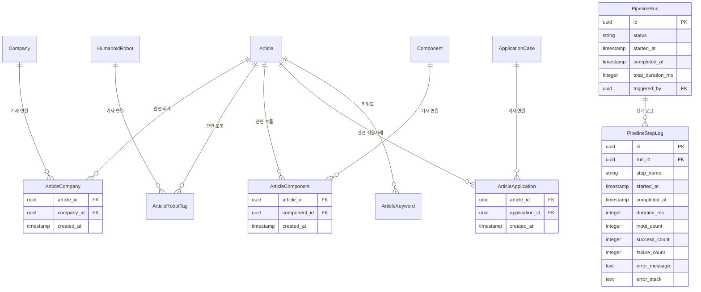

# 설계 문서: HRIP 분석 파이프라인

## 개요

HRIP 분석 파이프라인은 기사 입력·분석 파이프라인(A)과 경영진 관점 대시보드 뷰(B) 두 축으로 구성됩니다.

**A. 기사 입력·분석 파이프라인**은 기사 원문 → 파싱 → 엔티티 링킹 → DB 저장 → 집계 → 인사이트 생성의 단계적 흐름을 따릅니다. 기존 `ArticleAnalyzerService`를 확장하여 EntityLinker, ValidationRulesEngine, AggregationService, InsightCardsGenerator, MonthlyBriefGenerator를 추가합니다.

**B. 경영진 대시보드 뷰**는 기존 `DashboardService`를 확장하여 10개의 전략적 질문에 답하는 시각화 뷰를 제공합니다. 각 뷰는 독립적인 API 엔드포인트와 React 컴포넌트로 구현됩니다.

기존 코드베이스의 패턴(Express.js 라우트 → 서비스 → Drizzle ORM, React Query + Recharts 프론트엔드)을 그대로 따릅니다.

## 아키텍처


### 파이프라인 흐름


## 컴포넌트 및 인터페이스

### 1. ArticleParser 서비스

```typescript
// packages/backend/src/services/article-parser.service.ts

interface ParseOptions {
  companies: boolean;
  products: boolean;
  components: boolean;
  applications: boolean;
  keywords: boolean;
  summary: boolean;
}

interface ParsedEntity {
  name: string;
  type: 'company' | 'product' | 'component' | 'application' | 'keyword';
  confidence: number; // 0.0 ~ 1.0
  context: string;    // 원문에서 추출된 문맥
}

interface ParseResult {
  companies: ParsedEntity[];
  products: ParsedEntity[];
  components: ParsedEntity[];
  applications: ParsedEntity[];
  keywords: { term: string; relevance: number }[];
  summary: string;
  detectedLanguage: string;
}

class ArticleParserService {
  async parse(rawText: string, lang?: string, options?: Partial<ParseOptions>): Promise<ParseResult>;
  detectLanguage(text: string): string;
  private buildPrompt(text: string, lang: string, options: ParseOptions): string;
  private parseAIResponse(response: string): ParseResult;
}
```

### 2. EntityLinker 서비스

```typescript
// packages/backend/src/services/entity-linker.service.ts

interface LinkCandidate {
  entityId: string;
  entityName: string;
  entityType: string;
  similarityScore: number; // 0.0 ~ 1.0
  isAutoRecommended: boolean; // score >= 0.8
}

interface LinkRequest {
  parsedEntities: ParsedEntity[];
}

interface LinkResult {
  candidates: Record<string, LinkCandidate[]>; // key: parsedEntity.name
  unmatched: ParsedEntity[];
}

interface LinkConfirmation {
  links: { parsedName: string; linkedEntityId: string }[];
  newEntities: { name: string; type: string; metadata?: Record<string, unknown> }[];
}

class EntityLinkerService {
  async findCandidates(entities: ParsedEntity[]): Promise<LinkResult>;
  async confirmLinks(confirmation: LinkConfirmation): Promise<{ linkedCount: number; createdCount: number }>;
  private fuzzyMatch(name: string, type: string): Promise<LinkCandidate[]>;
  private calculateSimilarity(a: string, b: string): number;
}
```

### 3. ArticleToDBWriter 서비스

```typescript
// packages/backend/src/services/article-db-writer.service.ts

interface ArticleSaveRequest {
  title: string;
  publishedAt?: Date;
  url?: string;
  summary: string;
  contentHash: string;
  linkedCompanyIds: string[];
  linkedRobotIds: string[];
  linkedComponentIds: string[];
  linkedApplicationIds: string[];
  keywords: { term: string; relevance: number }[];
}

interface SaveResult {
  articleId: string;
  linkedEntities: {
    companies: number;
    robots: number;
    components: number;
    applications: number;
    keywords: number;
  };
  isNew: boolean;
}

class ArticleToDBWriterService {
  async save(request: ArticleSaveRequest, submittedBy: string): Promise<SaveResult>;
  async checkDuplicate(contentHash: string): Promise<boolean>;
  private saveInTransaction(request: ArticleSaveRequest, submittedBy: string): Promise<SaveResult>;
}
```

### 4. ValidationRulesEngine 서비스

```typescript
// packages/backend/src/services/validation-rules.service.ts

interface ValidationIssue {
  field: string;
  value: unknown;
  rule: string;
  message: string;
}

interface ValidationResult {
  isValid: boolean;
  errors: ValidationIssue[];
  warnings: ValidationIssue[];
}

type EntityData = Record<string, unknown>;

class ValidationRulesEngine {
  validate(entityType: string, data: EntityData): ValidationResult;
  validateYear(value: number): ValidationIssue | null;
  validateTops(value: number): ValidationIssue | null;
  validateTorque(value: number): ValidationIssue | null;
  validateHumanoidCompleteness(data: EntityData): ValidationIssue[];
}
```

### 5. AggregationService

```typescript
// packages/backend/src/services/aggregation.service.ts

interface SegmentAggregation {
  environment: string;
  task: string;
  locomotion: string;
  robotCount: number;
  caseCount: number;
}

interface YearlyAggregation {
  year: number;
  launches: number;
  applications: number;
  investmentEvents: number;
}

interface ComponentAggregation {
  componentId: string;
  componentName: string;
  componentType: string;
  adoptionCount: number;
  avgPerformance: Record<string, number>;
}

interface KeywordAggregation {
  keywordId: string;
  term: string;
  articleCount: number;
  deltaPercent: number;
}

class AggregationService {
  async getSegmentAggregation(): Promise<SegmentAggregation[]>;
  async getYearlyAggregation(): Promise<YearlyAggregation[]>;
  async getComponentAggregation(): Promise<ComponentAggregation[]>;
  async getKeywordAggregation(period: 'week' | 'month'): Promise<KeywordAggregation[]>;
  private getCachedOrCompute<T>(key: string, compute: () => Promise<T>, ttlMs?: number): Promise<T>;
}
```

### 6. InsightCardsGenerator 서비스

```typescript
// packages/backend/src/services/insight-cards.service.ts

interface InsightCard {
  id: string;
  title: string;
  value: string | number;
  description: string;
  trend?: 'up' | 'down' | 'stable';
  trendValue?: string;
}

class InsightCardsGenerator {
  async generateCards(): Promise<InsightCard[]>;
  private async generateWithLLM(aggregationData: Record<string, unknown>): Promise<InsightCard[]>;
  private generateFallbackCards(aggregationData: Record<string, unknown>): InsightCard[];
}
```

### 7. MonthlyBriefGenerator 서비스

```typescript
// packages/backend/src/services/monthly-brief.service.ts

interface MonthlyBriefResult {
  markdown: string;
  pptxBuffer: Buffer;
  generatedAt: Date;
  period: { start: Date; end: Date };
}

class MonthlyBriefGenerator {
  async generate(aggregationJson: Record<string, unknown>): Promise<MonthlyBriefResult>;
  private async generateMarkdown(data: Record<string, unknown>): Promise<string>;
  private async generatePptx(markdown: string, data: Record<string, unknown>): Promise<Buffer>;
  private generateFallbackMarkdown(data: Record<string, unknown>): string;
}
```

### 8. ExecutiveDashboardService

```typescript
// packages/backend/src/services/executive-dashboard.service.ts

// 뷰 1: 세그먼트 히트맵
interface SegmentHeatmapData {
  matrix: { env: string; task: string; locomotion: string; count: number; robots: { id: string; name: string }[] }[];
  maxCount: number;
}

// 뷰 2: 상용화 전환
interface CommercializationData {
  conversionRates: { from: string; to: string; rate: number }[];
  avgDurationByEnv: { environment: string; avgMonths: number }[];
}

// 뷰 3: 플레이어 확장 추이
interface PlayerExpansionData {
  companies: {
    companyId: string;
    companyName: string;
    timeline: { date: string; event: string; type: string }[];
    workforceTrend: { year: number; headcount: number }[];
    portfolioMap: { purpose: string; stage: string; count: number }[];
  }[];
}

// 뷰 4: 가격·성능 트렌드
interface PricePerformanceData {
  priceBands: { year: number; min: number; max: number; median: number }[];
  performanceTrends: {
    metric: string;
    data: { year: number; avg: number; min: number; max: number }[];
  }[];
}

// 뷰 5: 부품 채택 트렌드
interface ComponentTrendData {
  adoptionTrends: { componentType: string; data: { year: number; count: number }[] }[];
  correlations: { x: string; y: string; points: { xVal: number; yVal: number; label: string }[] }[];
}

// 뷰 6: 키워드 포지션 맵
interface KeywordPositionData {
  positions: { keyword: string; frequency: number; growthRate: number; category: string }[];
  risingTop10: { keyword: string; growthRate: number }[];
  decliningTop10: { keyword: string; growthRate: number }[];
}

// 뷰 7: 산업별 도입 현황
interface IndustryAdoptionData {
  industries: {
    industry: string;
    totalCases: number;
    stageDistribution: Record<string, number>;
    topCases: { robotName: string; task: string; status: string }[];
  }[];
}

// 뷰 8: 지역별 경쟁 구도
interface RegionalCompetitionData {
  regions: {
    region: string;
    companyCount: number;
    productCount: number;
    caseCount: number;
    topPlayers: { name: string; productCount: number }[];
  }[];
}

// 뷰 9: 핵심 기술 축
interface TechAxisData {
  bubbles: { keyword: string; articleCount: number; productCount: number; category: string }[];
  trendLines: { keyword: string; data: { year: number; count: number }[] }[];
}

// 뷰 10: Top 10 이벤트
interface TopEventsData {
  events: {
    id: string;
    title: string;
    date: string;
    relatedCompany: string;
    relatedRobot?: string;
    importanceScore: number;
    type: string;
    summary: string;
  }[];
  period: { start: string; end: string };
}

class ExecutiveDashboardService {
  async getSegmentHeatmap(): Promise<SegmentHeatmapData>;
  async getCommercializationAnalysis(): Promise<CommercializationData>;
  async getPlayerExpansion(companyIds?: string[]): Promise<PlayerExpansionData>;
  async getPricePerformanceTrend(): Promise<PricePerformanceData>;
  async getComponentTrend(): Promise<ComponentTrendData>;
  async getKeywordPositionMap(): Promise<KeywordPositionData>;
  async getIndustryAdoption(): Promise<IndustryAdoptionData>;
  async getRegionalCompetition(): Promise<RegionalCompetitionData>;
  async getTechAxis(): Promise<TechAxisData>;
  async getTopEvents(period: 'month' | 'quarter' | '6months'): Promise<TopEventsData>;
}
```

### 9. PipelineLogger

```typescript
// packages/backend/src/services/pipeline-logger.service.ts

interface PipelineStepLog {
  stepName: string;
  startedAt: Date;
  completedAt?: Date;
  durationMs?: number;
  inputCount: number;
  successCount: number;
  failureCount: number;
  error?: { message: string; stack?: string };
}

interface PipelineRunSummary {
  runId: string;
  startedAt: Date;
  completedAt: Date;
  totalDurationMs: number;
  steps: PipelineStepLog[];
  status: 'success' | 'partial_failure' | 'failure';
}

class PipelineLogger {
  startRun(): string; // returns runId
  startStep(runId: string, stepName: string, inputCount: number): void;
  completeStep(runId: string, stepName: string, successCount: number, failureCount: number): void;
  failStep(runId: string, stepName: string, error: Error): void;
  getSummary(runId: string): PipelineRunSummary;
}
```

### 10. 프론트엔드 컴포넌트 구조

```
packages/frontend/src/
├── app/
│   ├── analysis/           # 기사 분석 파이프라인 페이지
│   │   └── page.tsx
│   ├── review/             # 신규 엔티티 검토 대시보드
│   │   └── page.tsx
│   ├── executive/          # 경영진 대시보드 (10개 뷰)
│   │   └── page.tsx
│   └── brief/              # 월간 브리프 페이지
│       └── page.tsx
├── components/
│   ├── analysis/
│   │   ├── ArticleInputPanel.tsx      # 좌측: 원문 입력 + 옵션
│   │   ├── AnalysisResultPanel.tsx    # 우측: 결과 표시
│   │   ├── EntityLinkingPanel.tsx     # 엔티티 링킹 UI
│   │   └── SaveConfirmDialog.tsx      # 저장 확인 다이얼로그
│   ├── review/
│   │   ├── EntityReviewTable.tsx      # 엔티티 검토 테이블
│   │   └── ValidationWarnings.tsx     # 검증 경고 표시
│   └── executive/
│       ├── SegmentHeatmap.tsx         # 뷰 1
│       ├── CommercializationChart.tsx # 뷰 2
│       ├── PlayerExpansion.tsx        # 뷰 3
│       ├── PricePerformance.tsx       # 뷰 4
│       ├── ComponentTrend.tsx         # 뷰 5
│       ├── KeywordPositionMap.tsx     # 뷰 6
│       ├── IndustryAdoption.tsx       # 뷰 7
│       ├── RegionalCompetition.tsx    # 뷰 8
│       ├── TechAxis.tsx              # 뷰 9
│       └── TopEvents.tsx             # 뷰 10
```

## 데이터 모델

### 신규 테이블

기존 스키마를 확장하여 기사-엔티티 관계 테이블과 파이프라인 로그 테이블을 추가합니다.



### Drizzle 스키마 추가

```typescript
// 기사-회사 관계 테이블
export const articleCompanies = pgTable('article_companies', {
  articleId: uuid('article_id').notNull().references(() => articles.id, { onDelete: 'cascade' }),
  companyId: uuid('company_id').notNull().references(() => companies.id, { onDelete: 'cascade' }),
  createdAt: timestamp('created_at').defaultNow().notNull(),
}, (table) => ({
  pk: uniqueIndex('article_companies_pk').on(table.articleId, table.companyId),
}));

// 기사-부품 관계 테이블
export const articleComponents = pgTable('article_components', {
  articleId: uuid('article_id').notNull().references(() => articles.id, { onDelete: 'cascade' }),
  componentId: uuid('component_id').notNull().references(() => components.id, { onDelete: 'cascade' }),
  createdAt: timestamp('created_at').defaultNow().notNull(),
}, (table) => ({
  pk: uniqueIndex('article_components_pk').on(table.articleId, table.componentId),
}));

// 기사-적용사례 관계 테이블
export const articleApplications = pgTable('article_applications', {
  articleId: uuid('article_id').notNull().references(() => articles.id, { onDelete: 'cascade' }),
  applicationId: uuid('application_id').notNull().references(() => applicationCases.id, { onDelete: 'cascade' }),
  createdAt: timestamp('created_at').defaultNow().notNull(),
}, (table) => ({
  pk: uniqueIndex('article_applications_pk').on(table.articleId, table.applicationId),
}));

// 파이프라인 실행 로그
export const pipelineRuns = pgTable('pipeline_runs', {
  id: uuid('id').primaryKey().defaultRandom(),
  status: varchar('status', { length: 50 }).notNull().default('running'),
  startedAt: timestamp('started_at').defaultNow().notNull(),
  completedAt: timestamp('completed_at'),
  totalDurationMs: integer('total_duration_ms'),
  triggeredBy: uuid('triggered_by').references(() => users.id, { onDelete: 'set null' }),
});

// 파이프라인 단계 로그
export const pipelineStepLogs = pgTable('pipeline_step_logs', {
  id: uuid('id').primaryKey().defaultRandom(),
  runId: uuid('run_id').notNull().references(() => pipelineRuns.id, { onDelete: 'cascade' }),
  stepName: varchar('step_name', { length: 100 }).notNull(),
  startedAt: timestamp('started_at').defaultNow().notNull(),
  completedAt: timestamp('completed_at'),
  durationMs: integer('duration_ms'),
  inputCount: integer('input_count').default(0),
  successCount: integer('success_count').default(0),
  failureCount: integer('failure_count').default(0),
  errorMessage: text('error_message'),
  errorStack: text('error_stack'),
});
```

### API 라우트 구조

```typescript
// packages/backend/src/routes/analysis.ts
router.post('/parse', authMiddleware, analysisController.parse);
router.post('/link', authMiddleware, analysisController.link);
router.post('/save', authMiddleware, analysisController.save);
router.post('/validate', authMiddleware, analysisController.validate);

// packages/backend/src/routes/aggregation.ts
router.get('/segment', authMiddleware, aggregationController.getSegment);
router.get('/yearly', authMiddleware, aggregationController.getYearly);
router.get('/component', authMiddleware, aggregationController.getComponent);
router.get('/keyword', authMiddleware, aggregationController.getKeyword);

// packages/backend/src/routes/insights.ts
router.get('/cards', authMiddleware, insightsController.getCards);
router.post('/monthly-brief', authMiddleware, insightsController.generateBrief);

// packages/backend/src/routes/executive.ts
router.get('/segment-heatmap', authMiddleware, executiveController.getSegmentHeatmap);
router.get('/commercialization', authMiddleware, executiveController.getCommercialization);
router.get('/player-expansion', authMiddleware, executiveController.getPlayerExpansion);
router.get('/price-performance', authMiddleware, executiveController.getPricePerformance);
router.get('/component-trend', authMiddleware, executiveController.getComponentTrend);
router.get('/keyword-position', authMiddleware, executiveController.getKeywordPosition);
router.get('/industry-adoption', authMiddleware, executiveController.getIndustryAdoption);
router.get('/regional-competition', authMiddleware, executiveController.getRegionalCompetition);
router.get('/tech-axis', authMiddleware, executiveController.getTechAxis);
router.get('/top-events', authMiddleware, executiveController.getTopEvents);

// packages/backend/src/routes/review.ts
router.get('/entities', authMiddleware, reviewController.getEntities);
```


## 정확성 속성 (Correctness Properties)

*속성(property)은 시스템의 모든 유효한 실행에서 참이어야 하는 특성 또는 동작입니다. 속성은 사람이 읽을 수 있는 명세와 기계가 검증할 수 있는 정확성 보장 사이의 다리 역할을 합니다.*

### Property 1: 파서 출력 스키마 일관성

*For any* 유효한 입력 텍스트(한국어 또는 영어)에 대해, ArticleParser는 companies[], products[], components[], applications[], keywords[], summary 필드를 모두 포함하는 ParseResult를 반환해야 하며, 모든 추출된 엔티티의 confidence 값은 0.0 이상 1.0 이하여야 한다.

**Validates: Requirements 2.1, 2.3, 2.5**

### Property 2: 빈 입력 거부

*For any* 빈 문자열 또는 최소 길이 미만의 문자열에 대해, ArticleParser는 유효성 검증 오류를 반환해야 하며 ParseResult를 반환하지 않아야 한다.

**Validates: Requirements 2.4**

### Property 3: 언어 자동 감지 정확성

*For any* 한국어 또는 영어 텍스트에 대해, lang 파라미터 없이 ArticleParser를 호출하면 detectedLanguage 필드가 실제 언어와 일치해야 한다.

**Validates: Requirements 2.2**

### Property 4: 엔티티 링킹 후보 제약

*For any* 파싱된 엔티티 목록에 대해, EntityLinker가 반환하는 각 엔티티의 후보 수는 5개 이하이고, 각 후보의 similarityScore는 0.0~1.0 범위이며, score >= 0.8인 후보만 isAutoRecommended가 true여야 한다.

**Validates: Requirements 3.1, 3.2, 3.3**

### Property 5: 미매칭 엔티티 분류

*For any* 파싱된 엔티티 중 DB에 유사한 레코드가 없는 엔티티는 LinkResult.unmatched 배열에 포함되어야 한다.

**Validates: Requirements 3.5**

### Property 6: 타입별 독립 매칭

*For any* 엔티티 링킹 결과에서, company 타입 엔티티의 후보는 companies 테이블에서만, product 타입은 humanoidRobots에서만, component 타입은 components에서만 조회되어야 한다.

**Validates: Requirements 3.6**

### Property 7: 기사 저장 라운드트립

*For any* 유효한 ArticleSaveRequest에 대해, 저장 후 반환된 articleId로 조회하면 동일한 제목, URL, 요약을 가진 기사가 존재해야 하며, 연결된 엔티티 수가 SaveResult의 linkedEntities 카운트와 일치해야 한다.

**Validates: Requirements 4.1, 4.2, 4.5**

### Property 8: 중복 기사 거부

*For any* 이미 저장된 기사의 contentHash와 동일한 hash를 가진 저장 요청에 대해, ArticleToDBWriter는 저장을 거부하고 isNew: false를 반환해야 한다.

**Validates: Requirements 4.3**

### Property 9: 트랜잭션 원자성

*For any* 저장 과정에서 관계 테이블 삽입 중 오류가 발생하면, 기사 레코드와 모든 관계 레코드가 롤백되어 DB에 부분 데이터가 남지 않아야 한다.

**Validates: Requirements 4.4**

### Property 10: 검증 규칙 범위 체크

*For any* 숫자 값에 대해, ValidationRulesEngine은 연도는 [1990, 2035], TOPS는 [0.1, 10000], 토크는 [0.01, 5000] 범위 내일 때만 통과시키고, 범위 밖이면 오류를 반환해야 한다.

**Validates: Requirements 6.1, 6.2, 6.3**

### Property 11: 휴머노이드 필수 필드 경고

*For any* 휴머노이드 로봇 엔티티에서 locomotion_type 또는 hand_type이 null이거나 빈 문자열이면, ValidationRulesEngine은 warnings 배열에 해당 경고를 포함해야 한다.

**Validates: Requirements 6.4, 6.5**

### Property 12: 검증 결과 구조 및 저장 차단 규칙

*For any* ValidationResult에 대해, errors 배열이 비어있지 않으면 저장이 차단되어야 하고, errors가 비어있고 warnings만 있으면 저장이 허용되어야 한다.

**Validates: Requirements 6.6, 6.7, 6.8**

### Property 13: 세그먼트 집계 정합성

*For any* 데이터셋에 대해, 세그먼트별 로봇 수의 합은 전체 로봇 수와 일치해야 하며, 각 세그먼트의 caseCount는 해당 세그먼트에 속하는 실제 적용 사례 수와 일치해야 한다.

**Validates: Requirements 7.1**

### Property 14: 집계 캐시 멱등성

*For any* 집계 요청에 대해, 데이터 변경 없이 동일한 요청을 두 번 호출하면 동일한 결과를 반환해야 한다.

**Validates: Requirements 7.5**

### Property 15: 인사이트 카드 최소 개수 및 폴백

*For any* 집계 데이터 입력에 대해, InsightCardsGenerator는 최소 4개의 카드를 반환해야 하며, LLM 실패 시에도 폴백 카드가 4개 이상 생성되어야 한다.

**Validates: Requirements 8.3, 8.4**

### Property 16: 월간 브리프 생성 완전성

*For any* 유효한 집계 JSON 입력에 대해, MonthlyBriefGenerator는 비어있지 않은 Markdown 문자열과 유효한 PPTX Buffer를 모두 반환해야 하며, LLM 실패 시에도 템플릿 기반 브리프가 생성되어야 한다.

**Validates: Requirements 9.1, 9.2, 9.5**

### Property 17: 파이프라인 로깅 완전성

*For any* 파이프라인 실행에 대해, 모든 단계의 로그에는 startedAt, completedAt(또는 error), inputCount, successCount, failureCount가 기록되어야 하며, 실행 요약의 totalDurationMs는 각 단계 durationMs의 합 이상이어야 한다.

**Validates: Requirements 10.1, 10.3, 10.4**

### Property 18: 엔티티 검토 필수 필드 감지

*For any* 필수 필드가 누락된 엔티티에 대해, NewEntitiesReviewDashboard API는 해당 엔티티를 "필수 필드 누락" 경고와 함께 반환해야 한다.

**Validates: Requirements 5.2, 5.4**

### Property 19: 상용화 전환율 범위

*For any* 전환율 데이터에 대해, 각 전환율(rate)은 0.0 이상 1.0 이하여야 하며, 평균 전환 기간(avgMonths)은 0 이상이어야 한다.

**Validates: Requirements 12.1, 12.2**

### Property 20: 가격 밴드 정합성

*For any* 가격 밴드 데이터에 대해, 각 연도의 min <= median <= max 관계가 성립해야 한다.

**Validates: Requirements 14.1**

### Property 21: 키워드 포지션 맵 분류 정확성

*For any* 키워드 포지션 데이터에 대해, risingTop10의 모든 키워드는 growthRate > 0이어야 하고, decliningTop10의 모든 키워드는 growthRate < 0이어야 하며, 각 리스트는 최대 10개여야 한다.

**Validates: Requirements 16.1, 16.3**

### Property 22: 지역별 집계 정합성

*For any* 지역별 경쟁 구도 데이터에 대해, 모든 지역의 companyCount 합은 전체 회사 수와 일치해야 한다.

**Validates: Requirements 18.1**

### Property 23: Top 10 이벤트 정렬 및 완전성

*For any* Top 10 이벤트 결과에 대해, 이벤트는 importanceScore 내림차순으로 정렬되어야 하고, 최대 10개이며, 각 이벤트에는 title, date, relatedCompany, importanceScore 필드가 존재해야 한다.

**Validates: Requirements 20.1, 20.2**

## 에러 처리

### 파이프라인 에러 처리 전략

| 단계 | 에러 유형 | 처리 방식 |
|------|----------|----------|
| ArticleParser | LLM API 타임아웃/실패 | 재시도 1회 후 실패 시 기본 키워드 추출(regex 기반) 폴백 |
| ArticleParser | 빈 입력/최소 길이 미만 | 즉시 ValidationError 반환 |
| EntityLinker | DB 연결 실패 | 에러 로그 후 빈 후보 리스트 반환 |
| EntityLinker | fuzzy 매칭 타임아웃 | 정확 매칭(exact match)으로 폴백 |
| ArticleToDBWriter | 중복 content_hash | DuplicateError 반환, 저장 거부 |
| ArticleToDBWriter | 트랜잭션 실패 | 전체 롤백, TransactionError 반환 |
| ValidationRulesEngine | 알 수 없는 엔티티 타입 | 경고 로그 후 빈 ValidationResult 반환 |
| AggregationService | 캐시 미스 + 쿼리 실패 | 에러 로그 후 빈 집계 결과 반환 |
| InsightCardsGenerator | LLM API 실패 | 숫자 기반 폴백 카드 생성 |
| MonthlyBriefGenerator | LLM API 실패 | 템플릿 기반 브리프 생성 |
| MonthlyBriefGenerator | PPTX 생성 실패 | Markdown만 반환, PPTX 에러 로그 |
| ExecutiveDashboard | 데이터 부족 | "데이터 부족" 메시지와 함께 빈 차트 반환 |

### 공통 에러 응답 형식

```typescript
interface ApiError {
  code: string;
  message: string;
  details?: Record<string, unknown>;
  timestamp: string;
}
```

## 테스팅 전략

### 이중 테스팅 접근법

**단위 테스트 (Unit Tests)**:
- 특정 예제, 엣지 케이스, 에러 조건 검증
- 각 서비스의 핵심 메서드별 테스트
- Vitest 사용 (기존 프로젝트 설정 활용)

**속성 기반 테스트 (Property-Based Tests)**:
- 모든 유효한 입력에 대한 보편적 속성 검증
- fast-check 라이브러리 사용
- 각 테스트 최소 100회 반복 실행
- 각 테스트에 설계 문서 속성 번호 태그 부착

### 테스트 태그 형식

```
Feature: hrip-analysis-pipeline, Property {number}: {property_text}
```

### 테스트 범위

| 컴포넌트 | 단위 테스트 | 속성 기반 테스트 |
|---------|-----------|---------------|
| ArticleParser | 특정 기사 파싱 예제, LLM 폴백 | Property 1, 2, 3 |
| EntityLinker | 정확 매칭 예제, 빈 DB 케이스 | Property 4, 5, 6 |
| ArticleToDBWriter | 저장/조회 예제, 중복 거부 | Property 7, 8, 9 |
| ValidationRulesEngine | 경계값 테스트 | Property 10, 11, 12 |
| AggregationService | 빈 데이터 집계 | Property 13, 14 |
| InsightCardsGenerator | LLM 성공/실패 예제 | Property 15 |
| MonthlyBriefGenerator | 브리프 생성 예제 | Property 16 |
| PipelineLogger | 로그 기록 예제 | Property 17 |
| NewEntitiesReview API | 필터링 예제 | Property 18 |
| ExecutiveDashboard | 각 뷰 데이터 구조 예제 | Property 19, 20, 21, 22, 23 |
