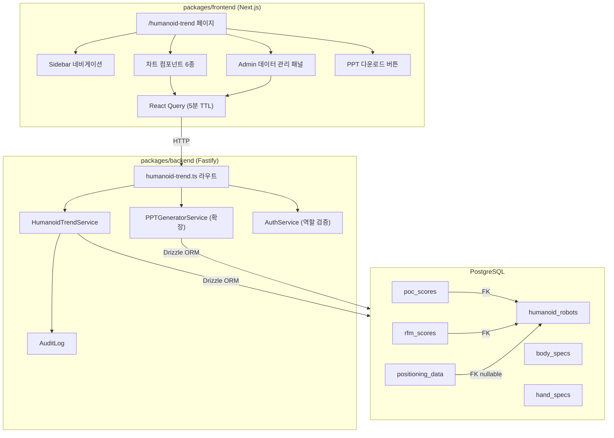
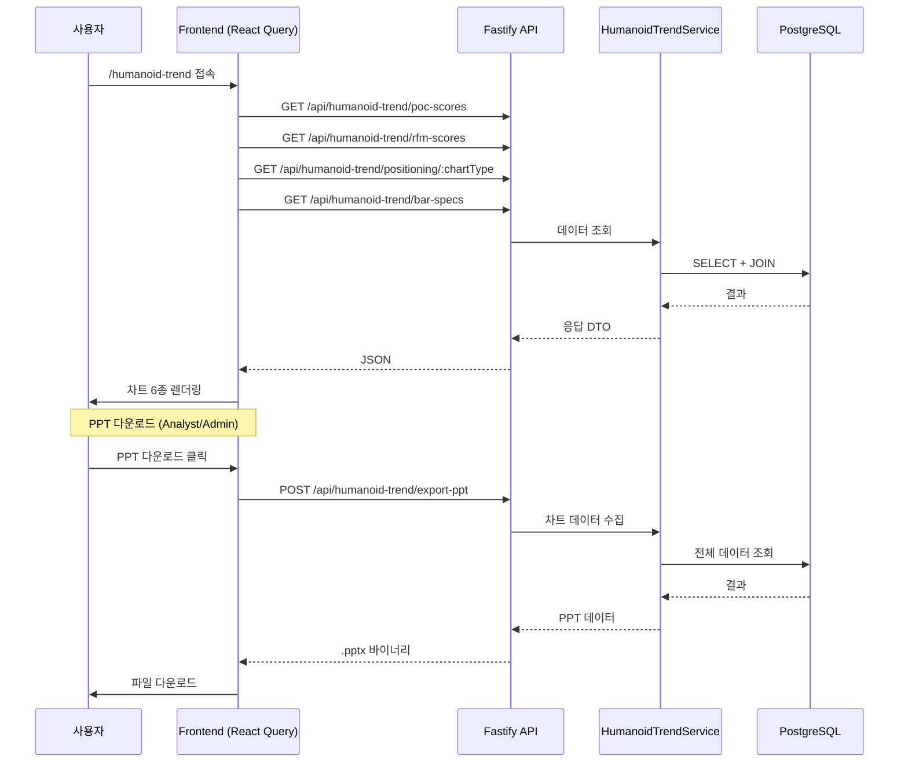

# 설계 문서 — 휴머노이드 동향 대시보드

## 개요

휴머노이드 동향 대시보드는 HRI Portal 내 `/humanoid-trend` 경로에 위치하는 전용 페이지로, 휴머노이드 로봇 산업의 경쟁 인텔리전스 차트 6종을 웹에서 시각화하고 PPT 리포트로 다운로드할 수 있는 기능이다.

기존 모노레포 구조(packages/frontend — Next.js, packages/backend — Fastify)를 따르며, 데이터 레이어는 Drizzle ORM + PostgreSQL, 차트는 Recharts, PPT 생성은 기존 `ppt-generator.service.ts`를 확장하여 구현한다.

### 핵심 설계 결정

1. **신규 테이블 3개 추가**: `poc_scores`, `rfm_scores`, `positioning_data` — 기존 `humanoid_robots` 테이블에 FK로 연결
2. **단일 서비스 클래스**: `HumanoidTrendService` — 6종 차트 데이터 조회 + Admin CRUD를 하나의 서비스로 통합
3. **PPT 확장**: 기존 `PPTGeneratorService`에 `humanoid_trend` 템플릿을 추가하여 차트 이미지 기반 슬라이드 생성
4. **React Query 캐싱**: 5분 TTL로 트렌드 데이터 캐싱, Admin 변경 시 optimistic update + invalidation

## 아키텍처

### 시스템 구성도



### 데이터 흐름




## 컴포넌트 및 인터페이스

### 백엔드 컴포넌트

#### 1. 라우트: `packages/backend/src/routes/humanoid-trend.ts`

기존 라우트 패턴(Fastify plugin)을 따르며, `/api/humanoid-trend` 프리픽스로 등록한다.

| 메서드 | 경로 | 역할 제한 | 설명 |
|--------|------|-----------|------|
| GET | `/poc-scores` | 인증 사용자 | PoC 점수 전체 조회 (로봇/회사명 JOIN) |
| GET | `/rfm-scores` | 인증 사용자 | RFM 점수 전체 조회 (로봇/회사명 JOIN) |
| GET | `/positioning/:chartType` | 인증 사용자 | 차트 타입별 포지셔닝 데이터 조회 |
| GET | `/bar-specs` | 인증 사용자 | 바 차트용 집계 데이터 (body_specs, hand_specs, poc_scores JOIN) |
| POST | `/poc-scores` | Admin | PoC 점수 생성 |
| PUT | `/poc-scores/:id` | Admin | PoC 점수 수정 |
| DELETE | `/poc-scores/:id` | Admin | PoC 점수 삭제 |
| POST | `/rfm-scores` | Admin | RFM 점수 생성 |
| PUT | `/rfm-scores/:id` | Admin | RFM 점수 수정 |
| DELETE | `/rfm-scores/:id` | Admin | RFM 점수 삭제 |
| POST | `/positioning` | Admin | 포지셔닝 데이터 생성 |
| PUT | `/positioning/:id` | Admin | 포지셔닝 데이터 수정 |
| DELETE | `/positioning/:id` | Admin | 포지셔닝 데이터 삭제 |
| POST | `/export-ppt` | Analyst, Admin | PPT 리포트 생성 및 다운로드 |

#### 2. 서비스: `packages/backend/src/services/humanoid-trend.service.ts`

```typescript
interface PocScoreDto {
  robotId: string;
  payloadScore: number;      // 1–10
  operationTimeScore: number; // 1–10
  fingerDofScore: number;     // 1–10
  formFactorScore: number;    // 1–10
  pocDeploymentScore: number; // 1–10
  costEfficiencyScore: number;// 1–10
}

interface RfmScoreDto {
  robotId: string;
  rfmModelName: string;
  generalityScore: number;       // 1–5
  realWorldDataScore: number;    // 1–5
  edgeInferenceScore: number;    // 1–5
  multiRobotCollabScore: number; // 1–5
  openSourceScore: number;       // 1–5
  commercialMaturityScore: number;// 1–5
}

interface PositioningDataDto {
  chartType: 'rfm_competitiveness' | 'poc_positioning' | 'soc_ecosystem';
  robotId?: string;
  label: string;
  xValue: number;
  yValue: number;
  bubbleSize: number;
  colorGroup: string;
  metadata?: Record<string, unknown>;
}

class HumanoidTrendService {
  // 조회
  async getPocScores(): Promise<PocScoreWithRobot[]>;
  async getRfmScores(): Promise<RfmScoreWithRobot[]>;
  async getPositioningData(chartType: string): Promise<PositioningDataWithRobot[]>;
  async getBarSpecs(): Promise<BarSpecData[]>;

  // CRUD (Admin)
  async createPocScore(data: PocScoreDto): Promise<PocScore>;
  async updatePocScore(id: string, data: Partial<PocScoreDto>): Promise<PocScore>;
  async deletePocScore(id: string): Promise<void>;
  async createRfmScore(data: RfmScoreDto): Promise<RfmScore>;
  async updateRfmScore(id: string, data: Partial<RfmScoreDto>): Promise<RfmScore>;
  async deleteRfmScore(id: string): Promise<void>;
  async createPositioningData(data: PositioningDataDto): Promise<PositioningData>;
  async updatePositioningData(id: string, data: Partial<PositioningDataDto>): Promise<PositioningData>;
  async deletePositioningData(id: string): Promise<void>;

  // 유효성 검증
  private validatePocScores(data: PocScoreDto): void; // 1–10 범위 검증
  private validateRfmScores(data: RfmScoreDto): void; // 1–5 범위 검증
}
```

#### 3. PPT 확장: `PPTGeneratorService`

기존 `PPTGeneratorService`에 `humanoid_trend` 템플릿을 추가한다. 차트 이미지는 서버사이드에서 테이블 기반 데이터 슬라이드로 대체하고, 프론트엔드에서 차트 캡처 이미지를 base64로 전송하는 하이브리드 방식을 사용한다.

```typescript
// PPTGenerationOptions.template에 'humanoid_trend' 추가
type PPTTemplate = 'market_overview' | 'company_deep_dive' | 'tech_components' | 'use_case' | 'humanoid_trend';

// 신규 메서드
private async addHumanoidTrendSlides(pptx: PptxGenJS, options: PPTGenerationOptions, theme: ThemeColors): Promise<void>;
```

슬라이드 구성:
1. 타이틀 슬라이드: "휴머노이드 동향 리포트" + 생성일 + Portal 로고
2. 산업용 PoC 팩터별 역량 비교 (레이더 차트 데이터 테이블)
3. RFM 역량 비교 (오버레이 레이더 차트 데이터 테이블)
4. RFM 경쟁력 포지셔닝 맵 (버블 차트 데이터 테이블)
5. 산업용 PoC 로봇 포지셔닝 맵 (버블 차트 데이터 테이블)
6. TOPS × SoC 에코시스템 포지셔닝 맵 (버블 차트 데이터 테이블)
7. 산업 배치 핵심 스펙 비교 (바 차트 데이터 테이블)

프론트엔드에서 차트 이미지를 캡처하여 POST body에 base64 이미지 배열로 전송하면, 서버에서 해당 이미지를 슬라이드에 삽입한다. 이미지가 없는 경우 데이터 테이블로 폴백한다.

### 프론트엔드 컴포넌트

#### 1. 페이지: `packages/frontend/src/app/humanoid-trend/page.tsx`

단일 페이지에 6개 차트 섹션을 수직 스크롤 레이아웃으로 배치한다. 상단에 sticky 섹션 네비게이션 바를 제공한다.

#### 2. 차트 컴포넌트 (packages/frontend/src/components/humanoid-trend/)

| 컴포넌트 | 차트 타입 | Recharts 컴포넌트 |
|----------|-----------|-------------------|
| `PocRadarSection.tsx` | 개별 레이더 차트 그리드 | `RadarChart`, `Radar`, `PolarGrid` |
| `RfmOverlayRadar.tsx` | 오버레이 레이더 차트 | `RadarChart`, `Radar` (다중 시리즈) |
| `RfmBubbleChart.tsx` | RFM 경쟁력 버블 차트 | `ScatterChart`, `Scatter`, `ZAxis` |
| `PocBubbleChart.tsx` | PoC 포지셔닝 버블 차트 | `ScatterChart`, `Scatter`, `ZAxis` |
| `SocBubbleChart.tsx` | SoC 에코시스템 버블 차트 | `ScatterChart`, `Scatter`, `ZAxis` |
| `SpecBarCharts.tsx` | 바 차트 4종 (2×2 그리드) | `BarChart`, `Bar` |
| `SectionNav.tsx` | 섹션 네비게이션 바 | 순수 HTML/CSS |
| `AdminDataPanel.tsx` | Admin CRUD 패널 (모달/드로어) | Form + Table |
| `PptDownloadButton.tsx` | PPT 다운로드 버튼 | Button + 로딩 상태 |

#### 3. API 클라이언트 확장: `packages/frontend/src/lib/api.ts`

```typescript
// ApiClient 클래스에 추가할 메서드
async getHumanoidTrendPocScores(): Promise<PocScoreWithRobot[]>;
async getHumanoidTrendRfmScores(): Promise<RfmScoreWithRobot[]>;
async getHumanoidTrendPositioning(chartType: string): Promise<PositioningDataWithRobot[]>;
async getHumanoidTrendBarSpecs(): Promise<BarSpecData[]>;
async createPocScore(data: PocScoreDto): Promise<PocScore>;
async updatePocScore(id: string, data: Partial<PocScoreDto>): Promise<PocScore>;
async deletePocScore(id: string): Promise<void>;
async createRfmScore(data: RfmScoreDto): Promise<RfmScore>;
async updateRfmScore(id: string, data: Partial<RfmScoreDto>): Promise<RfmScore>;
async deleteRfmScore(id: string): Promise<void>;
async createPositioningData(data: PositioningDataDto): Promise<PositioningData>;
async updatePositioningData(id: string, data: Partial<PositioningDataDto>): Promise<PositioningData>;
async deletePositioningData(id: string): Promise<void>;
async exportHumanoidTrendPpt(options: { theme: string; chartImages?: string[] }): Promise<Blob>;
```

#### 4. React Query 훅: `packages/frontend/src/hooks/useHumanoidTrend.ts`

```typescript
// 데이터 조회 훅 (5분 TTL)
export function usePocScores();
export function useRfmScores();
export function usePositioningData(chartType: string);
export function useBarSpecs();

// Admin 뮤테이션 훅 (optimistic update)
export function useCreatePocScore();
export function useUpdatePocScore();
export function useDeletePocScore();
// ... RFM, Positioning 동일 패턴
```

#### 5. Sidebar 네비게이션 추가

`packages/frontend/src/components/layout/Sidebar.tsx`의 `navigationGroups` 배열에서 '분석' 그룹에 항목 추가:

```typescript
{
  title: '분석',
  items: [
    { name: '분석 대시보드', href: '/dashboard', icon: BarChart3 },
    { name: '휴머노이드 동향', href: '/humanoid-trend', icon: TrendingUp }, // 신규
  ],
}
```


## 데이터 모델

### 신규 테이블 (Drizzle ORM 스키마)

기존 `packages/backend/src/db/schema.ts`에 추가한다.

#### poc_scores 테이블

```typescript
export const pocScores = pgTable(
  'poc_scores',
  {
    id: uuid('id').primaryKey().defaultRandom(),
    robotId: uuid('robot_id')
      .notNull()
      .references(() => humanoidRobots.id, { onDelete: 'cascade' }),
    payloadScore: integer('payload_score').notNull(),         // 1–10
    operationTimeScore: integer('operation_time_score').notNull(), // 1–10
    fingerDofScore: integer('finger_dof_score').notNull(),    // 1–10
    formFactorScore: integer('form_factor_score').notNull(),  // 1–10
    pocDeploymentScore: integer('poc_deployment_score').notNull(), // 1–10
    costEfficiencyScore: integer('cost_efficiency_score').notNull(), // 1–10
    evaluatedAt: timestamp('evaluated_at').defaultNow().notNull(),
    createdAt: timestamp('created_at').defaultNow().notNull(),
    updatedAt: timestamp('updated_at').defaultNow().notNull(),
  },
  (table) => ({
    robotIdx: index('poc_scores_robot_idx').on(table.robotId),
  })
);
```

#### rfm_scores 테이블

```typescript
export const rfmScores = pgTable(
  'rfm_scores',
  {
    id: uuid('id').primaryKey().defaultRandom(),
    robotId: uuid('robot_id')
      .notNull()
      .references(() => humanoidRobots.id, { onDelete: 'cascade' }),
    rfmModelName: varchar('rfm_model_name', { length: 255 }).notNull(),
    generalityScore: integer('generality_score').notNull(),        // 1–5
    realWorldDataScore: integer('real_world_data_score').notNull(), // 1–5
    edgeInferenceScore: integer('edge_inference_score').notNull(),  // 1–5
    multiRobotCollabScore: integer('multi_robot_collab_score').notNull(), // 1–5
    openSourceScore: integer('open_source_score').notNull(),       // 1–5
    commercialMaturityScore: integer('commercial_maturity_score').notNull(), // 1–5
    evaluatedAt: timestamp('evaluated_at').defaultNow().notNull(),
    createdAt: timestamp('created_at').defaultNow().notNull(),
    updatedAt: timestamp('updated_at').defaultNow().notNull(),
  },
  (table) => ({
    robotIdx: index('rfm_scores_robot_idx').on(table.robotId),
  })
);
```

#### positioning_data 테이블

```typescript
export const positioningData = pgTable(
  'positioning_data',
  {
    id: uuid('id').primaryKey().defaultRandom(),
    chartType: varchar('chart_type', { length: 50 }).notNull(), // 'rfm_competitiveness' | 'poc_positioning' | 'soc_ecosystem'
    robotId: uuid('robot_id')
      .references(() => humanoidRobots.id, { onDelete: 'cascade' }),
    label: varchar('label', { length: 255 }).notNull(),
    xValue: decimal('x_value', { precision: 10, scale: 4 }).notNull(),
    yValue: decimal('y_value', { precision: 10, scale: 4 }).notNull(),
    bubbleSize: decimal('bubble_size', { precision: 10, scale: 4 }).notNull(),
    colorGroup: varchar('color_group', { length: 50 }),
    metadata: jsonb('metadata').$type<Record<string, unknown>>(),
    evaluatedAt: timestamp('evaluated_at').defaultNow().notNull(),
    createdAt: timestamp('created_at').defaultNow().notNull(),
    updatedAt: timestamp('updated_at').defaultNow().notNull(),
  },
  (table) => ({
    robotIdx: index('positioning_data_robot_idx').on(table.robotId),
    chartTypeIdx: index('positioning_data_chart_type_idx').on(table.chartType),
  })
);
```

### Relations 추가

```typescript
// humanoidRobotsRelations에 추가
pocScores: many(pocScores),
rfmScores: many(rfmScores),
positioningData: many(positioningData),

// 신규 Relations
export const pocScoresRelations = relations(pocScores, ({ one }) => ({
  robot: one(humanoidRobots, {
    fields: [pocScores.robotId],
    references: [humanoidRobots.id],
  }),
}));

export const rfmScoresRelations = relations(rfmScores, ({ one }) => ({
  robot: one(humanoidRobots, {
    fields: [rfmScores.robotId],
    references: [humanoidRobots.id],
  }),
}));

export const positioningDataRelations = relations(positioningData, ({ one }) => ({
  robot: one(humanoidRobots, {
    fields: [positioningData.robotId],
    references: [humanoidRobots.id],
  }),
}));
```

### 바 차트 데이터 조회 (JOIN 쿼리)

바 차트 데이터는 별도 테이블 없이 기존 `body_specs`, `hand_specs`, `poc_scores` 테이블을 JOIN하여 집계한다:

```sql
SELECT
  hr.id, hr.name AS robot_name, c.name AS company_name,
  bs.payload_kg, bs.operation_time_hours,
  hs.hand_dof,
  ps.poc_deployment_score
FROM humanoid_robots hr
JOIN companies c ON hr.company_id = c.id
LEFT JOIN body_specs bs ON hr.id = bs.robot_id
LEFT JOIN hand_specs hs ON hr.id = hs.robot_id
LEFT JOIN poc_scores ps ON hr.id = ps.robot_id
WHERE bs.payload_kg IS NOT NULL
   OR bs.operation_time_hours IS NOT NULL
   OR hs.hand_dof IS NOT NULL
   OR ps.poc_deployment_score IS NOT NULL;
```

### 응답 DTO 타입

```typescript
interface PocScoreWithRobot {
  id: string;
  robotId: string;
  robotName: string;
  companyName: string;
  payloadScore: number;
  operationTimeScore: number;
  fingerDofScore: number;
  formFactorScore: number;
  pocDeploymentScore: number;
  costEfficiencyScore: number;
  averageScore: number; // 6개 팩터 산술 평균 (소수점 1자리)
  evaluatedAt: string;
}

interface RfmScoreWithRobot {
  id: string;
  robotId: string;
  robotName: string;
  companyName: string;
  rfmModelName: string;
  generalityScore: number;
  realWorldDataScore: number;
  edgeInferenceScore: number;
  multiRobotCollabScore: number;
  openSourceScore: number;
  commercialMaturityScore: number;
  evaluatedAt: string;
}

interface PositioningDataWithRobot {
  id: string;
  chartType: string;
  robotId: string | null;
  robotName: string | null;
  label: string;
  xValue: number;
  yValue: number;
  bubbleSize: number;
  colorGroup: string | null;
  metadata: Record<string, unknown> | null;
  evaluatedAt: string;
}

interface BarSpecData {
  robotId: string;
  robotName: string;
  companyName: string;
  payloadKg: number | null;
  operationTimeHours: number | null;
  handDof: number | null;
  pocDeploymentScore: number | null;
}
```


## 정확성 속성 (Correctness Properties)

*속성(Property)은 시스템의 모든 유효한 실행에서 참이어야 하는 특성 또는 동작입니다. 속성은 사람이 읽을 수 있는 명세와 기계가 검증할 수 있는 정확성 보장 사이의 다리 역할을 합니다.*

### Property 1: 데이터 저장 라운드트립

*For any* 유효한 PoC_Score, RFM_Score, 또는 Positioning_Data 엔티티를 생성(create)한 후 조회(read)하면, 반환된 엔티티의 모든 필드 값이 입력 값과 동일해야 한다.

**Validates: Requirements 1.1, 1.2, 1.3**

### Property 2: CASCADE 삭제 전파

*For any* humanoid_robot이 연관된 PoC_Score, RFM_Score, Positioning_Data 레코드를 가지고 있을 때, 해당 로봇을 삭제하면 연관된 모든 레코드도 함께 삭제되어야 한다.

**Validates: Requirements 1.4**

### Property 3: PoC 평균 점수 계산

*For any* 6개의 PoC 팩터 점수(각각 1–10 범위의 정수)에 대해, 평균 점수는 6개 값의 산술 평균을 소수점 1자리로 반올림한 값과 동일해야 한다.

**Validates: Requirements 2.7**

### Property 4: 로봇 색상 일관성

*For any* 로봇 ID에 대해, 색상 할당 함수는 호출 시점이나 차트 타입에 관계없이 항상 동일한 색상을 반환해야 한다. 또한 국가 코드 기반 색상 매핑에서 US는 blue, CN은 orange, KR은 pink/red를 반환해야 한다.

**Validates: Requirements 2.10, 6.26, 7.32**

### Property 5: 고유 색상 할당

*For any* N개의 서로 다른 로봇/RFM 모델(N ≤ 10)에 대해, 오버레이 레이더 차트에서 할당된 색상은 모두 서로 달라야 한다.

**Validates: Requirements 3.12**

### Property 6: 역할 기반 접근 제어

*For any* 사용자 역할과 API 엔드포인트 조합에 대해: (1) Viewer/Analyst/Admin 모두 GET 엔드포인트에 접근 가능해야 하고, (2) Admin만 POST/PUT/DELETE 엔드포인트에 접근 가능해야 하며, (3) Analyst와 Admin만 PPT export 엔드포인트에 접근 가능해야 하고, (4) 권한 없는 요청은 HTTP 403을 반환해야 한다.

**Validates: Requirements 8.41, 9.42, 9.50, 11.62, 11.63**

### Property 7: 점수 범위 유효성 검증

*For any* PoC 점수 값이 1–10 범위 밖이거나 RFM 점수 값이 1–5 범위 밖이거나 chart_type이 허용된 enum 값('rfm_competitiveness', 'poc_positioning', 'soc_ecosystem') 밖인 경우, API는 해당 요청을 거부하고 유효 범위를 포함한 검증 오류를 반환해야 한다.

**Validates: Requirements 10.52, 10.53, 10.54, 10.55**

### Property 8: 감사 로그 기록

*For any* Admin의 데이터 생성/수정/삭제 작업 후, 감사 로그에 admin 이메일, 작업 유형(create/update/delete), 엔티티 타입, 타임스탬프가 포함된 레코드가 존재해야 한다.

**Validates: Requirements 10.56**

### Property 9: API 응답에 JOIN 데이터 포함

*For any* PoC_Score 또는 RFM_Score 레코드가 데이터베이스에 존재할 때, GET API 응답의 모든 레코드에는 robotName과 companyName 필드가 비어있지 않은 문자열로 포함되어야 한다.

**Validates: Requirements 11.58, 11.59**

### Property 10: 포지셔닝 데이터 차트 타입 필터링

*For any* chartType 파라미터로 GET /api/humanoid-trend/positioning/:chartType를 호출하면, 반환된 모든 레코드의 chartType 필드가 요청한 chartType과 동일해야 한다.

**Validates: Requirements 11.60**

### Property 11: 바 차트 데이터 정합성

*For any* 로봇이 body_specs, hand_specs, poc_scores 중 하나 이상의 데이터를 가지고 있을 때, bar-specs API 응답에 해당 로봇이 포함되어야 하며, 각 필드 값은 원본 테이블의 값과 일치해야 한다. 모든 스펙이 NULL인 로봇은 응답에 포함되지 않아야 한다.

**Validates: Requirements 7.34, 11.61**

### Property 12: PPT 슬라이드 구조

*For any* 유효한 차트 데이터가 존재할 때 PPT를 생성하면, 생성된 파일에는 타이틀 슬라이드 1개와 차트 슬라이드 6개(총 7개 이상)가 포함되어야 하며, 차트 슬라이드의 제목은 지정된 6개 섹션명("산업용 PoC 팩터별 역량 비교", "RFM 역량 비교", "RFM 경쟁력 포지셔닝 맵", "산업용 PoC 로봇 포지셔닝 맵", "TOPS × SoC 에코시스템 포지셔닝 맵", "산업 배치 핵심 스펙 비교")과 일치해야 한다.

**Validates: Requirements 9.43, 9.46**

### Property 13: PPT 테마 적용

*For any* 테마 옵션('dark' 또는 'light')으로 PPT를 생성하면, 생성된 슬라이드의 배경색이 해당 테마의 배경색과 일치해야 한다.

**Validates: Requirements 9.48**


## 오류 처리

### API 오류 응답 구조

모든 API 오류는 일관된 구조로 반환한다:

```typescript
interface ApiErrorResponse {
  error: {
    code: string;        // 예: 'VALIDATION_ERROR', 'NOT_FOUND', 'FORBIDDEN', 'INTERNAL_ERROR'
    message: string;     // 사용자 친화적 메시지
    details?: unknown;   // 유효성 검증 오류 시 필드별 상세 정보
  };
}
```

### 오류 시나리오별 처리

| 시나리오 | HTTP 상태 | 코드 | 처리 |
|----------|-----------|------|------|
| 점수 범위 초과 (PoC 1–10, RFM 1–5) | 400 | `VALIDATION_ERROR` | 유효 범위 안내 메시지 반환 |
| 잘못된 chart_type enum | 400 | `VALIDATION_ERROR` | 허용 값 목록 반환 |
| 존재하지 않는 robot_id FK | 400 | `INVALID_REFERENCE` | "해당 로봇이 존재하지 않습니다" 반환 |
| 존재하지 않는 레코드 수정/삭제 | 404 | `NOT_FOUND` | "해당 레코드를 찾을 수 없습니다" 반환 |
| 권한 없는 Admin 작업 | 403 | `FORBIDDEN` | 역할별 안내 메시지 반환 |
| Viewer의 PPT 다운로드 시도 | 403 | `FORBIDDEN` | "리포트 다운로드는 Analyst 이상 권한이 필요합니다" 반환 |
| 데이터베이스 오류 | 500 | `INTERNAL_ERROR` | 일반 오류 메시지 반환 + 서버 로그 기록 |
| PPT 생성 실패 | 500 | `PPT_GENERATION_ERROR` | 오류 메시지 + 재시도 안내 + 타임스탬프/이메일 로그 |

### 프론트엔드 오류 처리

- React Query의 `onError` 콜백으로 toast 알림 표시
- PPT 생성 실패 시 재시도 버튼 제공
- Optimistic update 실패 시 자동 롤백 + 오류 toast
- 네트워크 오류 시 React Query의 자동 재시도 (3회)

### 데이터 부족 시 UI 처리

각 차트 섹션에서 데이터가 부족한 경우:
- PoC 레이더: 로봇별 데이터 없으면 "PoC 평가 데이터 미등록" 플레이스홀더 카드
- RFM 레이더: 2개 미만 시 "비교를 위해 최소 2개 이상의 RFM 데이터가 필요합니다" 안내
- 버블 차트 3종: 2개 미만 시 "포지셔닝 비교를 위해 최소 2개 이상의 데이터가 필요합니다" 안내
- 바 차트: 2개 미만 시 "비교를 위해 최소 2개 이상의 로봇 데이터가 필요합니다" 안내

## 테스트 전략

### 속성 기반 테스트 (Property-Based Testing)

라이브러리: **fast-check** (TypeScript용 PBT 라이브러리)

각 정확성 속성을 단일 property-based 테스트로 구현한다. 최소 100회 반복 실행한다.

```typescript
// 테스트 태그 형식
// Feature: humanoid-trend-dashboard, Property {N}: {property_text}
```

| Property | 테스트 파일 | 설명 |
|----------|------------|------|
| Property 1 | `humanoid-trend.service.test.ts` | 3개 엔티티 타입의 create → read 라운드트립 |
| Property 2 | `humanoid-trend.service.test.ts` | 로봇 삭제 시 CASCADE 전파 검증 |
| Property 3 | `poc-average.test.ts` | 6개 점수의 산술 평균 계산 정확성 |
| Property 4 | `color-utils.test.ts` | 로봇 ID → 색상 매핑 일관성 + 국가 색상 매핑 |
| Property 5 | `color-utils.test.ts` | N개 로봇의 고유 색상 할당 |
| Property 6 | `humanoid-trend.routes.test.ts` | 역할 × 엔드포인트 접근 제어 매트릭스 |
| Property 7 | `humanoid-trend.service.test.ts` | 범위 밖 점수 거부 + enum 검증 |
| Property 8 | `humanoid-trend.service.test.ts` | CRUD 후 감사 로그 존재 검증 |
| Property 9 | `humanoid-trend.routes.test.ts` | GET 응답의 JOIN 데이터 포함 검증 |
| Property 10 | `humanoid-trend.routes.test.ts` | chartType 필터링 정확성 |
| Property 11 | `humanoid-trend.service.test.ts` | bar-specs 데이터 정합성 |
| Property 12 | `ppt-generator.test.ts` | PPT 슬라이드 수 및 제목 검증 |
| Property 13 | `ppt-generator.test.ts` | PPT 테마 배경색 검증 |

### 단위 테스트 (Unit Tests)

단위 테스트는 특정 예제, 엣지 케이스, 오류 조건에 집중한다:

- **엣지 케이스**: 데이터 2개 미만 시 안내 메시지 표시 (Requirements 3.15, 4.20, 5.24, 6.29, 7.35)
- **예제 테스트**: /humanoid-trend 라우트 존재 확인 (8.36), 사이드바 네비게이션 링크 확인 (8.37)
- **예제 테스트**: PPT 타이틀 슬라이드 내용 확인 (9.45)
- **예제 테스트**: PPT 생성 실패 시 오류 로그 확인 (9.49)
- **예제 테스트**: Admin 버튼 표시 확인 (10.51)
- **예제 테스트**: DB 오류 시 HTTP 500 구조 확인 (11.64)
- **예제 테스트**: React Query 5분 TTL 설정 확인 (12.69)

### 테스트 구성

```
packages/backend/src/services/__tests__/
  humanoid-trend.service.test.ts    # Property 1, 2, 7, 8, 11
  poc-average.test.ts               # Property 3
  ppt-generator.test.ts             # Property 12, 13

packages/backend/src/routes/__tests__/
  humanoid-trend.routes.test.ts     # Property 6, 9, 10

packages/frontend/src/components/humanoid-trend/__tests__/
  color-utils.test.ts               # Property 4, 5
  chart-sections.test.ts            # 엣지 케이스 (데이터 부족 안내)
  page.test.ts                      # 라우트, 네비게이션, Admin 버튼 예제
```

### PBT 설정

```typescript
import fc from 'fast-check';

// 최소 100회 반복
const PBT_NUM_RUNS = 100;

// 예시: Property 3 — PoC 평균 점수 계산
// Feature: humanoid-trend-dashboard, Property 3: PoC 평균 점수 계산
test('Property 3: PoC 평균 점수 계산', () => {
  fc.assert(
    fc.property(
      fc.integer({ min: 1, max: 10 }),
      fc.integer({ min: 1, max: 10 }),
      fc.integer({ min: 1, max: 10 }),
      fc.integer({ min: 1, max: 10 }),
      fc.integer({ min: 1, max: 10 }),
      fc.integer({ min: 1, max: 10 }),
      (a, b, c, d, e, f) => {
        const expected = Math.round(((a + b + c + d + e + f) / 6) * 10) / 10;
        const result = computePocAverage(a, b, c, d, e, f);
        expect(result).toBe(expected);
      }
    ),
    { numRuns: PBT_NUM_RUNS }
  );
});
```
