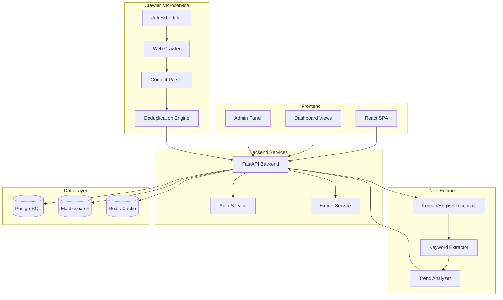
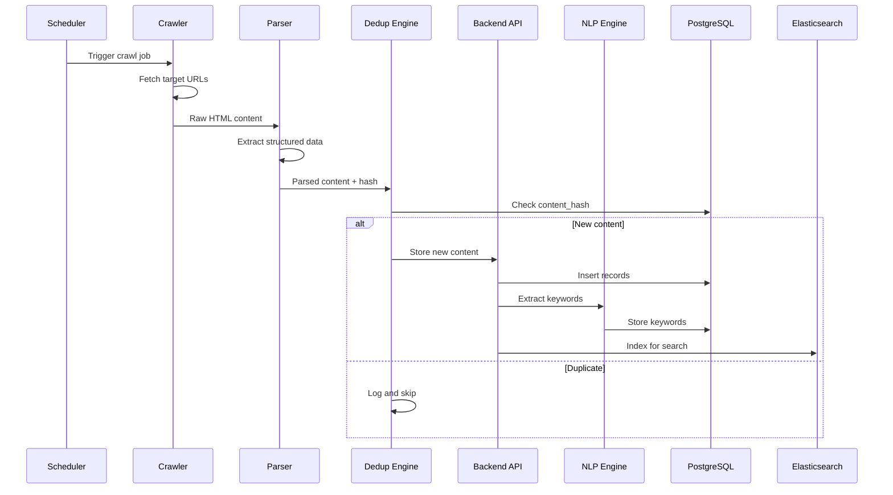
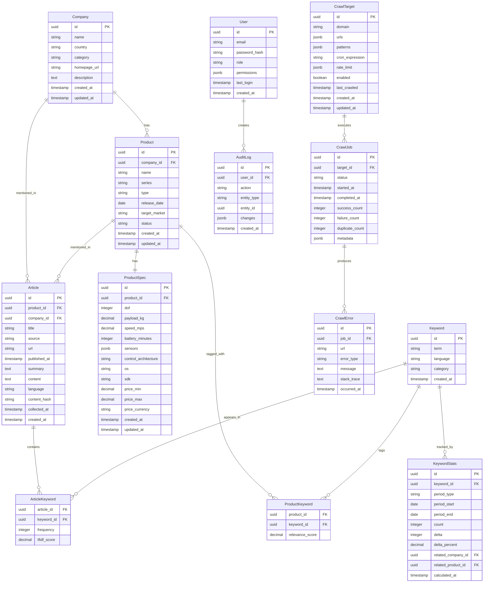

# Design Document: Robot Competitive Intelligence Portal

## Overview

The Robot Competitive Intelligence Portal is a full-stack web application designed to collect, organize, analyze, and visualize competitive intelligence data from the robotics industry. The system consists of four main subsystems:

1. **Crawler Microservice**: Automated web scraping with scheduling, deduplication, and error handling
2. **Backend API**: RESTful API for data management, search, and business logic
3. **NLP Engine**: Keyword extraction and trend analysis for Korean and English content
4. **Frontend Portal**: React-based SPA with dashboards, list/detail views, and export capabilities

The architecture follows a microservices pattern with clear separation of concerns, enabling independent scaling and deployment of each component.

## Architecture



### System Flow



## Components and Interfaces

### 1. Crawler Microservice

#### CrawlerService Interface

```typescript
interface CrawlerService {
  // Execute a crawl job for specified targets
  executeCrawlJob(jobConfig: CrawlJobConfig): Promise<CrawlResult>;
  
  // Get status of running/completed jobs
  getJobStatus(jobId: string): Promise<JobStatus>;
  
  // Cancel a running job
  cancelJob(jobId: string): Promise<void>;
}

interface CrawlJobConfig {
  targetUrls: TargetUrl[];
  rateLimit: RateLimitConfig;
  timeout: number;
  retryCount: number;
}

interface TargetUrl {
  url: string;
  domain: string;
  pattern: CrawlPattern;
  lastCrawled?: Date;
}

interface CrawlPattern {
  type: 'product_page' | 'spec_sheet' | 'article' | 'press_release' | 'pricing';
  selectors: ContentSelectors;
}

interface ContentSelectors {
  title?: string;
  content?: string;
  price?: string;
  specs?: Record<string, string>;
  publishDate?: string;
  author?: string;
}

interface CrawlResult {
  jobId: string;
  successCount: number;
  failureCount: number;
  duplicateCount: number;
  errors: CrawlError[];
  collectedItems: CollectedItem[];
}

interface CrawlError {
  url: string;
  errorType: 'network' | 'parsing' | 'timeout' | 'rate_limit';
  message: string;
  timestamp: Date;
}
```

#### SchedulerService Interface

```typescript
interface SchedulerService {
  // Schedule a recurring crawl job
  scheduleJob(schedule: CrawlSchedule): Promise<string>;
  
  // Update existing schedule
  updateSchedule(scheduleId: string, schedule: Partial<CrawlSchedule>): Promise<void>;
  
  // Remove a scheduled job
  removeSchedule(scheduleId: string): Promise<void>;
  
  // Get all scheduled jobs
  listSchedules(): Promise<CrawlSchedule[]>;
  
  // Trigger immediate execution
  triggerNow(scheduleId: string): Promise<string>;
}

interface CrawlSchedule {
  id: string;
  name: string;
  cronExpression: string;
  targetUrls: TargetUrl[];
  enabled: boolean;
  lastRun?: Date;
  nextRun?: Date;
}
```

#### DeduplicationService Interface

```typescript
interface DeduplicationService {
  // Generate content hash for deduplication
  generateContentHash(content: string): string;
  
  // Check if content already exists
  isDuplicate(contentHash: string): Promise<boolean>;
  
  // Register new content hash
  registerContent(contentHash: string, metadata: ContentMetadata): Promise<void>;
}

interface ContentMetadata {
  sourceUrl: string;
  collectedAt: Date;
  contentType: string;
}
```

### 2. Backend API Service

#### CompanyService Interface

```typescript
interface CompanyService {
  // CRUD operations for companies
  createCompany(data: CreateCompanyDto): Promise<Company>;
  getCompany(id: string): Promise<Company | null>;
  updateCompany(id: string, data: UpdateCompanyDto): Promise<Company>;
  deleteCompany(id: string): Promise<void>;
  
  // List with filtering
  listCompanies(filters: CompanyFilters, pagination: Pagination): Promise<PaginatedResult<Company>>;
  
  // Search companies
  searchCompanies(query: string): Promise<Company[]>;
}

interface CompanyFilters {
  country?: string;
  category?: string;
  searchTerm?: string;
}

interface Pagination {
  page: number;
  pageSize: number;
  sortBy?: string;
  sortOrder?: 'asc' | 'desc';
}

interface PaginatedResult<T> {
  items: T[];
  total: number;
  page: number;
  pageSize: number;
  totalPages: number;
}
```

#### ProductService Interface

```typescript
interface ProductService {
  // CRUD operations for products
  createProduct(data: CreateProductDto): Promise<Product>;
  getProduct(id: string): Promise<ProductWithDetails | null>;
  updateProduct(id: string, data: UpdateProductDto): Promise<Product>;
  deleteProduct(id: string): Promise<void>;
  
  // List with filtering
  listProducts(filters: ProductFilters, pagination: Pagination): Promise<PaginatedResult<Product>>;
  
  // Get products by company
  getProductsByCompany(companyId: string): Promise<Product[]>;
  
  // Search products
  searchProducts(query: SearchQuery): Promise<SearchResult<Product>>;
}

interface ProductFilters {
  companyId?: string;
  category?: 'humanoid' | 'service' | 'logistics' | 'home';
  releaseYear?: number;
  priceMin?: number;
  priceMax?: number;
  country?: string;
  keywords?: string[];
  specFilters?: SpecFilters;
}

interface SpecFilters {
  dofMin?: number;
  dofMax?: number;
  payloadMin?: number;
  payloadMax?: number;
  speedMin?: number;
  speedMax?: number;
}

interface ProductWithDetails {
  product: Product;
  specs: ProductSpec;
  articles: Article[];
  keywords: Keyword[];
  relatedProducts: Product[];
}
```

#### ArticleService Interface

```typescript
interface ArticleService {
  // CRUD operations for articles
  createArticle(data: CreateArticleDto): Promise<Article>;
  getArticle(id: string): Promise<Article | null>;
  updateArticle(id: string, data: UpdateArticleDto): Promise<Article>;
  deleteArticle(id: string): Promise<void>;
  
  // List with filtering
  listArticles(filters: ArticleFilters, pagination: Pagination): Promise<PaginatedResult<Article>>;
  
  // Get articles by product or company
  getArticlesByProduct(productId: string): Promise<Article[]>;
  getArticlesByCompany(companyId: string): Promise<Article[]>;
  
  // Full-text search
  searchArticles(query: string, filters?: ArticleFilters): Promise<SearchResult<Article>>;
  
  // Get article timeline
  getArticleTimeline(entityId: string, entityType: 'product' | 'company'): Promise<TimelineEntry[]>;
}

interface ArticleFilters {
  companyId?: string;
  productId?: string;
  source?: string;
  language?: 'ko' | 'en';
  publishedAfter?: Date;
  publishedBefore?: Date;
  keywords?: string[];
}

interface TimelineEntry {
  date: Date;
  articles: Article[];
  count: number;
}
```

#### SearchService Interface

```typescript
interface SearchService {
  // Global search across all entities
  globalSearch(query: string, options?: SearchOptions): Promise<GlobalSearchResult>;
  
  // Entity-specific search
  searchEntities<T>(index: string, query: SearchQuery): Promise<SearchResult<T>>;
  
  // Autocomplete suggestions
  getSuggestions(prefix: string, entityType?: string): Promise<Suggestion[]>;
}

interface SearchOptions {
  entityTypes?: ('company' | 'product' | 'article')[];
  limit?: number;
  highlightMatches?: boolean;
}

interface GlobalSearchResult {
  companies: SearchResult<Company>;
  products: SearchResult<Product>;
  articles: SearchResult<Article>;
  totalHits: number;
  queryTime: number;
}

interface SearchResult<T> {
  hits: SearchHit<T>[];
  total: number;
  maxScore: number;
}

interface SearchHit<T> {
  item: T;
  score: number;
  highlights?: Record<string, string[]>;
}
```

### 3. NLP Engine

#### KeywordExtractionService Interface

```typescript
interface KeywordExtractionService {
  // Extract keywords from text
  extractKeywords(text: string, language: 'ko' | 'en'): Promise<ExtractedKeyword[]>;
  
  // Batch extraction for multiple texts
  extractKeywordsBatch(items: TextItem[]): Promise<Map<string, ExtractedKeyword[]>>;
  
  // Get keyword suggestions based on context
  suggestKeywords(context: string, existingKeywords: string[]): Promise<string[]>;
}

interface TextItem {
  id: string;
  text: string;
  language: 'ko' | 'en';
}

interface ExtractedKeyword {
  term: string;
  score: number;
  frequency: number;
  category?: string;
}
```

#### TrendAnalysisService Interface

```typescript
interface TrendAnalysisService {
  // Calculate keyword statistics for a period
  calculateKeywordStats(period: Period): Promise<KeywordStats[]>;
  
  // Get trending keywords
  getTrendingKeywords(options: TrendOptions): Promise<TrendingKeyword[]>;
  
  // Get keyword history
  getKeywordHistory(keywordId: string, periods: number): Promise<KeywordHistory>;
  
  // Calculate change rates
  calculateChangeRates(currentPeriod: Period, previousPeriod: Period): Promise<ChangeRate[]>;
}

interface Period {
  type: 'week' | 'month';
  startDate: Date;
  endDate: Date;
}

interface TrendOptions {
  period: Period;
  limit?: number;
  minFrequency?: number;
  companyId?: string;
  productId?: string;
}

interface TrendingKeyword {
  keyword: Keyword;
  stats: KeywordStats;
  trend: 'rising' | 'falling' | 'stable';
  relatedEntities: RelatedEntity[];
}

interface KeywordHistory {
  keyword: Keyword;
  periods: PeriodStats[];
}

interface PeriodStats {
  period: Period;
  count: number;
  delta: number;
  deltaPercent: number;
}

interface ChangeRate {
  keywordId: string;
  previousCount: number;
  currentCount: number;
  absoluteChange: number;
  percentChange: number;
}
```

### 4. Dashboard and Export Services

#### DashboardService Interface

```typescript
interface DashboardService {
  // Get weekly highlights
  getWeeklyHighlights(): Promise<WeeklyHighlights>;
  
  // Get timeline data
  getTimeline(options: TimelineOptions): Promise<TimelineData>;
  
  // Get chart data
  getChartData(chartType: ChartType, options: ChartOptions): Promise<ChartData>;
  
  // Get dashboard summary
  getDashboardSummary(): Promise<DashboardSummary>;
}

interface WeeklyHighlights {
  newProducts: Product[];
  priceChanges: PriceChange[];
  prPeaks: ArticlePeak[];
  trendingKeywords: TrendingKeyword[];
  weekStart: Date;
  weekEnd: Date;
}

interface TimelineData {
  entries: TimelineEntry[];
  period: Period;
  metrics: TimelineMetrics;
}

interface ChartData {
  labels: string[];
  datasets: Dataset[];
  chartType: ChartType;
}

type ChartType = 'line' | 'bar' | 'pie' | 'area' | 'scatter';

interface DashboardSummary {
  totalCompanies: number;
  totalProducts: number;
  totalArticles: number;
  articlesThisWeek: number;
  newProductsThisWeek: number;
  topKeywords: TrendingKeyword[];
}
```

#### ExportService Interface

```typescript
interface ExportService {
  // Export data to CSV
  exportToCsv(data: ExportData, options: CsvOptions): Promise<Buffer>;
  
  // Export data to Excel
  exportToExcel(data: ExportData, options: ExcelOptions): Promise<Buffer>;
  
  // Capture chart as image
  captureChart(chartId: string, options: ImageOptions): Promise<Buffer>;
  
  // Generate print-friendly report
  generateReport(reportConfig: ReportConfig): Promise<Buffer>;
}

interface ExportData {
  type: 'companies' | 'products' | 'articles' | 'keywords' | 'mixed';
  items: any[];
  filters?: Record<string, any>;
  columns?: string[];
}

interface ImageOptions {
  format: 'png' | 'jpeg' | 'svg';
  width: number;
  height: number;
  theme: 'light' | 'dark';
  scale?: number;
}

interface ReportConfig {
  title: string;
  sections: ReportSection[];
  theme: 'light' | 'dark';
  format: 'pdf' | 'html';
  includeCharts: boolean;
  includeTables: boolean;
}

interface ReportSection {
  type: 'summary' | 'chart' | 'table' | 'text';
  title: string;
  data: any;
}
```

### 5. Admin Services

#### AdminCrawlerService Interface

```typescript
interface AdminCrawlerService {
  // Manage crawl targets
  addCrawlTarget(target: CreateTargetDto): Promise<CrawlTarget>;
  updateCrawlTarget(id: string, target: UpdateTargetDto): Promise<CrawlTarget>;
  deleteCrawlTarget(id: string): Promise<void>;
  listCrawlTargets(filters?: TargetFilters): Promise<CrawlTarget[]>;
  
  // Manage crawl patterns
  addCrawlPattern(targetId: string, pattern: CrawlPattern): Promise<void>;
  updateCrawlPattern(targetId: string, patternId: string, pattern: CrawlPattern): Promise<void>;
  deleteCrawlPattern(targetId: string, patternId: string): Promise<void>;
  
  // Rate limit configuration
  setRateLimit(targetId: string, config: RateLimitConfig): Promise<void>;
  getRateLimit(targetId: string): Promise<RateLimitConfig>;
  
  // Manual triggers
  triggerManualCrawl(targetIds: string[]): Promise<CrawlJob>;
  
  // Error monitoring
  getCrawlErrors(filters?: ErrorFilters): Promise<PaginatedResult<CrawlError>>;
  getCrawlStats(): Promise<CrawlStats>;
}

interface CrawlTarget {
  id: string;
  domain: string;
  urls: string[];
  patterns: CrawlPattern[];
  frequency: string; // cron expression
  rateLimit: RateLimitConfig;
  enabled: boolean;
  lastCrawled?: Date;
  lastError?: CrawlError;
}

interface RateLimitConfig {
  requestsPerMinute: number;
  requestsPerHour: number;
  delayBetweenRequests: number; // milliseconds
}

interface CrawlStats {
  totalTargets: number;
  activeTargets: number;
  totalCrawlsToday: number;
  successRate: number;
  averageCrawlTime: number;
  errorsToday: number;
}
```

#### AuthService Interface

```typescript
interface AuthService {
  // Authentication
  login(credentials: LoginCredentials): Promise<AuthToken>;
  logout(token: string): Promise<void>;
  refreshToken(refreshToken: string): Promise<AuthToken>;
  
  // Authorization
  validateToken(token: string): Promise<TokenPayload>;
  hasPermission(userId: string, permission: Permission): Promise<boolean>;
  
  // User management
  getCurrentUser(token: string): Promise<User>;
  updateUserRole(userId: string, role: UserRole): Promise<void>;
}

interface AuthToken {
  accessToken: string;
  refreshToken: string;
  expiresIn: number;
  tokenType: 'Bearer';
}

interface TokenPayload {
  userId: string;
  email: string;
  role: UserRole;
  permissions: Permission[];
  exp: number;
}

type UserRole = 'admin' | 'analyst' | 'viewer';
type Permission = 'read' | 'write' | 'admin' | 'export' | 'crawl_manage';
```

## Data Models

### Entity Relationship Diagram



### TypeScript Type Definitions

```typescript
// Core Entity Types
interface Company {
  id: string;
  name: string;
  country: string;
  category: string;
  homepageUrl: string;
  description: string;
  createdAt: Date;
  updatedAt: Date;
}

interface Product {
  id: string;
  companyId: string;
  name: string;
  series: string;
  type: 'humanoid' | 'service' | 'logistics' | 'home';
  releaseDate: Date;
  targetMarket: string;
  status: 'announced' | 'available' | 'discontinued';
  createdAt: Date;
  updatedAt: Date;
}

interface ProductSpec {
  id: string;
  productId: string;
  dof: number;
  payloadKg: number;
  speedMps: number;
  batteryMinutes: number;
  sensors: SensorConfig[];
  controlArchitecture: string;
  os: string;
  sdk: string;
  priceMin: number;
  priceMax: number;
  priceCurrency: string;
  createdAt: Date;
  updatedAt: Date;
}

interface SensorConfig {
  type: string;
  model?: string;
  specs?: Record<string, any>;
}

interface Article {
  id: string;
  productId?: string;
  companyId?: string;
  title: string;
  source: string;
  url: string;
  publishedAt: Date;
  summary: string;
  content: string;
  language: 'ko' | 'en';
  contentHash: string;
  collectedAt: Date;
  createdAt: Date;
}

interface Keyword {
  id: string;
  term: string;
  language: 'ko' | 'en';
  category: string;
  createdAt: Date;
}

interface KeywordStats {
  id: string;
  keywordId: string;
  periodType: 'week' | 'month';
  periodStart: Date;
  periodEnd: Date;
  count: number;
  delta: number;
  deltaPercent: number;
  relatedCompanyId?: string;
  relatedProductId?: string;
  calculatedAt: Date;
}

// DTOs for API operations
interface CreateCompanyDto {
  name: string;
  country: string;
  category: string;
  homepageUrl: string;
  description?: string;
}

interface UpdateCompanyDto {
  name?: string;
  country?: string;
  category?: string;
  homepageUrl?: string;
  description?: string;
}

interface CreateProductDto {
  companyId: string;
  name: string;
  series?: string;
  type: 'humanoid' | 'service' | 'logistics' | 'home';
  releaseDate?: Date;
  targetMarket?: string;
  status?: 'announced' | 'available' | 'discontinued';
}

interface UpdateProductDto {
  name?: string;
  series?: string;
  type?: 'humanoid' | 'service' | 'logistics' | 'home';
  releaseDate?: Date;
  targetMarket?: string;
  status?: 'announced' | 'available' | 'discontinued';
}

interface CreateArticleDto {
  productId?: string;
  companyId?: string;
  title: string;
  source: string;
  url: string;
  publishedAt: Date;
  summary?: string;
  content: string;
  language: 'ko' | 'en';
}

interface UpdateArticleDto {
  productId?: string;
  companyId?: string;
  title?: string;
  summary?: string;
}
```


## Correctness Properties

*A property is a characteristic or behavior that should hold true across all valid executions of a system—essentially, a formal statement about what the system should do. Properties serve as the bridge between human-readable specifications and machine-verifiable correctness guarantees.*

Based on the prework analysis of acceptance criteria, the following correctness properties have been identified for property-based testing:

### Property 1: Content Hash Consistency

*For any* content string, generating a content hash multiple times SHALL always produce the same hash value.

**Validates: Requirements 1.2**

### Property 2: Duplicate Detection Prevents Storage

*For any* content that has already been stored (identified by content hash), attempting to store the same content again SHALL NOT create a new record, and the total record count SHALL remain unchanged.

**Validates: Requirements 1.3**

### Property 3: Unique Content Storage Round-Trip

*For any* article with unique content, storing it and then retrieving it by ID SHALL return an article with matching title, content, source, and URL fields.

**Validates: Requirements 1.4**

### Property 4: Crawl Job Resilience

*For any* crawl job configuration with multiple target URLs where some URLs fail (network error, parsing error, or timeout), the job SHALL continue processing remaining URLs and the success count plus failure count SHALL equal the total URL count.

**Validates: Requirements 1.6, 8.2, 8.3**

### Property 5: Incremental Crawl Timestamp Tracking

*For any* successful crawl of a target URL, the last-crawled timestamp SHALL be updated to a value greater than or equal to the crawl start time, and subsequent crawl jobs SHALL have access to this timestamp.

**Validates: Requirements 1.7**

### Property 6: Entity Hierarchy Integrity

*For any* Product entity, it SHALL have a valid company_id that references an existing Company entity, and querying products by company_id SHALL return only products belonging to that company.

**Validates: Requirements 2.1, 2.3**

### Property 7: Product Category Validation

*For any* Product entity, the type field SHALL be one of the valid categories: 'humanoid', 'service', 'logistics', or 'home'. Attempting to create a product with an invalid category SHALL be rejected.

**Validates: Requirements 2.6**

### Property 8: Keyword Extraction Coverage

*For any* non-empty article text in Korean or English, the NLP engine SHALL extract at least one keyword, and each extracted keyword SHALL have a non-empty term and a relevance score between 0 and 1.

**Validates: Requirements 3.1, 3.2**

### Property 9: Keyword Stats Delta Calculation

*For any* keyword with statistics for two consecutive periods (current and previous), the delta value SHALL equal the current count minus the previous count, and the delta percent SHALL equal (delta / previous count) * 100 when previous count is non-zero.

**Validates: Requirements 3.5**

### Property 10: Product Detail Data Completeness

*For any* Product entity with associated specs, articles, and keywords, the product detail API response SHALL include all of: product overview fields, spec table data, pricing information (if available), article timeline entries, and related keyword list.

**Validates: Requirements 4.3**

### Property 11: Filter Results Correctness

*For any* combination of filters (company, category, release year, price range, keywords), all returned results SHALL match ALL applied filter criteria. No result SHALL violate any active filter condition.

**Validates: Requirements 4.4**

### Property 12: Sort Order Correctness

*For any* list query with a sort parameter, the returned results SHALL be ordered according to the specified sort field and direction. For ascending order, each item's sort value SHALL be less than or equal to the next item's value.

**Validates: Requirements 4.5**

### Property 13: Timeline Period Correctness

*For any* timeline query with a specified date range, all returned entries SHALL have dates within the specified range (inclusive of start, exclusive of end).

**Validates: Requirements 5.1**

### Property 14: Weekly Highlights Recency

*For any* "This Week's Highlights" response, all included items (new products, price changes, PR peaks, trending keywords) SHALL have timestamps or dates within the current calendar week.

**Validates: Requirements 5.3**

### Property 15: Export Data Filter Consistency

*For any* export request with active filters, the exported data SHALL contain exactly the same items as the filtered list view, with no additional or missing items.

**Validates: Requirements 6.4**

### Property 16: Rate Limit Configuration Persistence

*For any* rate limit configuration set for a crawl target, retrieving the configuration SHALL return the same values for requests per minute, requests per hour, and delay between requests.

**Validates: Requirements 7.2**

### Property 17: Error Logging Completeness

*For any* crawl error that occurs, the error log entry SHALL contain: the failed URL, error type, error message, and timestamp. No required field SHALL be null or empty.

**Validates: Requirements 7.3**

### Property 18: Manual Trigger Job Creation

*For any* manual crawl trigger request specifying target IDs, a new crawl job SHALL be created with status 'pending' or 'running', and the job's target list SHALL match the requested target IDs.

**Validates: Requirements 7.4**

### Property 19: Role-Based Access Control

*For any* user without admin role attempting to access admin-only endpoints (crawl target management, rate limit configuration, manual triggers), the request SHALL be denied with a 403 status code, and an audit log entry SHALL be created.

**Validates: Requirements 7.5, 9.1, 9.3**

### Property 20: Entity Field Completeness

*For any* stored entity (Company, Product, ProductSpec, Article, Keyword, KeywordStats), all required fields as defined in the data model SHALL be present and non-null. Retrieving the entity SHALL return all stored field values unchanged.

**Validates: Requirements 10.1, 10.2, 10.3, 10.4, 10.5, 10.6**

## Error Handling

### Crawler Error Handling

| Error Type | Handling Strategy | Recovery Action |
|------------|-------------------|-----------------|
| Network Timeout | Log error, mark URL as failed | Retry with exponential backoff (max 3 retries) |
| HTTP 4xx Errors | Log error with status code | Skip URL, continue with next target |
| HTTP 5xx Errors | Log error, mark as temporary failure | Schedule retry in next crawl cycle |
| Parsing Error | Log error with selector details | Skip content, alert admin for pattern review |
| Rate Limit (429) | Log warning, pause crawling | Wait for rate limit window, then resume |
| SSL/TLS Error | Log security warning | Skip URL, require admin review |
| Content Too Large | Log warning with size | Truncate or skip based on configuration |

### API Error Handling

| Error Type | HTTP Status | Response Format |
|------------|-------------|-----------------|
| Validation Error | 400 | `{ "error": "validation_error", "details": [...] }` |
| Authentication Failed | 401 | `{ "error": "unauthorized", "message": "..." }` |
| Authorization Failed | 403 | `{ "error": "forbidden", "message": "..." }` |
| Resource Not Found | 404 | `{ "error": "not_found", "resource": "...", "id": "..." }` |
| Conflict (Duplicate) | 409 | `{ "error": "conflict", "message": "..." }` |
| Rate Limited | 429 | `{ "error": "rate_limited", "retry_after": ... }` |
| Internal Error | 500 | `{ "error": "internal_error", "request_id": "..." }` |

### NLP Engine Error Handling

| Error Type | Handling Strategy | Fallback |
|------------|-------------------|----------|
| Language Detection Failed | Log warning | Default to English processing |
| Tokenization Error | Log error with text sample | Return empty keyword list |
| Model Loading Error | Log critical error | Use cached model or basic tokenizer |
| Memory Overflow | Log error, release resources | Process in smaller batches |

### Database Error Handling

| Error Type | Handling Strategy | Recovery Action |
|------------|-------------------|-----------------|
| Connection Lost | Log error, attempt reconnect | Use connection pool with retry logic |
| Deadlock Detected | Log warning | Retry transaction with backoff |
| Constraint Violation | Log error with details | Return validation error to caller |
| Query Timeout | Log slow query | Optimize query or increase timeout |

## Testing Strategy

### Dual Testing Approach

This project requires both unit tests and property-based tests for comprehensive coverage:

- **Unit Tests**: Verify specific examples, edge cases, integration points, and error conditions
- **Property Tests**: Verify universal properties across randomly generated inputs

### Property-Based Testing Configuration

**Library**: fast-check (TypeScript/JavaScript)

**Configuration Requirements**:
- Minimum 100 iterations per property test
- Each property test must reference its design document property
- Tag format: `Feature: robot-competitive-intelligence-portal, Property {number}: {property_text}`

### Test Categories

#### 1. Crawler Service Tests

**Unit Tests**:
- Test specific URL parsing scenarios
- Test known HTML structures from target sites
- Test error response handling for specific status codes

**Property Tests**:
- Property 1: Content hash consistency
- Property 2: Duplicate detection
- Property 4: Crawl job resilience
- Property 5: Timestamp tracking

#### 2. Data Service Tests

**Unit Tests**:
- Test CRUD operations with specific entity examples
- Test edge cases (empty strings, max lengths, special characters)
- Test foreign key constraint enforcement

**Property Tests**:
- Property 3: Storage round-trip
- Property 6: Entity hierarchy integrity
- Property 7: Category validation
- Property 20: Field completeness

#### 3. NLP Engine Tests

**Unit Tests**:
- Test keyword extraction with known Korean text samples
- Test keyword extraction with known English text samples
- Test edge cases (empty text, single word, very long text)

**Property Tests**:
- Property 8: Keyword extraction coverage
- Property 9: Delta calculation

#### 4. Search and Filter Tests

**Unit Tests**:
- Test specific filter combinations
- Test sorting with known datasets
- Test pagination edge cases

**Property Tests**:
- Property 11: Filter correctness
- Property 12: Sort order correctness
- Property 13: Timeline period correctness

#### 5. Dashboard and Export Tests

**Unit Tests**:
- Test chart data generation with specific datasets
- Test CSV/Excel export format correctness
- Test report generation with sample data

**Property Tests**:
- Property 14: Highlights recency
- Property 15: Export filter consistency

#### 6. Admin and Security Tests

**Unit Tests**:
- Test specific role/permission combinations
- Test rate limit enforcement scenarios
- Test audit log creation

**Property Tests**:
- Property 16: Rate limit persistence
- Property 17: Error logging completeness
- Property 18: Manual trigger job creation
- Property 19: RBAC enforcement

### Test Data Generation

For property-based tests, generators should produce:

```typescript
// Example generators for fast-check
const companyGenerator = fc.record({
  name: fc.string({ minLength: 1, maxLength: 100 }),
  country: fc.constantFrom('US', 'JP', 'KR', 'CN', 'DE'),
  category: fc.constantFrom('robotics', 'automation', 'AI'),
  homepageUrl: fc.webUrl(),
  description: fc.string({ maxLength: 1000 })
});

const productGenerator = fc.record({
  name: fc.string({ minLength: 1, maxLength: 100 }),
  series: fc.option(fc.string({ maxLength: 50 })),
  type: fc.constantFrom('humanoid', 'service', 'logistics', 'home'),
  releaseDate: fc.date({ min: new Date('2020-01-01'), max: new Date() }),
  targetMarket: fc.string({ maxLength: 100 }),
  status: fc.constantFrom('announced', 'available', 'discontinued')
});

const articleGenerator = fc.record({
  title: fc.string({ minLength: 1, maxLength: 200 }),
  source: fc.string({ minLength: 1, maxLength: 100 }),
  url: fc.webUrl(),
  content: fc.string({ minLength: 10, maxLength: 10000 }),
  language: fc.constantFrom('ko', 'en'),
  publishedAt: fc.date({ min: new Date('2020-01-01'), max: new Date() })
});
```

### Integration Testing

Integration tests should cover:
- Crawler → API → Database flow
- API → NLP Engine → Database flow
- Frontend → API → Search Engine flow
- Authentication → Authorization → Resource access flow

### Performance Testing

While not property-based, performance tests should verify:
- Search queries complete within 2 seconds for 10,000+ items
- Dashboard loads within 3 seconds
- Export generation completes within 30 seconds for large datasets
- Concurrent user handling (target: 50 simultaneous users)
