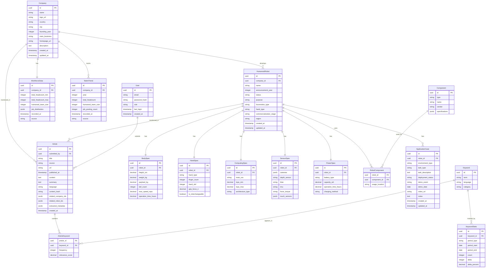

# Design Document: 휴머노이드 로봇 인텔리전스 포털

## Overview

휴머노이드 로봇 인텔리전스 포털은 휴머노이드 로봇 산업의 시장 동향을 모니터링하고 분석하는 풀스택 웹 애플리케이션입니다. 시스템은 다음 주요 서브시스템으로 구성됩니다:

1. **Backend API**: Express.js 기반 RESTful API - 데이터 관리, 검색, 비즈니스 로직
2. **NLP Engine**: 키워드 추출, AI 요약, 한국어/영어 처리
3. **Article Analyzer**: 기사 분석 및 자동 태깅 서비스
4. **Frontend Portal**: Next.js 기반 SPA - 카탈로그, 대시보드, 분석 뷰
5. **PPT Generator**: 파워포인트 리포트 생성 서비스

## Architecture


### System Flow - 기사 분석 및 자동 태깅


### System Flow - PPT 리포트 생성


## Components and Interfaces

### 1. 휴머노이드 로봇 서비스

#### HumanoidRobotService Interface

```typescript
interface HumanoidRobotService {
  // CRUD operations
  createRobot(data: CreateHumanoidRobotDto): Promise<HumanoidRobot>;
  getRobot(id: string): Promise<HumanoidRobotWithDetails | null>;
  updateRobot(id: string, data: UpdateHumanoidRobotDto): Promise<HumanoidRobot>;
  deleteRobot(id: string): Promise<void>;
  
  // Catalog with filtering
  listRobots(filters: RobotFilters, pagination: Pagination): Promise<PaginatedResult<HumanoidRobot>>;
  
  // Search
  searchRobots(query: string): Promise<HumanoidRobot[]>;
  
  // Radar chart data
  getRadarChartData(robotId: string): Promise<RadarChartData>;
}

interface RobotFilters {
  purpose?: 'industrial' | 'home' | 'service';
  locomotionType?: 'bipedal' | 'wheeled' | 'hybrid';
  handType?: 'gripper' | 'multi_finger' | 'interchangeable';
  commercializationStage?: 'concept' | 'prototype' | 'poc' | 'pilot' | 'commercial';
  region?: 'north_america' | 'europe' | 'china' | 'japan' | 'korea' | 'other';
  companyId?: string;
  announcementYearMin?: number;
  announcementYearMax?: number;
  environmentType?: string;
  taskType?: string;
}

interface HumanoidRobotWithDetails {
  robot: HumanoidRobot;
  bodySpec: BodySpec;
  handSpec: HandSpec;
  computingSpec: ComputingSpec;
  sensorSpec: SensorSpec;
  powerSpec: PowerSpec;
  company: Company;
  relatedArticles: Article[];
  applicationCases: ApplicationCase[];
}

interface RadarChartData {
  labels: string[];
  robotValues: number[];
  segmentAverages: number[];
}
```

### 2. 회사 및 인력 분석 서비스

#### CompanyService Interface

```typescript
interface CompanyService {
  createCompany(data: CreateCompanyDto): Promise<Company>;
  getCompany(id: string): Promise<CompanyWithWorkforce | null>;
  updateCompany(id: string, data: UpdateCompanyDto): Promise<Company>;
  deleteCompany(id: string): Promise<void>;
  listCompanies(filters: CompanyFilters, pagination: Pagination): Promise<PaginatedResult<Company>>;
  searchCompanies(query: string): Promise<Company[]>;
}

interface CompanyWithWorkforce {
  company: Company;
  workforceData: WorkforceData;
  talentTrend: TalentTrendEntry[];
  humanoidRobots: HumanoidRobot[];
  jobDistributionChart: DonutChartData;
  talentTrendChart: LineChartData;
}
```

#### WorkforceService Interface

```typescript
interface WorkforceService {
  createWorkforceData(companyId: string, data: CreateWorkforceDataDto): Promise<WorkforceData>;
  updateWorkforceData(companyId: string, data: UpdateWorkforceDataDto): Promise<WorkforceData>;
  getWorkforceData(companyId: string): Promise<WorkforceData | null>;
  
  addTalentTrendEntry(companyId: string, data: TalentTrendEntryDto): Promise<TalentTrendEntry>;
  getTalentTrend(companyId: string, years: number): Promise<TalentTrendEntry[]>;
  
  getJobDistribution(companyId: string): Promise<JobDistribution>;
  compareWorkforce(companyIds: string[]): Promise<WorkforceComparison[]>;
  getTopNByWorkforce(limit: number): Promise<WorkforceComparison[]>;
}

interface JobDistribution {
  rd: number;
  software: number;
  controlAi: number;
  mechatronics: number;
  operations: number;
  business: number;
}

interface TalentTrendEntry {
  year: number;
  totalHeadcount: number;
  humanoidTeamSize: number;
  jobPostingCount: number;
  recordedAt: Date;
  source: string;
}
```

### 3. 부품(Components) 서비스

#### ComponentService Interface

```typescript
interface ComponentService {
  createComponent(data: CreateComponentDto): Promise<Component>;
  getComponent(id: string): Promise<ComponentWithRobots | null>;
  updateComponent(id: string, data: UpdateComponentDto): Promise<Component>;
  deleteComponent(id: string): Promise<void>;
  listComponents(filters: ComponentFilters, pagination: Pagination): Promise<PaginatedResult<Component>>;
  getComponentsByRobot(robotId: string): Promise<Component[]>;
  getRobotsByComponent(componentId: string): Promise<HumanoidRobot[]>;
  
  // Chart data
  getTorqueDensityScatterData(): Promise<ScatterChartData>;
  getTopsTimelineData(): Promise<LineChartData>;
  getSensorStackData(): Promise<SensorStackData>;
}

interface ComponentFilters {
  type?: 'actuator' | 'soc' | 'sensor' | 'power';
  vendor?: string;
  torqueMin?: number;
  torqueMax?: number;
  topsMin?: number;
  topsMax?: number;
}

interface ScatterChartData {
  points: { x: number; y: number; label: string; robotId?: string }[];
  xLabel: string;
  yLabel: string;
}
```

### 4. 적용 사례 서비스

#### ApplicationCaseService Interface

```typescript
interface ApplicationCaseService {
  createCase(data: CreateApplicationCaseDto): Promise<ApplicationCase>;
  getCase(id: string): Promise<ApplicationCase | null>;
  updateCase(id: string, data: UpdateApplicationCaseDto): Promise<ApplicationCase>;
  deleteCase(id: string): Promise<void>;
  
  listCasesByRobot(robotId: string): Promise<ApplicationCase[]>;
  listCasesByEnvironment(environmentType: string): Promise<ApplicationCase[]>;
  listCasesByTask(taskType: string): Promise<ApplicationCase[]>;
  
  // Dashboard data
  getEnvironmentTaskMatrix(): Promise<MatrixData>;
  getDeploymentStatusDistribution(): Promise<DonutChartData>;
  getDemoTimeline(startDate: Date, endDate: Date): Promise<TimelineData>;
}

interface ApplicationCase {
  id: string;
  robotId: string;
  environmentType: 'factory' | 'warehouse' | 'retail' | 'healthcare' | 'hospitality' | 'home' | 'research_lab' | 'other';
  taskType: 'assembly' | 'picking' | 'packing' | 'inspection' | 'delivery' | 'cleaning' | 'assistance' | 'other';
  taskDescription: string;
  deploymentStatus: 'concept' | 'pilot' | 'production';
  demoEvent?: string;
  demoDate?: Date;
  videoUrl?: string;
  notes?: string;
  createdAt: Date;
  updatedAt: Date;
}

interface MatrixData {
  rows: string[];
  columns: string[];
  cells: { row: string; column: string; count: number; robots: string[] }[];
}

interface TimelineData {
  events: { date: Date; title: string; robotName: string; eventType: string }[];
}
```

### 5. 기사 분석 서비스

#### ArticleAnalyzerService Interface

```typescript
interface ArticleAnalyzerService {
  analyzeArticle(content: string, language: 'ko' | 'en'): Promise<ArticleAnalysisResult>;
  submitArticle(data: SubmitArticleDto): Promise<ArticleSubmissionResult>;
  getArticle(id: string): Promise<Article | null>;
  updateArticle(id: string, data: UpdateArticleDto): Promise<Article>;
  deleteArticle(id: string): Promise<void>;
  listArticles(filters: ArticleFilters, pagination: Pagination): Promise<PaginatedResult<Article>>;
  getArticlesByRobot(robotId: string): Promise<Article[]>;
  getArticlesByCompany(companyId: string): Promise<Article[]>;
}

interface ArticleAnalysisResult {
  summary: string;
  keyPoints: string[];
  mentionedCompanies: EntityMatch[];
  mentionedRobots: EntityMatch[];
  extractedTechnologies: string[];
  marketInsights: string[];
  keywords: { term: string; relevance: number }[];
}

interface EntityMatch {
  mentionedName: string;
  matchedEntity?: { id: string; name: string };
  confidence: number;
}

interface SubmitArticleDto {
  title: string;
  source: string;
  url?: string;
  content: string;
  language: 'ko' | 'en';
  confirmedCompanyIds: string[];
  confirmedRobotIds: string[];
}

interface ArticleSubmissionResult {
  success: boolean;
  article?: Article;
  isDuplicate: boolean;
  message: string;
}
```

### 6. PPT 생성 서비스

#### PPTGeneratorService Interface

```typescript
interface PPTGeneratorService {
  generateReport(config: PPTReportConfig): Promise<Buffer>;
  getAvailableTemplates(): Promise<PPTTemplate[]>;
  previewSlide(slideConfig: SlideConfig): Promise<string>; // base64 image
}

interface PPTReportConfig {
  title: string;
  theme: 'light' | 'dark';
  sections: PPTSection[];
  generatedBy: string;
}

interface PPTSection {
  type: 'title' | 'robot_overview' | 'company_profile' | 'comparison_table' | 'chart' | 'text';
  data: RobotSlideData | CompanySlideData | ChartSlideData | TextSlideData;
}

interface RobotSlideData {
  robotId: string;
  includeSpecs: boolean;
  includeRadarChart: boolean;
}

interface CompanySlideData {
  companyId: string;
  includeWorkforce: boolean;
  includeTalentTrend: boolean;
}

interface ChartSlideData {
  chartType: 'segment_matrix' | 'hand_distribution' | 'workforce_comparison' | 'torque_scatter' | 'tops_timeline';
  title: string;
  imageBase64: string;
}

interface PPTTemplate {
  id: string;
  name: string;
  theme: 'light' | 'dark';
  previewUrl: string;
}
```

### 7. 분석 대시보드 서비스

#### DashboardService Interface

```typescript
interface DashboardService {
  // Segment Matrix
  getSegmentMatrix(): Promise<SegmentMatrixData>;
  
  // Hand type distribution
  getHandTypeDistribution(): Promise<DonutChartData>;
  
  // Workforce analysis
  getWorkforceBySegment(): Promise<BarChartData>;
  getTopPlayersWorkforce(limit: number): Promise<BarChartData>;
  getJobDistributionRadar(companyIds?: string[]): Promise<RadarChartData>;
  
  // Application cases
  getEnvironmentTaskMatrix(): Promise<MatrixData>;
  getDeploymentStatusDistribution(): Promise<DonutChartData>;
  
  // Weekly highlights
  getWeeklyHighlights(): Promise<WeeklyHighlights>;
  
  // Summary metrics
  getDashboardSummary(): Promise<DashboardSummary>;
}

interface SegmentMatrixData {
  rows: string[]; // locomotion types
  columns: string[]; // purposes
  cells: { row: string; column: string; count: number; robots: { id: string; name: string }[] }[];
  totalCount: number;
}

interface DonutChartData {
  labels: string[];
  values: number[];
  colors: string[];
}

interface BarChartData {
  labels: string[];
  datasets: { label: string; data: number[]; color: string }[];
}

interface WeeklyHighlights {
  newProducts: HumanoidRobot[];
  companyUpdates: { company: Company; updateType: string; description: string }[];
  trendingTopics: { topic: string; count: number; delta: number }[];
  recentDemos: ApplicationCase[];
  weekStart: Date;
  weekEnd: Date;
}

interface DashboardSummary {
  totalRobots: number;
  totalCompanies: number;
  totalArticles: number;
  robotsByStage: Record<string, number>;
  robotsByRegion: Record<string, number>;
  recentUpdates: number;
}
```

### 8. 인증 및 권한 서비스

#### AuthService Interface

```typescript
interface AuthService {
  login(credentials: LoginCredentials): Promise<AuthToken>;
  logout(token: string): Promise<void>;
  refreshToken(refreshToken: string): Promise<AuthToken>;
  isEmailAllowed(email: string): Promise<boolean>;
  validateToken(token: string): Promise<TokenPayload>;
  hasPermission(userId: string, permission: Permission): Promise<boolean>;
  getCurrentUser(token: string): Promise<User>;
}

interface LoginCredentials {
  email: string;
  password: string;
}

interface AuthToken {
  accessToken: string;
  refreshToken: string;
  expiresIn: number;
  tokenType: 'Bearer';
}

interface TokenPayload {
  userId: string;
  email: string;
  role: UserRole;
  permissions: Permission[];
  exp: number;
}

type UserRole = 'admin' | 'analyst' | 'viewer';
type Permission = 
  | 'read' 
  | 'write' 
  | 'admin' 
  | 'export' 
  | 'submit_article' 
  | 'generate_ppt'
  | 'create_report';
```

## Data Models

### Entity Relationship Diagram




### TypeScript Type Definitions (Drizzle ORM)

```typescript
// Drizzle Schema Definitions
import { pgTable, uuid, varchar, integer, decimal, boolean, text, timestamp, jsonb, date, primaryKey } from 'drizzle-orm/pg-core';

export const companies = pgTable('companies', {
  id: uuid('id').primaryKey().defaultRandom(),
  name: varchar('name', { length: 255 }).notNull(),
  logoUrl: varchar('logo_url', { length: 500 }),
  country: varchar('country', { length: 100 }),
  city: varchar('city', { length: 100 }),
  foundingYear: integer('founding_year'),
  mainBusiness: varchar('main_business', { length: 255 }),
  homepageUrl: varchar('homepage_url', { length: 500 }),
  description: text('description'),
  createdAt: timestamp('created_at').defaultNow(),
  updatedAt: timestamp('updated_at').defaultNow(),
});

export const humanoidRobots = pgTable('humanoid_robots', {
  id: uuid('id').primaryKey().defaultRandom(),
  companyId: uuid('company_id').references(() => companies.id),
  name: varchar('name', { length: 255 }).notNull(),
  announcementYear: integer('announcement_year'),
  status: varchar('status', { length: 50 }),
  purpose: varchar('purpose', { length: 50 }),
  locomotionType: varchar('locomotion_type', { length: 50 }),
  handType: varchar('hand_type', { length: 50 }),
  commercializationStage: varchar('commercialization_stage', { length: 50 }),
  region: varchar('region', { length: 50 }),
  createdAt: timestamp('created_at').defaultNow(),
  updatedAt: timestamp('updated_at').defaultNow(),
});

export const bodySpecs = pgTable('body_specs', {
  id: uuid('id').primaryKey().defaultRandom(),
  robotId: uuid('robot_id').references(() => humanoidRobots.id).unique(),
  heightCm: decimal('height_cm', { precision: 6, scale: 2 }),
  weightKg: decimal('weight_kg', { precision: 6, scale: 2 }),
  payloadKg: decimal('payload_kg', { precision: 6, scale: 2 }),
  dofCount: integer('dof_count'),
  maxSpeedMps: decimal('max_speed_mps', { precision: 4, scale: 2 }),
  operationTimeHours: decimal('operation_time_hours', { precision: 4, scale: 2 }),
});

export const handSpecs = pgTable('hand_specs', {
  id: uuid('id').primaryKey().defaultRandom(),
  robotId: uuid('robot_id').references(() => humanoidRobots.id).unique(),
  handType: varchar('hand_type', { length: 50 }),
  fingerCount: integer('finger_count'),
  handDof: integer('hand_dof'),
  gripForceN: decimal('grip_force_n', { precision: 6, scale: 2 }),
  isInterchangeable: boolean('is_interchangeable'),
});

export const computingSpecs = pgTable('computing_specs', {
  id: uuid('id').primaryKey().defaultRandom(),
  robotId: uuid('robot_id').references(() => humanoidRobots.id).unique(),
  mainSoc: varchar('main_soc', { length: 255 }),
  topsMin: decimal('tops_min', { precision: 8, scale: 2 }),
  topsMax: decimal('tops_max', { precision: 8, scale: 2 }),
  architectureType: varchar('architecture_type', { length: 50 }),
});

export const sensorSpecs = pgTable('sensor_specs', {
  id: uuid('id').primaryKey().defaultRandom(),
  robotId: uuid('robot_id').references(() => humanoidRobots.id).unique(),
  cameras: jsonb('cameras'),
  depthSensor: varchar('depth_sensor', { length: 255 }),
  lidar: varchar('lidar', { length: 255 }),
  imu: varchar('imu', { length: 255 }),
  forceTorque: varchar('force_torque', { length: 255 }),
  touchSensors: jsonb('touch_sensors'),
});

export const powerSpecs = pgTable('power_specs', {
  id: uuid('id').primaryKey().defaultRandom(),
  robotId: uuid('robot_id').references(() => humanoidRobots.id).unique(),
  batteryType: varchar('battery_type', { length: 100 }),
  capacityWh: decimal('capacity_wh', { precision: 8, scale: 2 }),
  operationTimeHours: decimal('operation_time_hours', { precision: 4, scale: 2 }),
  chargingMethod: varchar('charging_method', { length: 100 }),
});

export const workforceData = pgTable('workforce_data', {
  id: uuid('id').primaryKey().defaultRandom(),
  companyId: uuid('company_id').references(() => companies.id).unique(),
  totalHeadcountMin: integer('total_headcount_min'),
  totalHeadcountMax: integer('total_headcount_max'),
  humanoidTeamSize: integer('humanoid_team_size'),
  jobDistribution: jsonb('job_distribution'),
  recordedAt: timestamp('recorded_at'),
  source: varchar('source', { length: 255 }),
  createdAt: timestamp('created_at').defaultNow(),
  updatedAt: timestamp('updated_at').defaultNow(),
});

export const talentTrends = pgTable('talent_trends', {
  id: uuid('id').primaryKey().defaultRandom(),
  companyId: uuid('company_id').references(() => companies.id),
  year: integer('year').notNull(),
  totalHeadcount: integer('total_headcount'),
  humanoidTeamSize: integer('humanoid_team_size'),
  jobPostingCount: integer('job_posting_count'),
  recordedAt: timestamp('recorded_at'),
  source: varchar('source', { length: 255 }),
});

export const components = pgTable('components', {
  id: uuid('id').primaryKey().defaultRandom(),
  type: varchar('type', { length: 50 }).notNull(),
  name: varchar('name', { length: 255 }).notNull(),
  vendor: varchar('vendor', { length: 255 }),
  specifications: jsonb('specifications'),
  createdAt: timestamp('created_at').defaultNow(),
  updatedAt: timestamp('updated_at').defaultNow(),
});

export const robotComponents = pgTable('robot_components', {
  robotId: uuid('robot_id').references(() => humanoidRobots.id),
  componentId: uuid('component_id').references(() => components.id),
  usageLocation: varchar('usage_location', { length: 100 }),
}, (table) => ({
  pk: primaryKey({ columns: [table.robotId, table.componentId] }),
}));

export const applicationCases = pgTable('application_cases', {
  id: uuid('id').primaryKey().defaultRandom(),
  robotId: uuid('robot_id').references(() => humanoidRobots.id),
  environmentType: varchar('environment_type', { length: 50 }),
  taskType: varchar('task_type', { length: 50 }),
  taskDescription: text('task_description'),
  deploymentStatus: varchar('deployment_status', { length: 50 }),
  demoEvent: varchar('demo_event', { length: 255 }),
  demoDate: date('demo_date'),
  videoUrl: varchar('video_url', { length: 500 }),
  notes: text('notes'),
  createdAt: timestamp('created_at').defaultNow(),
  updatedAt: timestamp('updated_at').defaultNow(),
});

export const articles = pgTable('articles', {
  id: uuid('id').primaryKey().defaultRandom(),
  submittedBy: uuid('submitted_by').references(() => users.id),
  title: varchar('title', { length: 500 }).notNull(),
  source: varchar('source', { length: 255 }),
  url: varchar('url', { length: 500 }),
  publishedAt: timestamp('published_at'),
  content: text('content'),
  summary: text('summary'),
  language: varchar('language', { length: 10 }),
  contentHash: varchar('content_hash', { length: 64 }).unique(),
  relatedCompanyIds: jsonb('related_company_ids'),
  relatedRobotIds: jsonb('related_robot_ids'),
  extractedMetadata: jsonb('extracted_metadata'),
  createdAt: timestamp('created_at').defaultNow(),
});

export const keywords = pgTable('keywords', {
  id: uuid('id').primaryKey().defaultRandom(),
  term: varchar('term', { length: 255 }).notNull(),
  language: varchar('language', { length: 10 }),
  category: varchar('category', { length: 100 }),
  createdAt: timestamp('created_at').defaultNow(),
});

export const articleKeywords = pgTable('article_keywords', {
  articleId: uuid('article_id').references(() => articles.id),
  keywordId: uuid('keyword_id').references(() => keywords.id),
  frequency: integer('frequency'),
  relevanceScore: decimal('relevance_score', { precision: 4, scale: 3 }),
}, (table) => ({
  pk: primaryKey({ columns: [table.articleId, table.keywordId] }),
}));

export const keywordStats = pgTable('keyword_stats', {
  id: uuid('id').primaryKey().defaultRandom(),
  keywordId: uuid('keyword_id').references(() => keywords.id),
  periodType: varchar('period_type', { length: 20 }),
  periodStart: date('period_start'),
  periodEnd: date('period_end'),
  count: integer('count'),
  delta: integer('delta'),
  deltaPercent: decimal('delta_percent', { precision: 6, scale: 2 }),
  calculatedAt: timestamp('calculated_at').defaultNow(),
});

export const users = pgTable('users', {
  id: uuid('id').primaryKey().defaultRandom(),
  email: varchar('email', { length: 255 }).notNull().unique(),
  passwordHash: varchar('password_hash', { length: 255 }),
  role: varchar('role', { length: 50 }).notNull(),
  lastLogin: timestamp('last_login'),
  createdAt: timestamp('created_at').defaultNow(),
});
```


## Correctness Properties

*A property is a characteristic or behavior that should hold true across all valid executions of a system—essentially, a formal statement about what the system should do. Properties serve as the bridge between human-readable specifications and machine-verifiable correctness guarantees.*

Based on the prework analysis of acceptance criteria, the following correctness properties have been identified for property-based testing:

### Property 1: Role-Based Permission Enforcement

*For any* user with a specific role (Admin, Analyst, Viewer), the system SHALL grant exactly the permissions defined for that role. Admin users can perform data entry/modification/tag management, Analyst users can create reports and add memos but cannot modify data, and Viewer users can only search and view dashboards.

**Validates: Requirements 1.1, 1.3, 1.4, 1.5**

### Property 2: Email Allowlist Authentication

*For any* login attempt, the system SHALL grant access if and only if the email is in the Allowed_Emails list. Emails not in the list SHALL be denied access.

**Validates: Requirements 1.2**

### Property 3: Unauthorized Access Denial and Logging

*For any* user attempting to access a function beyond their role permissions, the system SHALL deny the request and create an audit log entry containing the user ID, attempted action, and timestamp.

**Validates: Requirements 1.6**

### Property 4: Token Authentication Round-Trip

*For any* valid user credentials, generating a token and then validating it SHALL return the correct user ID, email, role, and permissions.

**Validates: Requirements 1.7**

### Property 5: Article Storage Round-Trip

*For any* submitted article with unique content, storing it and then retrieving it by ID SHALL return an article with matching title, content, summary, and submitter information.

**Validates: Requirements 2.1, 2.2, 2.3**

### Property 6: Content Hash Consistency

*For any* content string, generating a Content_Hash multiple times SHALL always produce the same hash value.

**Validates: Requirements 2.4**

### Property 7: Duplicate Content Detection

*For any* article content that has already been stored (identified by Content_Hash), attempting to store the same content again SHALL be rejected and the total article count SHALL remain unchanged.

**Validates: Requirements 2.5**

### Property 8: Article Submission Audit Trail

*For any* article submission, the system SHALL record the submitter's user ID and submission timestamp. Retrieving the article SHALL return these audit fields with non-null values.

**Validates: Requirements 2.9**

### Property 9: Entity Tag Association Persistence

*For any* article with confirmed company and robot tags, storing the article and then retrieving it SHALL return the same tag associations.

**Validates: Requirements 2-1.5, 2-1.7**

### Property 10: Catalog Filter Correctness

*For any* combination of catalog filters (purpose, locomotion type, hand type, commercialization stage, region, environment type, task type), all returned robots SHALL match ALL applied filter criteria. No result SHALL violate any active filter condition.

**Validates: Requirements 3.1, 3.2, 3.3, 3.4, 3.5, 3.6**

### Property 11: Catalog Sort Order Correctness

*For any* catalog query with a sort parameter (name, company, release year, commercialization stage), the returned results SHALL be ordered according to the specified sort field and direction.

**Validates: Requirements 3.8**

### Property 12: Radar Chart Data Completeness

*For any* robot with body specs, the radar chart data SHALL include all required metrics (height, weight, payload, DoF, speed, operation time) with numeric values.

**Validates: Requirements 3.9, 4.9**

### Property 13: Robot Detail Data Completeness

*For any* HumanoidRobot entity with associated specs, the detail API response SHALL include all required fields: name, company, announcement year, status, and all specification categories (Body, Hand, Computing, Sensor, Power).

**Validates: Requirements 4.1, 4.2, 4.3, 4.4, 4.5, 4.6**

### Property 14: Specification Edit Permission

*For any* specification update request, the system SHALL allow the update if and only if the requesting user has Admin role. Non-Admin users SHALL receive an access denied response.

**Validates: Requirements 4.7**

### Property 15: Robot-Article Association

*For any* HumanoidRobot with associated articles, querying related articles SHALL return all articles where the robot_id is in related_robot_ids, and no articles without that association.

**Validates: Requirements 4.8**

### Property 16: Company Data Storage Round-Trip

*For any* Company entity, storing it and then retrieving it SHALL return matching values for: name, logo URL, country, city, founding year, main business, homepage URL, and description.

**Validates: Requirements 5.1**

### Property 17: Workforce Data Storage Round-Trip

*For any* WorkforceData entity, storing it and then retrieving it SHALL return matching values for: total headcount range, humanoid team size, and job distribution.

**Validates: Requirements 5.2, 5.3**

### Property 18: Talent Trend Tracking

*For any* TalentTrend entry added for a company, querying the company's talent trend SHALL include that entry with matching year, headcount, and job posting count.

**Validates: Requirements 5.4**

### Property 19: Workforce Chart Data Consistency

*For any* company with workforce data, the job distribution donut chart values SHALL sum to 100%, and the talent trend line chart SHALL include all recorded years in chronological order.

**Validates: Requirements 5.5, 5.6, 5.7**

### Property 20: Workforce Update Audit

*For any* workforce data update, the system SHALL record the update timestamp and source. Retrieving the workforce data SHALL return these audit fields with non-null values.

**Validates: Requirements 5.9**

### Property 21: Component Data Completeness

*For any* Component entity of type actuator, the stored data SHALL include: type, torque, speed, weight, and integration level. For SoC type: vendor and TOPS. For sensor type: sensor type, placement, and specifications. For power type: battery type, capacity, and charging specs.

**Validates: Requirements 6.1, 6.2, 6.3, 6.4**

### Property 22: Component-Robot Association

*For any* Component used by HumanoidRobots, querying robots by component SHALL return all robots that use that component, and querying components by robot SHALL return all components used by that robot.

**Validates: Requirements 6.5**

### Property 23: Component Filter Correctness

*For any* component filter combination (type, vendor, specification ranges), all returned components SHALL match ALL applied filter criteria.

**Validates: Requirements 6.6**

### Property 24: Actuator Scatter Plot Data

*For any* actuator component, the torque density vs weight scatter plot SHALL include a data point with valid torque and weight values.

**Validates: Requirements 6.8**

### Property 25: Segment Matrix Calculation

*For any* set of HumanoidRobots in the database, the Segment Matrix SHALL correctly count robots in each cell (locomotion type × purpose), and the sum of all cells SHALL equal the total robot count.

**Validates: Requirements 7.1**

### Property 26: Hand Type Distribution Calculation

*For any* set of HumanoidRobots, the hand type distribution SHALL correctly count robots for each hand type, and the sum SHALL equal the total robot count.

**Validates: Requirements 7.2**

### Property 27: Top N Players Selection

*For any* request for Top N humanoid players by workforce, the returned companies SHALL be the N companies with the highest humanoid team sizes, ordered descending.

**Validates: Requirements 7.4**

### Property 28: Weekly Highlights Recency

*For any* "This Week's Highlights" response, all included items (new products, company updates, trending topics, recent demos) SHALL have timestamps within the current calendar week.

**Validates: Requirements 7.8**

### Property 29: Application Case Data Completeness

*For any* ApplicationCase entity, the stored data SHALL include: robot_id, environment_type, task_type, and deployment_status with valid enum values.

**Validates: Requirements 8.1, 8.2, 8.3**

### Property 30: Environment-Task Matrix Calculation

*For any* set of ApplicationCases, the environment vs task matrix SHALL correctly count cases in each cell, and the sum of all cells SHALL equal the total case count.

**Validates: Requirements 8.6**

### Property 31: Deployment Status Distribution

*For any* set of ApplicationCases, the deployment status distribution SHALL correctly count cases for each status (concept, pilot, production), and the sum SHALL equal the total case count.

**Validates: Requirements 8.7**

### Property 32: Keyword Extraction Coverage

*For any* non-empty article text in Korean or English, the NLP engine SHALL extract at least one keyword, and each extracted keyword SHALL have a non-empty term and a relevance score between 0 and 1.

**Validates: Requirements 9.1, 9.2**

### Property 33: Keyword Statistics Delta Calculation

*For any* keyword with statistics for two consecutive periods (current and previous), the delta value SHALL equal the current count minus the previous count.

**Validates: Requirements 9.3, 9.4, 9.5**

### Property 34: PPT Generation Output

*For any* valid PPT report configuration with selected robots/companies/charts, the generated file SHALL be a valid PPTX format containing the title slide and all selected content sections.

**Validates: Requirements 10.1, 10.2, 10.3, 10.4, 10.5, 10.6**

### Property 35: PPT Theme Consistency

*For any* PPT report with a specified theme (light or dark), all slides in the generated file SHALL use the corresponding theme template.

**Validates: Requirements 10.7**

### Property 36: Export Filter Consistency

*For any* export request with active filters, the exported data SHALL contain exactly the same items as the filtered list view, with no additional or missing items.

**Validates: Requirements 11.4**

### Property 37: API Error Resilience

*For any* data collection operation that encounters an API error, the system SHALL log the error with details and continue processing other sources without system-wide failure.

**Validates: Requirements 12.2, 12.3**

### Property 38: Entity Storage Round-Trip

*For any* entity type (HumanoidRobot, BodySpec, HandSpec, ComputingSpec, SensorSpec, PowerSpec, Company, WorkforceData, TalentTrend, Component, ApplicationCase, Article, User), storing an entity and then retrieving it by ID SHALL return all stored field values unchanged.

**Validates: Requirements 13.1-13.13**

## Error Handling

### API Error Responses

```typescript
interface ApiError {
  code: string;
  message: string;
  details?: Record<string, any>;
  timestamp: string;
}

// Error codes
const ErrorCodes = {
  UNAUTHORIZED: 'UNAUTHORIZED',
  FORBIDDEN: 'FORBIDDEN',
  NOT_FOUND: 'NOT_FOUND',
  DUPLICATE_CONTENT: 'DUPLICATE_CONTENT',
  VALIDATION_ERROR: 'VALIDATION_ERROR',
  INTERNAL_ERROR: 'INTERNAL_ERROR',
  AI_SERVICE_ERROR: 'AI_SERVICE_ERROR',
  PPT_GENERATION_ERROR: 'PPT_GENERATION_ERROR',
} as const;
```

### Error Handling Strategy

1. **Authentication Errors**: Return 401 with clear message, redirect to login
2. **Authorization Errors**: Return 403, log attempt for audit
3. **Validation Errors**: Return 400 with field-specific error details
4. **Duplicate Content**: Return 409 with existing article reference
5. **AI Service Errors**: Return 503, allow retry, store partial results
6. **Database Errors**: Return 500, log full error, return generic message
7. **PPT Generation Errors**: Return 500, provide fallback to data export

## Testing Strategy

### Unit Tests

Unit tests focus on specific examples and edge cases:

- Entity validation (required fields, enum values)
- Content hash generation edge cases
- Filter logic with boundary values
- Permission checks for each role
- Chart data calculation with empty/single/multiple items

### Property-Based Tests

Property tests verify universal properties across all inputs using fast-check library:

- **Minimum 100 iterations** per property test
- Each test tagged with: **Feature: robot-competitive-intelligence-portal, Property {number}: {property_text}**

```typescript
// Example property test structure
import fc from 'fast-check';

describe('Catalog Filter Correctness', () => {
  it('Property 10: all returned robots match all applied filters', () => {
    fc.assert(
      fc.property(
        fc.record({
          purpose: fc.constantFrom('industrial', 'home', 'service', undefined),
          locomotionType: fc.constantFrom('bipedal', 'wheeled', 'hybrid', undefined),
          handType: fc.constantFrom('gripper', 'multi_finger', 'interchangeable', undefined),
        }),
        async (filters) => {
          const results = await robotService.listRobots(filters, { page: 1, limit: 100 });
          return results.items.every(robot => 
            (!filters.purpose || robot.purpose === filters.purpose) &&
            (!filters.locomotionType || robot.locomotionType === filters.locomotionType) &&
            (!filters.handType || robot.handType === filters.handType)
          );
        }
      ),
      { numRuns: 100 }
    );
  });
});
```

### Integration Tests

- API endpoint tests with authentication
- Database transaction tests
- AI service integration tests (mocked)
- PPT generation tests with sample data

### Test Coverage Requirements

- All correctness properties must have corresponding property tests
- Critical paths (auth, data storage) require 90%+ coverage
- UI components require snapshot tests for chart rendering


## Visualization & Report Templates

### Dashboard Visualization Components

산업 리포트 형식을 참고하여 다음과 같은 시각화 컴포넌트를 구현합니다:

#### 1. Market Overview Section

```typescript
interface MarketOverviewData {
  totalRobots: number;
  totalCompanies: number;
  marketGrowthRate: number;
  keyMetrics: {
    label: string;
    value: string;
    delta: number;
    trend: 'up' | 'down' | 'stable';
  }[];
}
```

**시각화 요소:**
- Summary Cards: 핵심 지표 4개 (총 로봇 수, 총 회사 수, 신규 등록, 주간 변화율)
- Key Messages Box: 주요 인사이트 3-5개 bullet points
- Market Size Forecast Chart: 연도별 시장 규모 예측 라인 차트

#### 2. Segmentation Analysis

```typescript
interface SegmentationData {
  byPurpose: { segment: string; count: number; percentage: number }[];
  byLocomotion: { segment: string; count: number; percentage: number }[];
  byRegion: { segment: string; count: number; percentage: number }[];
  byStage: { segment: string; count: number; percentage: number }[];
}
```

**시각화 요소:**
- Segment Matrix Heatmap: 이동방식 × 용도 매트릭스 (셀 색상 = 로봇 수)
- Stacked Bar Chart: 지역별 상용화 단계 분포
- Treemap: 용도별 로봇 분포 (크기 = 로봇 수)
- Donut Charts: 각 세그먼트별 분포 (Hand Type, Locomotion, Purpose)

#### 3. Technology & Components Section

```typescript
interface ComponentAnalysisData {
  actuatorTrends: {
    year: number;
    avgTorqueDensity: number;
    avgWeight: number;
    integrationLevel: Record<string, number>;
  }[];
  socTrends: {
    year: number;
    avgTops: number;
    vendors: { name: string; marketShare: number }[];
  }[];
  bomBreakdown: {
    component: string;
    costPercentage: number;
    trend: 'increasing' | 'decreasing' | 'stable';
  }[];
}
```

**시각화 요소:**
- Scatter Plot: 토크 밀도 vs 무게 (버블 크기 = 적용 로봇 수)
- Line Chart: TOPS 추이 (연도별)
- Stacked Area Chart: 부품 비용 구조 변화
- Sensor Stack Infographic: 일반적인 센서 구성 다이어그램

#### 4. Competitive Landscape

```typescript
interface CompetitiveLandscapeData {
  topPlayers: {
    company: Company;
    robotCount: number;
    workforceSize: number;
    marketPosition: 'leader' | 'challenger' | 'niche' | 'emerging';
  }[];
  marketShareByRegion: Record<string, { company: string; share: number }[]>;
  talentComparison: {
    company: string;
    totalHeadcount: number;
    humanoidTeam: number;
    jobDistribution: JobDistribution;
  }[];
}
```

**시각화 요소:**
- Horizontal Bar Chart: Top N 회사 인력 비교
- Radar Chart: 회사별 역량 비교 (R&D, SW, AI, 메카트로닉스, 운영, 비즈니스)
- Bubble Chart: 회사 포지셔닝 (X=인력규모, Y=제품수, 버블크기=상용화단계)
- Table: 주요 플레이어 비교표 (회사명, 국가, 제품수, 인력, 주요제품)

#### 5. Use Cases & Applications

```typescript
interface UseCaseAnalysisData {
  environmentTaskMatrix: MatrixData;
  deploymentTimeline: {
    date: Date;
    company: string;
    robot: string;
    environment: string;
    task: string;
    status: string;
  }[];
  industryAdoption: {
    industry: string;
    adoptionRate: number;
    keyUseCases: string[];
    challenges: string[];
  }[];
}
```

**시각화 요소:**
- Matrix Heatmap: 환경 × 작업 매트릭스
- Timeline: 주요 시연/배포 타임라인 (수평 타임라인)
- Sankey Diagram: 회사 → 로봇 → 환경 → 작업 흐름
- Progress Bars: 산업별 도입 진행률

### Report Template Structure

PPT 리포트 생성 시 다음 템플릿 구조를 따릅니다:

#### Template 1: Market Overview Report

```typescript
const marketOverviewTemplate: PPTTemplate = {
  id: 'market-overview',
  name: 'Humanoid Market Overview',
  sections: [
    { type: 'title', title: 'Humanoid Robot Market Overview {year}' },
    { type: 'summary', title: 'Executive Summary', bullets: 5 },
    { type: 'chart', chartType: 'segment_matrix', title: 'Market Segmentation' },
    { type: 'chart', chartType: 'region_distribution', title: 'Regional Distribution' },
    { type: 'table', dataType: 'top_players', title: 'Key Players' },
    { type: 'chart', chartType: 'stage_distribution', title: 'Commercialization Stage' },
    { type: 'text', title: 'Key Takeaways' },
  ],
};
```

#### Template 2: Company Deep Dive

```typescript
const companyDeepDiveTemplate: PPTTemplate = {
  id: 'company-deep-dive',
  name: 'Company Profile Deep Dive',
  sections: [
    { type: 'title', title: '{company_name} Profile' },
    { type: 'company_overview', includeFields: ['logo', 'country', 'founding_year', 'main_business'] },
    { type: 'chart', chartType: 'workforce_donut', title: 'Organization Structure' },
    { type: 'chart', chartType: 'talent_trend', title: 'Talent Trend' },
    { type: 'table', dataType: 'company_robots', title: 'Humanoid Products' },
    { type: 'chart', chartType: 'robot_comparison_radar', title: 'Product Comparison' },
  ],
};
```

#### Template 3: Technology & Components

```typescript
const techComponentsTemplate: PPTTemplate = {
  id: 'tech-components',
  name: 'Core Components & BOM Analysis',
  sections: [
    { type: 'title', title: 'Humanoid Robot Components Analysis' },
    { type: 'chart', chartType: 'bom_breakdown', title: 'BOM Cost Structure' },
    { type: 'chart', chartType: 'torque_scatter', title: 'Actuator Performance' },
    { type: 'chart', chartType: 'tops_timeline', title: 'Computing Power Trend' },
    { type: 'infographic', dataType: 'sensor_stack', title: 'Sensor Configuration' },
    { type: 'table', dataType: 'component_vendors', title: 'Key Component Vendors' },
  ],
};
```

#### Template 4: Use Case Analysis

```typescript
const useCaseTemplate: PPTTemplate = {
  id: 'use-case-analysis',
  name: 'Industrial vs Household Applications',
  sections: [
    { type: 'title', title: 'Humanoid Robot Applications' },
    { type: 'chart', chartType: 'environment_task_matrix', title: 'Application Matrix' },
    { type: 'chart', chartType: 'deployment_status', title: 'Deployment Status' },
    { type: 'timeline', dataType: 'demo_timeline', title: 'Key Demonstrations' },
    { type: 'table', dataType: 'use_cases', title: 'Use Case Examples' },
    { type: 'text', title: 'Industry Implications' },
  ],
};
```

### Chart Component Specifications

#### Recharts 기반 차트 컴포넌트

```typescript
// 공통 차트 설정
interface ChartConfig {
  theme: 'light' | 'dark';
  width: number;
  height: number;
  margin: { top: number; right: number; bottom: number; left: number };
  colors: string[];
}

// 라인 차트 (Talent Trend, TOPS Timeline)
interface LineChartProps {
  data: { x: string | number; y: number; series?: string }[];
  xAxisLabel: string;
  yAxisLabel: string;
  showLegend: boolean;
  showGrid: boolean;
}

// 막대 차트 (Workforce Comparison)
interface BarChartProps {
  data: { category: string; value: number; group?: string }[];
  orientation: 'horizontal' | 'vertical';
  stacked: boolean;
  showValues: boolean;
}

// 산점도 (Torque vs Weight)
interface ScatterChartProps {
  data: { x: number; y: number; size?: number; label: string; color?: string }[];
  xAxisLabel: string;
  yAxisLabel: string;
  showTrendLine: boolean;
}

// 도넛 차트 (Job Distribution, Hand Type)
interface DonutChartProps {
  data: { label: string; value: number; color: string }[];
  innerRadius: number;
  showLabels: boolean;
  showPercentage: boolean;
}

// 레이더 차트 (Robot Performance, Company Capability)
interface RadarChartProps {
  data: { axis: string; value: number; series: string }[];
  maxValue: number;
  showLegend: boolean;
}

// 히트맵 (Segment Matrix, Environment-Task Matrix)
interface HeatmapProps {
  data: { row: string; column: string; value: number }[];
  colorScale: string[];
  showValues: boolean;
  cellSize: { width: number; height: number };
}

// 타임라인 (Demo Timeline)
interface TimelineProps {
  events: { date: Date; title: string; description: string; type: string }[];
  orientation: 'horizontal' | 'vertical';
  showConnectors: boolean;
}
```

### Infographic Components

#### Sensor Stack Infographic

```typescript
interface SensorStackConfig {
  layers: {
    name: string;
    sensors: {
      type: string;
      position: 'head' | 'torso' | 'arm' | 'hand' | 'leg' | 'foot';
      count: number;
      specs: string;
    }[];
  }[];
  robotSilhouette: 'bipedal' | 'wheeled' | 'hybrid';
}
```

#### BOM Breakdown Infographic

```typescript
interface BOMBreakdownConfig {
  components: {
    category: string;
    percentage: number;
    subComponents: { name: string; percentage: number }[];
    trend: 'up' | 'down' | 'stable';
    keyVendors: string[];
  }[];
  totalCostRange: { min: number; max: number; currency: string };
}
```
