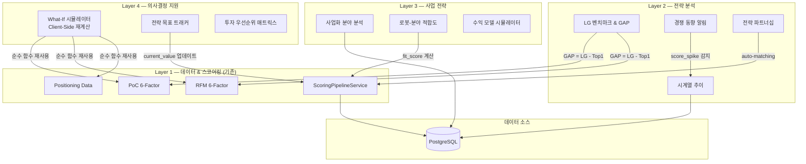
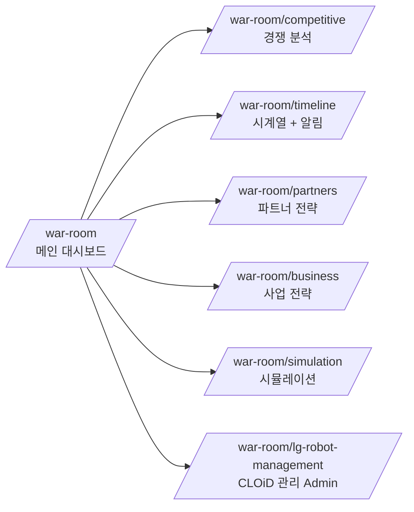
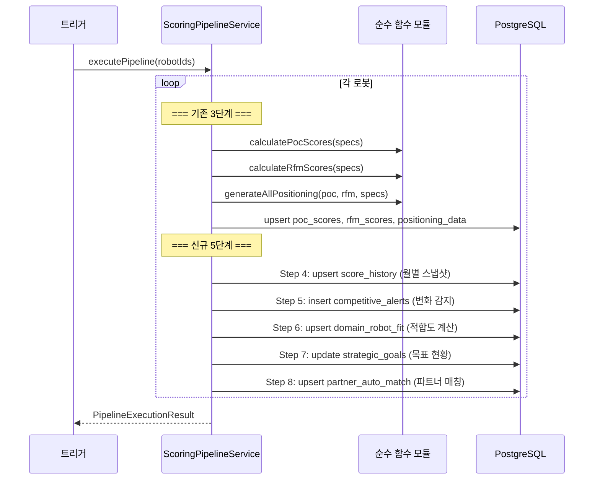
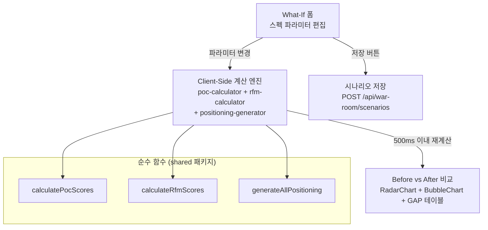
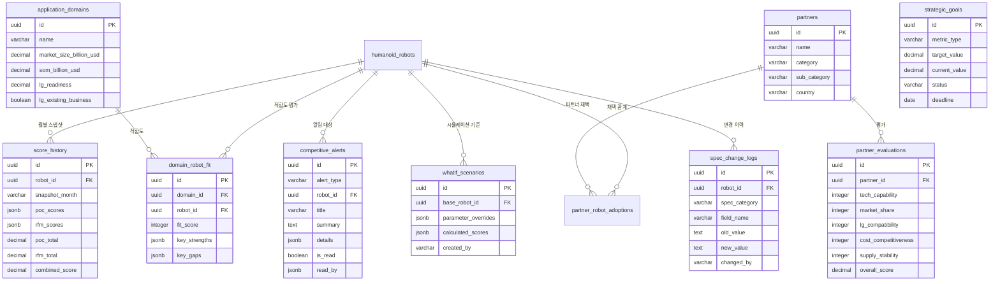

# 설계 문서 — v1.4 전략 워룸 / 전략 분석 레이어

## 개요

전략 워룸은 HRI Portal의 기존 스코어링 파이프라인(PoC 6-Factor / RFM 6-Factor) 위에 4개 레이어 구조의 전략 분석 시스템을 구축한다.

- **Layer 1 (기존)**: 데이터 수집 & 스코어링 — humanoidRobots, bodySpecs, pocScores, rfmScores, positioningData
- **Layer 2 (신규)**: 전략 분석 — LG 벤치마크, GAP 분석, 시계열 추이, 경쟁 알림
- **Layer 3 (신규)**: 사업 전략 — 사업화 분야, 수익 모델, 로봇-분야 적합도
- **Layer 4 (신규)**: 의사결정 지원 — What-If 시뮬레이터, 전략 목표, 투자 우선순위

핵심 설계 원칙:
- **순수 계산 재사용**: 기존 `calculatePocScores()`, `calculateRfmScores()`, `generateAllPositioning()` 순수 함수를 What-If 시뮬레이터에서 클라이언트 사이드로 재사용
- **파이프라인 확장**: 기존 `ScoringPipelineService.executePipeline()` 루프 내에 5단계 추가 (ScoreHistory → CompetitiveAlert → DomainRobotFit → StrategicGoal → PartnerMatching)
- **역할 기반 접근 제어**: Viewer(403) / Analyst(읽기+시나리오) / Admin(전체 CRUD) 3단계
- **다크 테마 일관성**: 기존 slate-950 하드코딩 패턴 유지

## 아키텍처



### 전체 페이지 구조



### 스코어링 파이프라인 확장 흐름



### What-If 시뮬레이터 Client-Side 아키텍처



설계 결정: 기존 `packages/backend/src/services/scoring/` 의 순수 함수들은 DB 의존성이 없으므로, `packages/shared/` 패키지로 추출하여 프론트엔드와 백엔드에서 동일 코드를 사용한다. 이를 통해 What-If 시뮬레이터의 client-side 재계산이 서버 왕복 없이 500ms 이내에 완료된다.

## 컴포넌트 및 인터페이스

### 1. 신규 서비스 레이어

#### 1.1 WarRoomDashboardService

파일: `packages/backend/src/services/war-room-dashboard.service.ts`

```typescript
interface DashboardSummary {
  lgPositioning: {
    robotName: string;
    pocTotal: number;
    rfmTotal: number;
    combinedScore: number;
    overallRank: number;
    totalRobots: number;
  };
  recentAlerts: CompetitiveAlert[]; // 최근 5건
  partnerSummary: { category: string; count: number }[];
  topPartners: { name: string; overallScore: number }[]; // 상위 3
  topDomains: { name: string; opportunity: number }[]; // 상위 3 (lg_readiness × SOM)
  goalStatus: { achieved: number; on_track: number; at_risk: number; behind: number };
}

class WarRoomDashboardService {
  async getDashboardSummary(lgRobotId: string): Promise<DashboardSummary>;
  async getLgRobots(): Promise<{ id: string; name: string }[]>; // region='KR' AND company ILIKE '%LG%'
}
```

#### 1.2 CompetitiveAnalysisService

파일: `packages/backend/src/services/war-room-competitive.service.ts`

```typescript
interface GapAnalysis {
  factors: {
    factorName: string;
    factorType: 'poc' | 'rfm';
    lgValue: number;
    topCompetitorValue: number;
    topCompetitorName: string;
    gap: number; // LG - Top1 (양수=리드, 음수=열세)
  }[];
  lgRanking: {
    pocRank: number;
    rfmRank: number;
    combinedRank: number;
    totalRobots: number;
  };
}

class CompetitiveAnalysisService {
  async getGapAnalysis(lgRobotId: string): Promise<GapAnalysis>;
  async getCompetitiveOverlay(lgRobotId: string): Promise<{
    lgData: PositioningValues[];
    top5Data: PositioningValues[][];
  }>;
}
```

#### 1.3 ScoreHistoryService

파일: `packages/backend/src/services/war-room-score-history.service.ts`

```typescript
interface ScoreHistoryEntry {
  robotId: string;
  robotName: string;
  snapshotMonth: string; // YYYY-MM
  pocScores: Record<string, number>; // 6 factors
  rfmScores: Record<string, number>; // 6 factors
  pocTotal: number;
  rfmTotal: number;
  combinedScore: number;
}

class ScoreHistoryService {
  async getTimeSeries(robotIds: string[], months: number): Promise<ScoreHistoryEntry[]>;
  async createSnapshot(robotId: string, pocScores: PocScoreValues, rfmScores: RfmScoreValues): Promise<void>;
}
```

#### 1.4 CompetitiveAlertService

파일: `packages/backend/src/services/war-room-alert.service.ts`

```typescript
type AlertType = 'score_spike' | 'mass_production' | 'funding' | 'partnership';

interface CompetitiveAlertRecord {
  id: string;
  alertType: AlertType;
  robotId: string;
  robotName: string;
  title: string;
  summary: string;
  details: Record<string, unknown>;
  isRead: boolean;
  createdAt: string;
}

class CompetitiveAlertService {
  async getAlerts(filters: { type?: AlertType; isRead?: boolean }): Promise<CompetitiveAlertRecord[]>;
  async markAsRead(alertId: string, userId: string): Promise<void>;
  async detectScoreSpike(robotId: string, currentScores: PocScoreValues & RfmScoreValues, previousMonth: string): Promise<void>;
  async detectKeywordAlerts(robotId: string, keywords: string[]): Promise<void>;
}
```

#### 1.5 PartnerService

파일: `packages/backend/src/services/war-room-partner.service.ts`

```typescript
class PartnerService {
  async list(filters: { category?: string; subCategory?: string; country?: string }): Promise<Partner[]>;
  async getById(id: string): Promise<PartnerDetail>;
  async create(data: CreatePartnerInput): Promise<Partner>;
  async update(id: string, data: UpdatePartnerInput): Promise<Partner>;
  async submitEvaluation(data: CreateEvaluationInput): Promise<PartnerEvaluation>;
  async getAdoptionMatrix(): Promise<AdoptionMatrixEntry[]>;
  async autoMatch(robotId: string): Promise<PartnerMatchResult[]>;
}
```

#### 1.6 DomainService

파일: `packages/backend/src/services/war-room-domain.service.ts`

```typescript
class DomainService {
  async list(): Promise<ApplicationDomainWithFit[]>;
  async getById(id: string): Promise<ApplicationDomainDetail>;
  async update(id: string, data: UpdateDomainInput): Promise<ApplicationDomain>;
  async getFitMatrix(): Promise<DomainRobotFitEntry[]>;
  async calculateLgReadiness(domainId: string): Promise<number>;
  async calculateFitScore(robotId: string, domainId: string): Promise<number>;
}
```

#### 1.7 ScenarioService

파일: `packages/backend/src/services/war-room-scenario.service.ts`

```typescript
class ScenarioService {
  async list(userId: string): Promise<WhatifScenario[]>;
  async create(data: CreateScenarioInput): Promise<WhatifScenario>;
  async delete(id: string, userId: string, userRole: string): Promise<void>;
}
```

#### 1.8 StrategicGoalService

파일: `packages/backend/src/services/war-room-goal.service.ts`

```typescript
class StrategicGoalService {
  async list(): Promise<StrategicGoal[]>;
  async create(data: CreateGoalInput): Promise<StrategicGoal>;
  async update(id: string, data: UpdateGoalInput): Promise<StrategicGoal>;
  async updateCurrentValues(): Promise<void>; // 파이프라인에서 호출
  async determineStatus(goal: StrategicGoal): 'achieved' | 'on_track' | 'at_risk' | 'behind';
}
```

#### 1.9 LgRobotManagementService

파일: `packages/backend/src/services/war-room-lg-robot.service.ts`

```typescript
interface SpecChangeLog {
  id: string;
  robotId: string;
  specCategory: string; // 'body' | 'hand' | 'computing' | 'sensor' | 'power'
  fieldName: string;
  oldValue: string | null;
  newValue: string | null;
  changedBy: string;
  changedAt: string;
}

class LgRobotManagementService {
  async getLgRobots(): Promise<LgRobotWithSpecs[]>;
  async updateSpecs(robotId: string, specs: UpdateAllSpecsInput, userId: string): Promise<void>;
  async createLgRobot(data: CreateLgRobotInput, userId: string): Promise<HumanoidRobot>;
  async getChangeHistory(robotId: string): Promise<SpecChangeLog[]>;
  private async logSpecChanges(robotId: string, category: string, oldSpec: any, newSpec: any, userId: string): Promise<void>;
}
```

### 2. 스코어링 파이프라인 확장

기존 `ScoringPipelineService.executePipeline()` 내부의 로봇별 루프에 5개 신규 스텝을 추가한다.

파일: `packages/backend/src/services/scoring-pipeline.service.ts` (수정)

```typescript
// 기존 processRobot() 메서드 확장
async processRobot(robotWithSpecs: RobotWithSpecs, runId: string): Promise<ScoringResult> {
  // 기존 3단계
  const pocScore = calculatePocScores(robotWithSpecs);
  const rfmScore = calculateRfmScores(robotWithSpecs);
  const positioning = generateAllPositioning(pocScore, rfmScore, robotWithSpecs);
  await this.upsertScores(robotWithSpecs.robot.id, { pocScore, rfmScore, positioning });

  // 신규 5단계 (각 단계 독립 try-catch)
  await this.stepScoreHistory(robotWithSpecs.robot.id, pocScore, rfmScore, runId);
  await this.stepCompetitiveAlert(robotWithSpecs, pocScore, rfmScore, runId);
  await this.stepDomainRobotFit(robotWithSpecs, pocScore, runId);
  await this.stepStrategicGoalUpdate(runId);
  await this.stepPartnerAutoMatch(robotWithSpecs, runId);
}
```

신규 파이프라인 스텝 모듈:

파일: `packages/backend/src/services/scoring/score-history-step.ts`
파일: `packages/backend/src/services/scoring/competitive-alert-step.ts`
파일: `packages/backend/src/services/scoring/domain-fit-step.ts`
파일: `packages/backend/src/services/scoring/strategic-goal-step.ts`
파일: `packages/backend/src/services/scoring/partner-match-step.ts`

각 스텝은 독립적인 try-catch로 감싸져 있어, 한 스텝이 실패해도 나머지 스텝과 다른 로봇의 처리가 계속된다 (요구사항 112).

### 3. API 라우트

파일: `packages/backend/src/routes/war-room.ts`

```typescript
// 대시보드
GET  /api/war-room/dashboard?lgRobotId=:id

// 경쟁 분석
GET  /api/war-room/competitive/:robotId

// 시계열
GET  /api/war-room/score-history?robot_ids=:ids&months=:n

// 알림
GET  /api/war-room/alerts?type=:type&is_read=:bool
PUT  /api/war-room/alerts/:id/read

// 파트너
GET  /api/war-room/partners?category=:cat&sub_category=:sub&country=:country
GET  /api/war-room/partners/:id
POST /api/war-room/partners                    // Admin only
PUT  /api/war-room/partners/:id                // Admin only
POST /api/war-room/partner-evaluations         // Admin + Analyst
GET  /api/war-room/partner-adoptions

// 사업화 분야
GET  /api/war-room/domains
GET  /api/war-room/domains/:id
PUT  /api/war-room/domains/:id                 // Admin only
GET  /api/war-room/domain-robot-fit

// 시나리오
GET  /api/war-room/scenarios
POST /api/war-room/scenarios                   // Admin + Analyst
DELETE /api/war-room/scenarios/:id             // Creator or Admin

// 전략 목표
GET  /api/war-room/goals
POST /api/war-room/goals                       // Admin only
PUT  /api/war-room/goals/:id                   // Admin only

// 투자 우선순위
GET  /api/war-room/investment-priority

// CLOiD 관리
GET  /api/war-room/lg-robots
POST /api/war-room/lg-robots                   // Admin only
PUT  /api/war-room/lg-robots/:id/specs         // Admin only
GET  /api/war-room/lg-robots/:id/history
```

역할 기반 접근 제어는 기존 `requireRole()` 미들웨어를 재사용한다:

```typescript
import { requireRole } from './auth.js';

// 모든 /api/war-room/* 엔드포인트에 Viewer 차단
app.use('/api/war-room/*', requireRole('admin', 'analyst'));

// Admin 전용 엔드포인트에 추가 미들웨어
app.post('/api/war-room/partners', requireRole('admin'), ...);
app.put('/api/war-room/partners/:id', requireRole('admin'), ...);
// ... 등
```

### 4. 프론트엔드 컴포넌트 구조

```
packages/frontend/src/
├── app/war-room/
│   ├── page.tsx                          # 메인 대시보드
│   ├── layout.tsx                        # 5-탭 네비게이션 + LG 로봇 드롭다운
│   ├── competitive/page.tsx              # 경쟁 분석
│   ├── timeline/page.tsx                 # 시계열 + 알림
│   ├── partners/page.tsx                 # 파트너 전략
│   ├── business/page.tsx                 # 사업 전략
│   ├── simulation/page.tsx               # 시뮬레이션
│   └── lg-robot-management/page.tsx      # CLOiD 관리 (Admin)
├── components/war-room/
│   ├── WarRoomLayout.tsx                 # 탭 네비게이션 + 로봇 셀렉터
│   ├── LgRobotSelector.tsx              # LG 로봇 드롭다운
│   ├── dashboard/
│   │   ├── LgPositioningCard.tsx        # LG 종합 포지셔닝 카드
│   │   ├── AlertPanel.tsx               # 경쟁 동향 알림 패널 (최근 5건)
│   │   ├── RadarSummary.tsx             # LG vs Top 5 레이더 요약
│   │   ├── PartnerSummaryCard.tsx       # 전략 파트너 핵심 요약
│   │   ├── TopDomainsCard.tsx           # 사업화 기회 상위 3개
│   │   └── GoalStatusCard.tsx           # 전략 목표 카드
│   ├── competitive/
│   │   ├── GapAnalysisGrid.tsx          # 12팩터 GAP 카드 그리드
│   │   ├── LgOverlayRadar.tsx           # LG vs Top 5 오버레이 레이더
│   │   ├── LgOverlayBubble.tsx          # LG vs Top 5 오버레이 버블
│   │   └── LgRankingCard.tsx            # LG 종합 순위 카드
│   ├── timeline/
│   │   ├── ScoreTrendChart.tsx          # 역량 변화 추이 LineChart
│   │   ├── RobotMultiSelect.tsx         # 로봇 멀티셀렉트 (최대 10)
│   │   ├── FactorMultiSelect.tsx        # 팩터 멀티셀렉트
│   │   ├── AlertList.tsx                # 경쟁 알림 패널
│   │   └── AlertDetailModal.tsx         # 알림 상세 모달
│   ├── partners/
│   │   ├── CategoryTabs.tsx             # 카테고리별 탭
│   │   ├── SubCategoryTabs.tsx          # 부품 서브카테고리 탭
│   │   ├── PartnerGrid.tsx              # 파트너 카드 그리드
│   │   ├── CompetitivenessMatrix.tsx    # 경쟁력 매트릭스 ScatterChart
│   │   ├── AdoptionHeatmap.tsx          # 채택 히트맵
│   │   ├── ComponentImpactPanel.tsx     # 부품 영향도 분석
│   │   ├── PartnerCompareTable.tsx      # 파트너 비교 테이블
│   │   └── RoadmapTimeline.tsx          # LG 부품 로드맵 타임라인
│   ├── business/
│   │   ├── OpportunityMatrix.tsx        # 사업화 기회 매트릭스 ScatterChart
│   │   ├── DomainFitHeatmap.tsx         # 로봇-분야 적합도 히트맵
│   │   ├── EntryOrderList.tsx           # CLOiD 최적 진입 순서
│   │   └── RevenueSimulator.tsx         # 수익 모델 시뮬레이터
│   ├── simulation/
│   │   ├── WhatIfForm.tsx               # What-If 스펙 편집 폼
│   │   ├── PrebuiltScenarios.tsx        # 6 프리빌트 시나리오 버튼
│   │   ├── BeforeAfterRadar.tsx         # Before vs After RadarChart
│   │   ├── BeforeAfterBubble.tsx        # Before vs After BubbleChart
│   │   ├── BeforeAfterGapTable.tsx      # Before vs After GAP 테이블
│   │   ├── ScenarioManager.tsx          # 시나리오 저장/로드/비교
│   │   ├── GoalTracker.tsx              # 전략 목표 관리
│   │   └── InvestmentPriorityMatrix.tsx # 투자 우선순위 매트릭스
│   └── lg-management/
│       ├── LgRobotList.tsx              # LG 로봇 목록
│       ├── SpecEditorForm.tsx           # 인라인 스펙 편집 폼
│       ├── ChangeHistoryPanel.tsx       # 변경 이력 패널
│       └── CreateRobotModal.tsx         # 새 LG 로봇 추가 모달
├── hooks/
│   └── useWarRoom.ts                    # War Room React Query 훅 모음
├── lib/
│   └── war-room-calculator.ts           # Client-side 스코어링 계산 (순수 함수 import)
└── types/
    └── war-room.ts                      # War Room 타입 정의
```

### 5. Shared 패키지 (순수 함수)

What-If 시뮬레이터의 client-side 재계산을 위해 기존 순수 함수를 shared 패키지로 추출한다.

```
packages/shared/
├── src/
│   ├── scoring/
│   │   ├── poc-calculator.ts            # 기존 코드 이동
│   │   ├── rfm-calculator.ts            # 기존 코드 이동
│   │   ├── positioning-generator.ts     # 기존 코드 이동
│   │   └── index.ts
│   └── index.ts
├── package.json
└── tsconfig.json
```

설계 결정: 기존 `packages/backend/src/services/scoring/` 의 순수 함수들은 이미 DB 의존성이 없으므로 (`RobotWithSpecs` 인터페이스만 사용), shared 패키지로 이동 후 백엔드와 프론트엔드 모두에서 import 가능하다. 백엔드의 기존 import 경로는 re-export로 호환성을 유지한다.


## 데이터 모델

### 신규 테이블 9종 (Drizzle ORM 스키마)

#### 1. partners — 전략 파트너

```typescript
export const partners = pgTable(
  'partners',
  {
    id: uuid('id').primaryKey().defaultRandom(),
    name: varchar('name', { length: 255 }).notNull(),
    category: varchar('category', { length: 50 }).notNull(), // component, rfm, data, platform, integration
    subCategory: varchar('sub_category', { length: 100 }),   // vision_sensor, battery, ai_chip, actuator, motor, reducer, force_sensor (component only)
    country: varchar('country', { length: 100 }),
    description: text('description'),
    website: varchar('website', { length: 500 }),
    logoUrl: varchar('logo_url', { length: 500 }),
    createdAt: timestamp('created_at').defaultNow().notNull(),
    updatedAt: timestamp('updated_at').defaultNow().notNull(),
  },
  (table) => ({
    categoryIdx: index('partners_category_idx').on(table.category),
    subCategoryIdx: index('partners_sub_category_idx').on(table.subCategory),
  })
);
```

#### 2. partner_robot_adoptions — 파트너-로봇 채택 관계

```typescript
export const partnerRobotAdoptions = pgTable(
  'partner_robot_adoptions',
  {
    id: uuid('id').primaryKey().defaultRandom(),
    partnerId: uuid('partner_id').notNull().references(() => partners.id, { onDelete: 'cascade' }),
    robotId: uuid('robot_id').notNull().references(() => humanoidRobots.id, { onDelete: 'cascade' }),
    adoptionType: varchar('adoption_type', { length: 100 }),
    adoptionStatus: varchar('adoption_status', { length: 50 }).notNull().default('evaluating'), // evaluating, adopted, strategic
    notes: text('notes'),
    createdAt: timestamp('created_at').defaultNow().notNull(),
  },
  (table) => ({
    partnerIdx: index('partner_robot_adoptions_partner_idx').on(table.partnerId),
    robotIdx: index('partner_robot_adoptions_robot_idx').on(table.robotId),
  })
);
```

#### 3. partner_evaluations — 파트너 평가

```typescript
export const partnerEvaluations = pgTable(
  'partner_evaluations',
  {
    id: uuid('id').primaryKey().defaultRandom(),
    partnerId: uuid('partner_id').notNull().references(() => partners.id, { onDelete: 'cascade' }),
    evaluatorId: varchar('evaluator_id', { length: 255 }).notNull(),
    techCapability: integer('tech_capability').notNull(),       // 1-10
    marketShare: integer('market_share').notNull(),             // 1-10
    lgCompatibility: integer('lg_compatibility').notNull(),     // 1-10
    costCompetitiveness: integer('cost_competitiveness').notNull(), // 1-10
    supplyStability: integer('supply_stability').notNull(),     // 1-10
    overallScore: decimal('overall_score', { precision: 4, scale: 2 }), // auto-calculated average
    evaluatedAt: timestamp('evaluated_at').defaultNow().notNull(),
  },
  (table) => ({
    partnerIdx: index('partner_evaluations_partner_idx').on(table.partnerId),
  })
);
```

#### 4. application_domains — 사업화 분야

```typescript
export const applicationDomains = pgTable(
  'application_domains',
  {
    id: uuid('id').primaryKey().defaultRandom(),
    name: varchar('name', { length: 255 }).notNull(),
    description: text('description'),
    marketSizeBillionUsd: decimal('market_size_billion_usd', { precision: 10, scale: 2 }),
    cagrPercent: decimal('cagr_percent', { precision: 6, scale: 2 }),
    somBillionUsd: decimal('som_billion_usd', { precision: 10, scale: 2 }),
    keyTasks: jsonb('key_tasks').$type<string[]>().default([]),
    entryBarriers: jsonb('entry_barriers').$type<string[]>().default([]),
    lgExistingBusiness: boolean('lg_existing_business').default(false),
    lgReadiness: decimal('lg_readiness', { precision: 4, scale: 3 }), // 0.000 - 1.000
    updatedAt: timestamp('updated_at').defaultNow().notNull(),
  },
  (table) => ({
    nameIdx: index('application_domains_name_idx').on(table.name),
  })
);
```

#### 5. domain_robot_fit — 로봇-분야 적합도

```typescript
export const domainRobotFit = pgTable(
  'domain_robot_fit',
  {
    id: uuid('id').primaryKey().defaultRandom(),
    domainId: uuid('domain_id').notNull().references(() => applicationDomains.id, { onDelete: 'cascade' }),
    robotId: uuid('robot_id').notNull().references(() => humanoidRobots.id, { onDelete: 'cascade' }),
    fitScore: integer('fit_score').notNull(), // 1-10
    fitRationale: text('fit_rationale'),
    keyStrengths: jsonb('key_strengths').$type<string[]>().default([]),
    keyGaps: jsonb('key_gaps').$type<string[]>().default([]),
    evaluatedAt: timestamp('evaluated_at').defaultNow().notNull(),
  },
  (table) => ({
    domainIdx: index('domain_robot_fit_domain_idx').on(table.domainId),
    robotIdx: index('domain_robot_fit_robot_idx').on(table.robotId),
    domainRobotIdx: uniqueIndex('domain_robot_fit_domain_robot_idx').on(table.domainId, table.robotId),
  })
);
```

#### 6. score_history — 월별 스코어 스냅샷

```typescript
export const scoreHistory = pgTable(
  'score_history',
  {
    id: uuid('id').primaryKey().defaultRandom(),
    robotId: uuid('robot_id').notNull().references(() => humanoidRobots.id, { onDelete: 'cascade' }),
    snapshotMonth: varchar('snapshot_month', { length: 7 }).notNull(), // YYYY-MM
    pocScores: jsonb('poc_scores').$type<Record<string, number>>().notNull(), // 6 PoC factors
    rfmScores: jsonb('rfm_scores').$type<Record<string, number>>().notNull(), // 6 RFM factors
    pocTotal: decimal('poc_total', { precision: 6, scale: 2 }).notNull(),
    rfmTotal: decimal('rfm_total', { precision: 6, scale: 2 }).notNull(),
    combinedScore: decimal('combined_score', { precision: 6, scale: 2 }).notNull(),
    createdAt: timestamp('created_at').defaultNow().notNull(),
  },
  (table) => ({
    robotMonthIdx: uniqueIndex('score_history_robot_month_idx').on(table.robotId, table.snapshotMonth),
    monthIdx: index('score_history_month_idx').on(table.snapshotMonth),
  })
);
```

#### 7. competitive_alerts — 경쟁 동향 알림

```typescript
export const competitiveAlerts = pgTable(
  'competitive_alerts',
  {
    id: uuid('id').primaryKey().defaultRandom(),
    alertType: varchar('alert_type', { length: 50 }).notNull(), // score_spike, mass_production, funding, partnership
    robotId: uuid('robot_id').notNull().references(() => humanoidRobots.id, { onDelete: 'cascade' }),
    title: varchar('title', { length: 500 }).notNull(),
    summary: text('summary'),
    details: jsonb('details').$type<Record<string, unknown>>().default({}),
    isRead: boolean('is_read').default(false),
    readBy: jsonb('read_by').$type<string[]>().default([]),
    createdAt: timestamp('created_at').defaultNow().notNull(),
  },
  (table) => ({
    alertTypeIdx: index('competitive_alerts_type_idx').on(table.alertType),
    robotIdx: index('competitive_alerts_robot_idx').on(table.robotId),
    createdAtIdx: index('competitive_alerts_created_at_idx').on(table.createdAt),
  })
);
```

#### 8. whatif_scenarios — What-If 시나리오

```typescript
export const whatifScenarios = pgTable(
  'whatif_scenarios',
  {
    id: uuid('id').primaryKey().defaultRandom(),
    name: varchar('name', { length: 255 }).notNull(),
    description: text('description'),
    baseRobotId: uuid('base_robot_id').notNull().references(() => humanoidRobots.id, { onDelete: 'cascade' }),
    parameterOverrides: jsonb('parameter_overrides').$type<Record<string, unknown>>().notNull(),
    calculatedScores: jsonb('calculated_scores').$type<Record<string, unknown>>().notNull(),
    createdBy: varchar('created_by', { length: 255 }).notNull(),
    createdAt: timestamp('created_at').defaultNow().notNull(),
  },
  (table) => ({
    baseRobotIdx: index('whatif_scenarios_base_robot_idx').on(table.baseRobotId),
    createdByIdx: index('whatif_scenarios_created_by_idx').on(table.createdBy),
  })
);
```

#### 9. strategic_goals — 전략 목표

```typescript
export const strategicGoals = pgTable(
  'strategic_goals',
  {
    id: uuid('id').primaryKey().defaultRandom(),
    title: varchar('title', { length: 255 }).notNull(),
    description: text('description'),
    metricType: varchar('metric_type', { length: 50 }).notNull(), // overall_rank, poc_factor, rfm_factor, market_share, partner_count, domain_entry, revenue_target
    targetValue: decimal('target_value', { precision: 10, scale: 2 }).notNull(),
    currentValue: decimal('current_value', { precision: 10, scale: 2 }).default('0'),
    deadline: date('deadline'),
    status: varchar('status', { length: 50 }).notNull().default('behind'), // achieved, on_track, at_risk, behind
    requiredActions: jsonb('required_actions').$type<string[]>().default([]),
    createdAt: timestamp('created_at').defaultNow().notNull(),
  },
  (table) => ({
    statusIdx: index('strategic_goals_status_idx').on(table.status),
    metricTypeIdx: index('strategic_goals_metric_type_idx').on(table.metricType),
  })
);
```

#### 10. spec_change_logs — 스펙 변경 이력 (CLOiD 관리용)

```typescript
export const specChangeLogs = pgTable(
  'spec_change_logs',
  {
    id: uuid('id').primaryKey().defaultRandom(),
    robotId: uuid('robot_id').notNull().references(() => humanoidRobots.id, { onDelete: 'cascade' }),
    specCategory: varchar('spec_category', { length: 50 }).notNull(), // body, hand, computing, sensor, power
    fieldName: varchar('field_name', { length: 100 }).notNull(),
    oldValue: text('old_value'),
    newValue: text('new_value'),
    changedBy: varchar('changed_by', { length: 255 }).notNull(),
    changedAt: timestamp('changed_at').defaultNow().notNull(),
  },
  (table) => ({
    robotIdx: index('spec_change_logs_robot_idx').on(table.robotId),
    changedAtIdx: index('spec_change_logs_changed_at_idx').on(table.changedAt),
  })
);
```

### ER 다이어그램 (신규 테이블 관계)



### 시드 데이터

#### 파트너 시드 (14건)

| 카테고리 | 서브카테고리 | 파트너명 | 국가 |
|----------|-------------|---------|------|
| component | vision_sensor | Intel RealSense | US |
| component | vision_sensor | Orbbec | CN |
| component | battery | Samsung SDI | KR |
| component | battery | CATL | CN |
| component | ai_chip | NVIDIA | US |
| component | ai_chip | Qualcomm | US |
| component | actuator | Harmonic Drive | JP |
| component | motor | Maxon | CH |
| component | reducer | Nabtesco | JP |
| component | force_sensor | ATI Industrial | US |
| rfm | - | Google DeepMind | US |
| data | - | Scale AI | US |
| platform | - | ROS / Open Robotics | US |
| integration | - | Foxconn | TW |

#### 사업화 분야 시드 (8건)

| 분야 | market_size (B$) | CAGR% | SOM (B$) | lg_existing_business |
|------|-----------------|-------|----------|---------------------|
| manufacturing | 45.0 | 12.5 | 2.5 | true |
| logistics | 38.0 | 15.0 | 2.0 | true |
| retail | 22.0 | 18.0 | 1.2 | true |
| healthcare | 28.0 | 20.0 | 1.5 | true |
| hospitality | 15.0 | 14.0 | 0.8 | false |
| home | 35.0 | 22.0 | 3.0 | true |
| agriculture | 12.0 | 16.0 | 0.5 | false |
| construction | 18.0 | 10.0 | 0.7 | false |

### lg_readiness 계산 공식

```
lg_readiness = (poc_factor_fulfillment × 0.4) + (lg_existing_business_bonus × 0.3) + (partner_availability × 0.3)

where:
  poc_factor_fulfillment = (LG 로봇의 PoC 6-Factor 평균) / 10  → 0~1
  lg_existing_business_bonus = lg_existing_business ? 1.0 : 0.0
  partner_availability = (해당 분야 관련 파트너 중 adopted/strategic 상태 수) / (전체 관련 파트너 수) → 0~1
```

### 전략 목표 상태 판정 로직

```
if current_value >= target_value:
    status = 'achieved'
elif current_value >= target_value * 0.8 AND deadline > now():
    status = 'on_track'
elif current_value >= target_value * 0.5:
    status = 'at_risk'
else:
    status = 'behind'
```

### What-If 프리빌트 시나리오 6종

| 시나리오명 | 파라미터 오버라이드 |
|-----------|-------------------|
| Jetson Thor 탑재 | `{ topsMax: 800, architectureType: 'edge' }` |
| 전고체 배터리 | `{ operationTimeHours: 16 }` |
| RoboSense AC2 센서 | `{ depthSensor: 'RoboSense AC2 LiDAR', lidar: 'RoboSense AC2' }` |
| 보행 추가 | `{ locomotionType: 'bipedal', maxSpeedMps: 1.5 }` |
| 양산 전환 | `{ commercializationStage: 'commercial', pocDeploymentScore: 8 }` |
| 가격 경쟁력 | `{ estimatedPriceUsd: 30000 }` |


## 정확성 속성 (Correctness Properties)

*속성(Property)은 시스템의 모든 유효한 실행에서 참이어야 하는 특성 또는 동작입니다. 속성은 사람이 읽을 수 있는 명세와 기계가 검증할 수 있는 정확성 보장 사이의 다리 역할을 합니다.*

### Property 1: LG 로봇 필터링 정확성

*For any* humanoidRobots 데이터셋에 대해, LG 로봇 필터링 함수는 `region = 'KR'` AND `company.name ILIKE '%LG%'` 조건을 만족하는 로봇만 반환해야 하며, 조건을 만족하지 않는 로봇은 절대 포함되지 않아야 한다.

**Validates: Requirements 11.8, 16.89**

### Property 2: 역할 기반 접근 제어

*For any* 사용자 역할(Viewer, Analyst, Admin)과 /api/war-room/* 엔드포인트 조합에 대해: Viewer는 항상 403 Forbidden을 받아야 하고, Analyst는 읽기 엔드포인트와 시나리오 생성(POST /scenarios)에 200을 받되 Admin 전용 쓰기 엔드포인트(POST/PUT partners, POST/PUT goals, PUT domains, POST/PUT lg-robots)에는 403을 받아야 하며, Admin은 모든 엔드포인트에 접근 가능해야 한다.

**Validates: Requirements 11.14, 11.15, 11.16, 16.88, 19.128, 20.133**

### Property 3: GAP 분석 계산 정확성

*For any* LG 로봇 스코어와 경쟁사 Top 1 로봇 스코어의 12팩터(PoC 6 + RFM 6) 조합에 대해, GAP 값은 `LG_score - Top1_score`로 계산되어야 하며, 양수이면 LG 리드(green), 음수이면 LG 열세(red), 0이면 동등(gray)으로 분류되어야 한다.

**Validates: Requirements 11.11, 11.12, 15.70**

### Property 4: 로봇 순위 계산 정확성

*For any* 스코어링된 로봇 목록에 대해, 특정 로봇의 순위는 해당 로봇보다 높은 점수를 가진 로봇의 수 + 1이어야 하며, pocTotal, rfmTotal, combinedScore 각각에 대해 독립적으로 올바른 순위가 계산되어야 한다.

**Validates: Requirements 11.13**

### Property 5: 도메인 기회 순위 정확성

*For any* Application_Domain 목록에 대해, 기회 순위는 `lg_readiness × som_billion_usd` 내림차순으로 정렬되어야 하며, 상위 3개 항목이 올바르게 선택되어야 한다.

**Validates: Requirements 11.5, 14.57**

### Property 6: Score_History 스냅샷 upsert 멱등성

*For any* 로봇에 대해, 동일 월(YYYY-MM)에 스코어링 파이프라인을 두 번 실행하면 score_history 테이블에 해당 (robot_id, snapshot_month) 조합의 레코드는 정확히 하나만 존재해야 하며, 두 번째 실행의 값으로 업데이트되어야 한다.

**Validates: Requirements 12.18, 12.19, 17.106**

### Property 7: 경쟁 알림 감지 정확성

*For any* 현재 스코어와 이전 월 스코어 쌍에 대해: (a) 단일 팩터 변화율이 20% 이상이면 score_spike 알림이 생성되어야 하고, (b) pocDeploymentScore 증가가 2점 이상이면 mass_production 알림이 생성되어야 한다. *For any* 키워드 목록에 대해: (c) funding 관련 키워드(funding, investment, Series A-F, IPO, valuation)가 매칭되면 funding 알림이 생성되어야 하고, (d) partnership 관련 키워드(partnership, collaboration, joint venture, MOU, strategic alliance)가 매칭되면 partnership 알림이 생성되어야 한다.

**Validates: Requirements 12.25, 12.26, 12.27, 12.28, 17.107**

### Property 8: 알림 쿼리 정렬 및 필터링

*For any* Competitive_Alert 목록에 대해, 쿼리 결과는 항상 created_at 내림차순으로 정렬되어야 하며, alert_type 필터가 적용된 경우 해당 타입의 알림만 반환되어야 한다.

**Validates: Requirements 12.29, 12.32**

### Property 9: 파트너 평가 overall_score 자동 계산

*For any* 5개 평가 차원(tech_capability, market_share, lg_compatibility, cost_competitiveness, supply_stability)의 1-10 정수 값 조합에 대해, overall_score는 5개 값의 산술 평균과 동일해야 한다.

**Validates: Requirements 13.35**

### Property 10: lg_readiness 계산 공식 정확성

*For any* PoC 6-Factor 평균(0-10), lg_existing_business 불리언, 파트너 가용성 비율(0-1) 조합에 대해, lg_readiness는 `(poc_avg/10 × 0.4) + (lg_biz ? 1.0 : 0.0) × 0.3 + (partner_avail × 0.3)`으로 계산되어야 하며, 결과는 항상 [0, 1] 범위 내여야 한다.

**Validates: Requirements 14.55**

### Property 11: 수익 모델 계산 정확성

*For any* 유효한 수익 모델 파라미터에 대해: (a) hardware_sales 모델은 `unit_price × volume`을, (b) raas 모델은 `monthly_fee × subscribers × months`를, (c) b2b2c 모델은 `platform_fee + transaction_commission`을 정확히 계산해야 하며, 결과는 항상 0 이상이어야 한다.

**Validates: Requirements 14.58, 14.59**

### Property 12: What-If 클라이언트 사이드 재계산 일관성

*For any* 유효한 RobotWithSpecs 데이터와 파라미터 오버라이드 조합에 대해, 클라이언트 사이드에서 `calculatePocScores()`와 `calculateRfmScores()`를 실행한 결과는 동일한 입력으로 서버 사이드에서 실행한 결과와 정확히 동일해야 한다. (동일 순수 함수 사용으로 보장)

**Validates: Requirements 15.67**

### Property 13: 시나리오 저장/로드 라운드트립

*For any* What-If 시나리오(name, description, base_robot_id, parameter_overrides, calculated_scores)에 대해, 저장(POST) 후 로드(GET)하면 원본과 동일한 데이터가 반환되어야 한다.

**Validates: Requirements 15.73**

### Property 14: 전략 목표 상태 자동 판정

*For any* target_value, current_value, deadline 조합에 대해: current_value ≥ target_value이면 'achieved', current_value ≥ target_value × 0.8이고 deadline이 미래이면 'on_track', current_value ≥ target_value × 0.5이면 'at_risk', 그 외(current_value < target_value × 0.5 또는 deadline 경과)이면 'behind'로 판정되어야 한다.

**Validates: Requirements 15.77, 15.78, 17.109**

### Property 15: 파이프라인 5단계 실행 및 로깅

*For any* 파이프라인 실행에 대해, 기존 3단계 완료 후 5개 신규 단계(score_history, competitive_alert, domain_robot_fit, strategic_goal, partner_matching)가 순서대로 실행되어야 하며, 각 단계에 대해 pipelineStepLogs에 step_name, input_count, success_count, failure_count, duration이 기록되어야 한다.

**Validates: Requirements 17.105, 17.111**

### Property 16: 파이프라인 오류 격리

*For any* 로봇 목록에서 특정 파이프라인 스텝이 실패하더라도, 해당 로봇의 나머지 스텝과 다른 로봇의 모든 스텝은 정상적으로 실행되어야 하며, 실패한 스텝은 에러 로그가 기록되어야 한다.

**Validates: Requirements 17.112**

### Property 17: 스펙 변경 이력 기록 라운드트립

*For any* LG 로봇 스펙 변경(spec_category, field_name, old_value, new_value)에 대해, 변경 저장 후 변경 이력 조회 시 해당 변경 레코드가 존재해야 하며, old_value, new_value, changed_by, changed_at이 정확히 기록되어야 한다.

**Validates: Requirements 16.97**

### Property 18: 입력 유효성 검증

*For any* War_Room 폼 입력에 대해: (a) 파트너 평가 점수는 1-10 정수 범위를 벗어나면 거부되어야 하고, (b) 시나리오 파라미터는 해당 스펙 필드의 유효 타입과 범위를 벗어나면 거부되어야 하며, (c) 전략 목표의 target_value는 양수여야 한다. 유효하지 않은 입력은 DB에 저장되지 않아야 한다.

**Validates: Requirements 20.137**

## 오류 처리

### API 오류 응답 형식

모든 `/api/war-room/*` 엔드포인트는 일관된 JSON 오류 응답을 반환한다 (요구사항 129):

```json
{
  "error": {
    "status": 403,
    "type": "FORBIDDEN",
    "message": "Viewer role cannot access War Room"
  }
}
```

### 오류 시나리오별 처리

| 오류 상황 | HTTP 상태 | 처리 방식 |
|-----------|----------|-----------|
| Viewer 역할 접근 | 403 | 접근 거부 + 메인 대시보드 리다이렉트 |
| Analyst가 Admin 전용 엔드포인트 접근 | 403 | 접근 거부 |
| 존재하지 않는 리소스 조회 | 404 | Not Found |
| 유효하지 않은 입력 (범위 초과 등) | 400 | Bad Request + 필드별 오류 메시지 |
| 시나리오 삭제 권한 없음 (타인 시나리오) | 403 | Forbidden |
| 파이프라인 신규 스텝 실패 | - | 에러 로그 기록, 다음 스텝 계속 실행 |
| DB 연결 실패 | 500 | Internal Server Error |
| 중복 score_history (같은 월) | - | upsert로 자동 처리 (충돌 시 업데이트) |

### 파이프라인 오류 격리 전략

```typescript
// 각 신규 스텝은 독립적 try-catch로 감싸짐
for (const robot of robots) {
  // 기존 3단계 (실패 시 해당 로봇 건너뛰기)
  try {
    await this.processRobotCore(robot, runId);
  } catch (err) {
    logger.logStepError(runId, 'core_scoring', robot.id, err);
    continue;
  }

  // 신규 5단계 (각 단계 독립 실행)
  const steps = [
    { name: 'score_history', fn: () => this.stepScoreHistory(...) },
    { name: 'competitive_alert', fn: () => this.stepCompetitiveAlert(...) },
    { name: 'domain_robot_fit', fn: () => this.stepDomainRobotFit(...) },
    { name: 'strategic_goal', fn: () => this.stepStrategicGoalUpdate(...) },
    { name: 'partner_matching', fn: () => this.stepPartnerAutoMatch(...) },
  ];

  for (const step of steps) {
    try {
      await logger.startStep(runId, step.name);
      await step.fn();
      await logger.completeStep(runId, step.name);
    } catch (err) {
      await logger.logStepError(runId, step.name, robot.id, err);
      // 다음 스텝 계속 실행
    }
  }
}
```

### 프론트엔드 오류 처리

- React Query의 `onError` 콜백으로 토스트 알림 표시
- 403 응답 시 `/dashboard`로 리다이렉트 + "접근 권한이 없습니다" 알림
- What-If 계산 오류 시 이전 유효 결과 유지 + 오류 표시
- 네트워크 오류 시 자동 재시도 (React Query 기본 3회)

## 테스팅 전략

### 단위 테스트 (Unit Tests)

구체적 예시와 엣지 케이스를 검증한다.

- **GAP 분석**: LG가 리드/열세/동등인 구체적 스코어 예시
- **전략 목표 상태 판정**: 경계값 테스트 (정확히 80%, 정확히 50%, 마감일 당일)
- **경쟁 알림 감지**: 정확히 20% 변화, 정확히 2점 증가 경계값
- **lg_readiness 계산**: lg_existing_business=true/false, 파트너 없는 경우
- **수익 모델**: 각 모델별 구체적 계산 예시
- **프리빌트 시나리오**: 6종 시나리오 파라미터 오버라이드 정확성
- **API 엔드포인트**: 인증/권한 검증, 요청/응답 형식 검증
- **시드 데이터**: 14개 파트너, 8개 도메인 시드 데이터 존재 확인

### 속성 기반 테스트 (Property-Based Tests)

`fast-check` 라이브러리를 사용하여 각 정확성 속성을 최소 100회 반복 테스트한다.

각 테스트는 설계 문서의 속성을 참조하는 태그를 포함한다:
- 태그 형식: `Feature: war-room-strategic-analysis, Property {number}: {property_text}`

테스트 대상:

- **Property 1**: 임의의 로봇 데이터셋 생성 → LG 필터링 결과 검증
- **Property 2**: 임의의 역할 + 엔드포인트 조합 → 접근 제어 결과 검증
- **Property 3**: 임의의 12팩터 스코어 쌍 → GAP 계산 및 색상 분류 검증
- **Property 4**: 임의의 스코어 목록 → 순위 계산 검증
- **Property 5**: 임의의 도메인 목록 → 기회 순위 정렬 검증
- **Property 6**: 동일 로봇/월에 2회 스냅샷 → 레코드 수 1 검증 (멱등성)
- **Property 7**: 임의의 스코어 변화율/키워드 → 알림 생성 조건 검증
- **Property 8**: 임의의 알림 목록 + 필터 → 정렬/필터링 검증
- **Property 9**: 임의의 5개 1-10 정수 → overall_score = 평균 검증
- **Property 10**: 임의의 PoC 평균/비즈니스/파트너 비율 → lg_readiness 공식 및 범위 검증
- **Property 11**: 임의의 수익 모델 파라미터 → 계산 공식 검증
- **Property 12**: 임의의 RobotWithSpecs + 오버라이드 → 클라이언트/서버 결과 동일성 검증
- **Property 13**: 임의의 시나리오 데이터 → 저장/로드 라운드트립 검증
- **Property 14**: 임의의 target/current/deadline → 상태 판정 로직 검증
- **Property 15**: 파이프라인 실행 → 5개 스텝 로그 존재 검증
- **Property 16**: 일부 스텝 실패 주입 → 나머지 스텝 정상 실행 검증
- **Property 17**: 임의의 스펙 변경 → 변경 이력 라운드트립 검증
- **Property 18**: 범위 밖 입력 → 거부 검증

### 통합 테스트 (Integration Tests)

- 파이프라인 전체 실행 흐름 (기존 3단계 + 신규 5단계)
- CLOiD 스펙 변경 → 자동 파이프라인 트리거 → 스코어 업데이트 E2E
- What-If 시나리오 저장 → 로드 → 비교 E2E
- 역할별 API 접근 제어 E2E
- React Query 캐시 무효화 검증 (파이프라인 실행 후 UI 자동 갱신)
